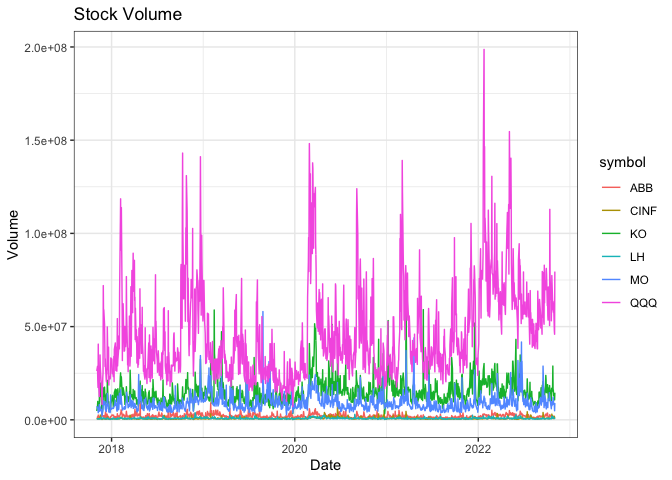

```r
library(tidyverse)
```

```
## ── Attaching packages ─────────────────────────────────────── tidyverse 1.3.1 ──
```

```
## ✔ ggplot2 3.3.5     ✔ purrr   0.3.4
## ✔ tibble  3.1.8     ✔ dplyr   1.0.8
## ✔ tidyr   1.2.0     ✔ stringr 1.4.0
## ✔ readr   2.1.2     ✔ forcats 0.5.1
```

```
## ── Conflicts ────────────────────────────────────────── tidyverse_conflicts() ──
## ✖ dplyr::filter() masks stats::filter()
## ✖ dplyr::lag()    masks stats::lag()
```

```r
library(knitr)
library(downloader)
library(dplyr)
library(lubridate)
```

```
## 
## Attaching package: 'lubridate'
```

```
## The following objects are masked from 'package:base':
## 
##     date, intersect, setdiff, union
```

```r
library(ggplot2)
library(grid)
library(corrplot)
```

```
## corrplot 0.92 loaded
```

```r
library(readr) 
library(haven)
library(readxl)
library(foreign)
library(stringr)
library(stringi)
library(tidyquant)
```

```
## Loading required package: PerformanceAnalytics
```

```
## Loading required package: xts
```

```
## Loading required package: zoo
```

```
## 
## Attaching package: 'zoo'
```

```
## The following objects are masked from 'package:base':
## 
##     as.Date, as.Date.numeric
```

```
## 
## Attaching package: 'xts'
```

```
## The following objects are masked from 'package:dplyr':
## 
##     first, last
```

```
## 
## Attaching package: 'PerformanceAnalytics'
```

```
## The following object is masked from 'package:graphics':
## 
##     legend
```

```
## Loading required package: quantmod
```

```
## Loading required package: TTR
```

```
## Registered S3 method overwritten by 'quantmod':
##   method            from
##   as.zoo.data.frame zoo
```

```r
library(timetk)
library(DT)
library(dygraphs)
```


```r
tickers_today <- c("QQQ", "MO", "KO", "ABB", "LH", "CINF")

end <- today()
start <- today() - years(5)

tickers_function <- function(tickers_today) {
  tq_get(tickers_today, get = "stock.prices", from = start, to = end) %>%
  select(symbol, date, adjusted) %>%
  pivot_wider(names_from = symbol, values_from = adjusted) %>%
  tk_xts(date_var = date) %>%
  dygraph()
}

tickers_function(tickers_today)
```

```
## Warning: Non-numeric columns being dropped: date
```

```{=html}
<div id="htmlwidget-7967c164fff80301c536" style="width:672px;height:480px;" class="dygraphs html-widget"></div>
<script type="application/json" data-for="htmlwidget-7967c164fff80301c536">{"x":{"attrs":{"labels":["day","QQQ","MO","KO","ABB","LH","CINF"],"legend":"auto","retainDateWindow":false,"axes":{"x":{"pixelsPerLabel":60}}},"scale":"daily","annotations":[],"shadings":[],"events":[],"format":"date","data":[["2017-11-03T00:00:00.000Z","2017-11-06T00:00:00.000Z","2017-11-07T00:00:00.000Z","2017-11-08T00:00:00.000Z","2017-11-09T00:00:00.000Z","2017-11-10T00:00:00.000Z","2017-11-13T00:00:00.000Z","2017-11-14T00:00:00.000Z","2017-11-15T00:00:00.000Z","2017-11-16T00:00:00.000Z","2017-11-17T00:00:00.000Z","2017-11-20T00:00:00.000Z","2017-11-21T00:00:00.000Z","2017-11-22T00:00:00.000Z","2017-11-24T00:00:00.000Z","2017-11-27T00:00:00.000Z","2017-11-28T00:00:00.000Z","2017-11-29T00:00:00.000Z","2017-11-30T00:00:00.000Z","2017-12-01T00:00:00.000Z","2017-12-04T00:00:00.000Z","2017-12-05T00:00:00.000Z","2017-12-06T00:00:00.000Z","2017-12-07T00:00:00.000Z","2017-12-08T00:00:00.000Z","2017-12-11T00:00:00.000Z","2017-12-12T00:00:00.000Z","2017-12-13T00:00:00.000Z","2017-12-14T00:00:00.000Z","2017-12-15T00:00:00.000Z","2017-12-18T00:00:00.000Z","2017-12-19T00:00:00.000Z","2017-12-20T00:00:00.000Z","2017-12-21T00:00:00.000Z","2017-12-22T00:00:00.000Z","2017-12-26T00:00:00.000Z","2017-12-27T00:00:00.000Z","2017-12-28T00:00:00.000Z","2017-12-29T00:00:00.000Z","2018-01-02T00:00:00.000Z","2018-01-03T00:00:00.000Z","2018-01-04T00:00:00.000Z","2018-01-05T00:00:00.000Z","2018-01-08T00:00:00.000Z","2018-01-09T00:00:00.000Z","2018-01-10T00:00:00.000Z","2018-01-11T00:00:00.000Z","2018-01-12T00:00:00.000Z","2018-01-16T00:00:00.000Z","2018-01-17T00:00:00.000Z","2018-01-18T00:00:00.000Z","2018-01-19T00:00:00.000Z","2018-01-22T00:00:00.000Z","2018-01-23T00:00:00.000Z","2018-01-24T00:00:00.000Z","2018-01-25T00:00:00.000Z","2018-01-26T00:00:00.000Z","2018-01-29T00:00:00.000Z","2018-01-30T00:00:00.000Z","2018-01-31T00:00:00.000Z","2018-02-01T00:00:00.000Z","2018-02-02T00:00:00.000Z","2018-02-05T00:00:00.000Z","2018-02-06T00:00:00.000Z","2018-02-07T00:00:00.000Z","2018-02-08T00:00:00.000Z","2018-02-09T00:00:00.000Z","2018-02-12T00:00:00.000Z","2018-02-13T00:00:00.000Z","2018-02-14T00:00:00.000Z","2018-02-15T00:00:00.000Z","2018-02-16T00:00:00.000Z","2018-02-20T00:00:00.000Z","2018-02-21T00:00:00.000Z","2018-02-22T00:00:00.000Z","2018-02-23T00:00:00.000Z","2018-02-26T00:00:00.000Z","2018-02-27T00:00:00.000Z","2018-02-28T00:00:00.000Z","2018-03-01T00:00:00.000Z","2018-03-02T00:00:00.000Z","2018-03-05T00:00:00.000Z","2018-03-06T00:00:00.000Z","2018-03-07T00:00:00.000Z","2018-03-08T00:00:00.000Z","2018-03-09T00:00:00.000Z","2018-03-12T00:00:00.000Z","2018-03-13T00:00:00.000Z","2018-03-14T00:00:00.000Z","2018-03-15T00:00:00.000Z","2018-03-16T00:00:00.000Z","2018-03-19T00:00:00.000Z","2018-03-20T00:00:00.000Z","2018-03-21T00:00:00.000Z","2018-03-22T00:00:00.000Z","2018-03-23T00:00:00.000Z","2018-03-26T00:00:00.000Z","2018-03-27T00:00:00.000Z","2018-03-28T00:00:00.000Z","2018-03-29T00:00:00.000Z","2018-04-02T00:00:00.000Z","2018-04-03T00:00:00.000Z","2018-04-04T00:00:00.000Z","2018-04-05T00:00:00.000Z","2018-04-06T00:00:00.000Z","2018-04-09T00:00:00.000Z","2018-04-10T00:00:00.000Z","2018-04-11T00:00:00.000Z","2018-04-12T00:00:00.000Z","2018-04-13T00:00:00.000Z","2018-04-16T00:00:00.000Z","2018-04-17T00:00:00.000Z","2018-04-18T00:00:00.000Z","2018-04-19T00:00:00.000Z","2018-04-20T00:00:00.000Z","2018-04-23T00:00:00.000Z","2018-04-24T00:00:00.000Z","2018-04-25T00:00:00.000Z","2018-04-26T00:00:00.000Z","2018-04-27T00:00:00.000Z","2018-04-30T00:00:00.000Z","2018-05-01T00:00:00.000Z","2018-05-02T00:00:00.000Z","2018-05-03T00:00:00.000Z","2018-05-04T00:00:00.000Z","2018-05-07T00:00:00.000Z","2018-05-08T00:00:00.000Z","2018-05-09T00:00:00.000Z","2018-05-10T00:00:00.000Z","2018-05-11T00:00:00.000Z","2018-05-14T00:00:00.000Z","2018-05-15T00:00:00.000Z","2018-05-16T00:00:00.000Z","2018-05-17T00:00:00.000Z","2018-05-18T00:00:00.000Z","2018-05-21T00:00:00.000Z","2018-05-22T00:00:00.000Z","2018-05-23T00:00:00.000Z","2018-05-24T00:00:00.000Z","2018-05-25T00:00:00.000Z","2018-05-29T00:00:00.000Z","2018-05-30T00:00:00.000Z","2018-05-31T00:00:00.000Z","2018-06-01T00:00:00.000Z","2018-06-04T00:00:00.000Z","2018-06-05T00:00:00.000Z","2018-06-06T00:00:00.000Z","2018-06-07T00:00:00.000Z","2018-06-08T00:00:00.000Z","2018-06-11T00:00:00.000Z","2018-06-12T00:00:00.000Z","2018-06-13T00:00:00.000Z","2018-06-14T00:00:00.000Z","2018-06-15T00:00:00.000Z","2018-06-18T00:00:00.000Z","2018-06-19T00:00:00.000Z","2018-06-20T00:00:00.000Z","2018-06-21T00:00:00.000Z","2018-06-22T00:00:00.000Z","2018-06-25T00:00:00.000Z","2018-06-26T00:00:00.000Z","2018-06-27T00:00:00.000Z","2018-06-28T00:00:00.000Z","2018-06-29T00:00:00.000Z","2018-07-02T00:00:00.000Z","2018-07-03T00:00:00.000Z","2018-07-05T00:00:00.000Z","2018-07-06T00:00:00.000Z","2018-07-09T00:00:00.000Z","2018-07-10T00:00:00.000Z","2018-07-11T00:00:00.000Z","2018-07-12T00:00:00.000Z","2018-07-13T00:00:00.000Z","2018-07-16T00:00:00.000Z","2018-07-17T00:00:00.000Z","2018-07-18T00:00:00.000Z","2018-07-19T00:00:00.000Z","2018-07-20T00:00:00.000Z","2018-07-23T00:00:00.000Z","2018-07-24T00:00:00.000Z","2018-07-25T00:00:00.000Z","2018-07-26T00:00:00.000Z","2018-07-27T00:00:00.000Z","2018-07-30T00:00:00.000Z","2018-07-31T00:00:00.000Z","2018-08-01T00:00:00.000Z","2018-08-02T00:00:00.000Z","2018-08-03T00:00:00.000Z","2018-08-06T00:00:00.000Z","2018-08-07T00:00:00.000Z","2018-08-08T00:00:00.000Z","2018-08-09T00:00:00.000Z","2018-08-10T00:00:00.000Z","2018-08-13T00:00:00.000Z","2018-08-14T00:00:00.000Z","2018-08-15T00:00:00.000Z","2018-08-16T00:00:00.000Z","2018-08-17T00:00:00.000Z","2018-08-20T00:00:00.000Z","2018-08-21T00:00:00.000Z","2018-08-22T00:00:00.000Z","2018-08-23T00:00:00.000Z","2018-08-24T00:00:00.000Z","2018-08-27T00:00:00.000Z","2018-08-28T00:00:00.000Z","2018-08-29T00:00:00.000Z","2018-08-30T00:00:00.000Z","2018-08-31T00:00:00.000Z","2018-09-04T00:00:00.000Z","2018-09-05T00:00:00.000Z","2018-09-06T00:00:00.000Z","2018-09-07T00:00:00.000Z","2018-09-10T00:00:00.000Z","2018-09-11T00:00:00.000Z","2018-09-12T00:00:00.000Z","2018-09-13T00:00:00.000Z","2018-09-14T00:00:00.000Z","2018-09-17T00:00:00.000Z","2018-09-18T00:00:00.000Z","2018-09-19T00:00:00.000Z","2018-09-20T00:00:00.000Z","2018-09-21T00:00:00.000Z","2018-09-24T00:00:00.000Z","2018-09-25T00:00:00.000Z","2018-09-26T00:00:00.000Z","2018-09-27T00:00:00.000Z","2018-09-28T00:00:00.000Z","2018-10-01T00:00:00.000Z","2018-10-02T00:00:00.000Z","2018-10-03T00:00:00.000Z","2018-10-04T00:00:00.000Z","2018-10-05T00:00:00.000Z","2018-10-08T00:00:00.000Z","2018-10-09T00:00:00.000Z","2018-10-10T00:00:00.000Z","2018-10-11T00:00:00.000Z","2018-10-12T00:00:00.000Z","2018-10-15T00:00:00.000Z","2018-10-16T00:00:00.000Z","2018-10-17T00:00:00.000Z","2018-10-18T00:00:00.000Z","2018-10-19T00:00:00.000Z","2018-10-22T00:00:00.000Z","2018-10-23T00:00:00.000Z","2018-10-24T00:00:00.000Z","2018-10-25T00:00:00.000Z","2018-10-26T00:00:00.000Z","2018-10-29T00:00:00.000Z","2018-10-30T00:00:00.000Z","2018-10-31T00:00:00.000Z","2018-11-01T00:00:00.000Z","2018-11-02T00:00:00.000Z","2018-11-05T00:00:00.000Z","2018-11-06T00:00:00.000Z","2018-11-07T00:00:00.000Z","2018-11-08T00:00:00.000Z","2018-11-09T00:00:00.000Z","2018-11-12T00:00:00.000Z","2018-11-13T00:00:00.000Z","2018-11-14T00:00:00.000Z","2018-11-15T00:00:00.000Z","2018-11-16T00:00:00.000Z","2018-11-19T00:00:00.000Z","2018-11-20T00:00:00.000Z","2018-11-21T00:00:00.000Z","2018-11-23T00:00:00.000Z","2018-11-26T00:00:00.000Z","2018-11-27T00:00:00.000Z","2018-11-28T00:00:00.000Z","2018-11-29T00:00:00.000Z","2018-11-30T00:00:00.000Z","2018-12-03T00:00:00.000Z","2018-12-04T00:00:00.000Z","2018-12-06T00:00:00.000Z","2018-12-07T00:00:00.000Z","2018-12-10T00:00:00.000Z","2018-12-11T00:00:00.000Z","2018-12-12T00:00:00.000Z","2018-12-13T00:00:00.000Z","2018-12-14T00:00:00.000Z","2018-12-17T00:00:00.000Z","2018-12-18T00:00:00.000Z","2018-12-19T00:00:00.000Z","2018-12-20T00:00:00.000Z","2018-12-21T00:00:00.000Z","2018-12-24T00:00:00.000Z","2018-12-26T00:00:00.000Z","2018-12-27T00:00:00.000Z","2018-12-28T00:00:00.000Z","2018-12-31T00:00:00.000Z","2019-01-02T00:00:00.000Z","2019-01-03T00:00:00.000Z","2019-01-04T00:00:00.000Z","2019-01-07T00:00:00.000Z","2019-01-08T00:00:00.000Z","2019-01-09T00:00:00.000Z","2019-01-10T00:00:00.000Z","2019-01-11T00:00:00.000Z","2019-01-14T00:00:00.000Z","2019-01-15T00:00:00.000Z","2019-01-16T00:00:00.000Z","2019-01-17T00:00:00.000Z","2019-01-18T00:00:00.000Z","2019-01-22T00:00:00.000Z","2019-01-23T00:00:00.000Z","2019-01-24T00:00:00.000Z","2019-01-25T00:00:00.000Z","2019-01-28T00:00:00.000Z","2019-01-29T00:00:00.000Z","2019-01-30T00:00:00.000Z","2019-01-31T00:00:00.000Z","2019-02-01T00:00:00.000Z","2019-02-04T00:00:00.000Z","2019-02-05T00:00:00.000Z","2019-02-06T00:00:00.000Z","2019-02-07T00:00:00.000Z","2019-02-08T00:00:00.000Z","2019-02-11T00:00:00.000Z","2019-02-12T00:00:00.000Z","2019-02-13T00:00:00.000Z","2019-02-14T00:00:00.000Z","2019-02-15T00:00:00.000Z","2019-02-19T00:00:00.000Z","2019-02-20T00:00:00.000Z","2019-02-21T00:00:00.000Z","2019-02-22T00:00:00.000Z","2019-02-25T00:00:00.000Z","2019-02-26T00:00:00.000Z","2019-02-27T00:00:00.000Z","2019-02-28T00:00:00.000Z","2019-03-01T00:00:00.000Z","2019-03-04T00:00:00.000Z","2019-03-05T00:00:00.000Z","2019-03-06T00:00:00.000Z","2019-03-07T00:00:00.000Z","2019-03-08T00:00:00.000Z","2019-03-11T00:00:00.000Z","2019-03-12T00:00:00.000Z","2019-03-13T00:00:00.000Z","2019-03-14T00:00:00.000Z","2019-03-15T00:00:00.000Z","2019-03-18T00:00:00.000Z","2019-03-19T00:00:00.000Z","2019-03-20T00:00:00.000Z","2019-03-21T00:00:00.000Z","2019-03-22T00:00:00.000Z","2019-03-25T00:00:00.000Z","2019-03-26T00:00:00.000Z","2019-03-27T00:00:00.000Z","2019-03-28T00:00:00.000Z","2019-03-29T00:00:00.000Z","2019-04-01T00:00:00.000Z","2019-04-02T00:00:00.000Z","2019-04-03T00:00:00.000Z","2019-04-04T00:00:00.000Z","2019-04-05T00:00:00.000Z","2019-04-08T00:00:00.000Z","2019-04-09T00:00:00.000Z","2019-04-10T00:00:00.000Z","2019-04-11T00:00:00.000Z","2019-04-12T00:00:00.000Z","2019-04-15T00:00:00.000Z","2019-04-16T00:00:00.000Z","2019-04-17T00:00:00.000Z","2019-04-18T00:00:00.000Z","2019-04-22T00:00:00.000Z","2019-04-23T00:00:00.000Z","2019-04-24T00:00:00.000Z","2019-04-25T00:00:00.000Z","2019-04-26T00:00:00.000Z","2019-04-29T00:00:00.000Z","2019-04-30T00:00:00.000Z","2019-05-01T00:00:00.000Z","2019-05-02T00:00:00.000Z","2019-05-03T00:00:00.000Z","2019-05-06T00:00:00.000Z","2019-05-07T00:00:00.000Z","2019-05-08T00:00:00.000Z","2019-05-09T00:00:00.000Z","2019-05-10T00:00:00.000Z","2019-05-13T00:00:00.000Z","2019-05-14T00:00:00.000Z","2019-05-15T00:00:00.000Z","2019-05-16T00:00:00.000Z","2019-05-17T00:00:00.000Z","2019-05-20T00:00:00.000Z","2019-05-21T00:00:00.000Z","2019-05-22T00:00:00.000Z","2019-05-23T00:00:00.000Z","2019-05-24T00:00:00.000Z","2019-05-28T00:00:00.000Z","2019-05-29T00:00:00.000Z","2019-05-30T00:00:00.000Z","2019-05-31T00:00:00.000Z","2019-06-03T00:00:00.000Z","2019-06-04T00:00:00.000Z","2019-06-05T00:00:00.000Z","2019-06-06T00:00:00.000Z","2019-06-07T00:00:00.000Z","2019-06-10T00:00:00.000Z","2019-06-11T00:00:00.000Z","2019-06-12T00:00:00.000Z","2019-06-13T00:00:00.000Z","2019-06-14T00:00:00.000Z","2019-06-17T00:00:00.000Z","2019-06-18T00:00:00.000Z","2019-06-19T00:00:00.000Z","2019-06-20T00:00:00.000Z","2019-06-21T00:00:00.000Z","2019-06-24T00:00:00.000Z","2019-06-25T00:00:00.000Z","2019-06-26T00:00:00.000Z","2019-06-27T00:00:00.000Z","2019-06-28T00:00:00.000Z","2019-07-01T00:00:00.000Z","2019-07-02T00:00:00.000Z","2019-07-03T00:00:00.000Z","2019-07-05T00:00:00.000Z","2019-07-08T00:00:00.000Z","2019-07-09T00:00:00.000Z","2019-07-10T00:00:00.000Z","2019-07-11T00:00:00.000Z","2019-07-12T00:00:00.000Z","2019-07-15T00:00:00.000Z","2019-07-16T00:00:00.000Z","2019-07-17T00:00:00.000Z","2019-07-18T00:00:00.000Z","2019-07-19T00:00:00.000Z","2019-07-22T00:00:00.000Z","2019-07-23T00:00:00.000Z","2019-07-24T00:00:00.000Z","2019-07-25T00:00:00.000Z","2019-07-26T00:00:00.000Z","2019-07-29T00:00:00.000Z","2019-07-30T00:00:00.000Z","2019-07-31T00:00:00.000Z","2019-08-01T00:00:00.000Z","2019-08-02T00:00:00.000Z","2019-08-05T00:00:00.000Z","2019-08-06T00:00:00.000Z","2019-08-07T00:00:00.000Z","2019-08-08T00:00:00.000Z","2019-08-09T00:00:00.000Z","2019-08-12T00:00:00.000Z","2019-08-13T00:00:00.000Z","2019-08-14T00:00:00.000Z","2019-08-15T00:00:00.000Z","2019-08-16T00:00:00.000Z","2019-08-19T00:00:00.000Z","2019-08-20T00:00:00.000Z","2019-08-21T00:00:00.000Z","2019-08-22T00:00:00.000Z","2019-08-23T00:00:00.000Z","2019-08-26T00:00:00.000Z","2019-08-27T00:00:00.000Z","2019-08-28T00:00:00.000Z","2019-08-29T00:00:00.000Z","2019-08-30T00:00:00.000Z","2019-09-03T00:00:00.000Z","2019-09-04T00:00:00.000Z","2019-09-05T00:00:00.000Z","2019-09-06T00:00:00.000Z","2019-09-09T00:00:00.000Z","2019-09-10T00:00:00.000Z","2019-09-11T00:00:00.000Z","2019-09-12T00:00:00.000Z","2019-09-13T00:00:00.000Z","2019-09-16T00:00:00.000Z","2019-09-17T00:00:00.000Z","2019-09-18T00:00:00.000Z","2019-09-19T00:00:00.000Z","2019-09-20T00:00:00.000Z","2019-09-23T00:00:00.000Z","2019-09-24T00:00:00.000Z","2019-09-25T00:00:00.000Z","2019-09-26T00:00:00.000Z","2019-09-27T00:00:00.000Z","2019-09-30T00:00:00.000Z","2019-10-01T00:00:00.000Z","2019-10-02T00:00:00.000Z","2019-10-03T00:00:00.000Z","2019-10-04T00:00:00.000Z","2019-10-07T00:00:00.000Z","2019-10-08T00:00:00.000Z","2019-10-09T00:00:00.000Z","2019-10-10T00:00:00.000Z","2019-10-11T00:00:00.000Z","2019-10-14T00:00:00.000Z","2019-10-15T00:00:00.000Z","2019-10-16T00:00:00.000Z","2019-10-17T00:00:00.000Z","2019-10-18T00:00:00.000Z","2019-10-21T00:00:00.000Z","2019-10-22T00:00:00.000Z","2019-10-23T00:00:00.000Z","2019-10-24T00:00:00.000Z","2019-10-25T00:00:00.000Z","2019-10-28T00:00:00.000Z","2019-10-29T00:00:00.000Z","2019-10-30T00:00:00.000Z","2019-10-31T00:00:00.000Z","2019-11-01T00:00:00.000Z","2019-11-04T00:00:00.000Z","2019-11-05T00:00:00.000Z","2019-11-06T00:00:00.000Z","2019-11-07T00:00:00.000Z","2019-11-08T00:00:00.000Z","2019-11-11T00:00:00.000Z","2019-11-12T00:00:00.000Z","2019-11-13T00:00:00.000Z","2019-11-14T00:00:00.000Z","2019-11-15T00:00:00.000Z","2019-11-18T00:00:00.000Z","2019-11-19T00:00:00.000Z","2019-11-20T00:00:00.000Z","2019-11-21T00:00:00.000Z","2019-11-22T00:00:00.000Z","2019-11-25T00:00:00.000Z","2019-11-26T00:00:00.000Z","2019-11-27T00:00:00.000Z","2019-11-29T00:00:00.000Z","2019-12-02T00:00:00.000Z","2019-12-03T00:00:00.000Z","2019-12-04T00:00:00.000Z","2019-12-05T00:00:00.000Z","2019-12-06T00:00:00.000Z","2019-12-09T00:00:00.000Z","2019-12-10T00:00:00.000Z","2019-12-11T00:00:00.000Z","2019-12-12T00:00:00.000Z","2019-12-13T00:00:00.000Z","2019-12-16T00:00:00.000Z","2019-12-17T00:00:00.000Z","2019-12-18T00:00:00.000Z","2019-12-19T00:00:00.000Z","2019-12-20T00:00:00.000Z","2019-12-23T00:00:00.000Z","2019-12-24T00:00:00.000Z","2019-12-26T00:00:00.000Z","2019-12-27T00:00:00.000Z","2019-12-30T00:00:00.000Z","2019-12-31T00:00:00.000Z","2020-01-02T00:00:00.000Z","2020-01-03T00:00:00.000Z","2020-01-06T00:00:00.000Z","2020-01-07T00:00:00.000Z","2020-01-08T00:00:00.000Z","2020-01-09T00:00:00.000Z","2020-01-10T00:00:00.000Z","2020-01-13T00:00:00.000Z","2020-01-14T00:00:00.000Z","2020-01-15T00:00:00.000Z","2020-01-16T00:00:00.000Z","2020-01-17T00:00:00.000Z","2020-01-21T00:00:00.000Z","2020-01-22T00:00:00.000Z","2020-01-23T00:00:00.000Z","2020-01-24T00:00:00.000Z","2020-01-27T00:00:00.000Z","2020-01-28T00:00:00.000Z","2020-01-29T00:00:00.000Z","2020-01-30T00:00:00.000Z","2020-01-31T00:00:00.000Z","2020-02-03T00:00:00.000Z","2020-02-04T00:00:00.000Z","2020-02-05T00:00:00.000Z","2020-02-06T00:00:00.000Z","2020-02-07T00:00:00.000Z","2020-02-10T00:00:00.000Z","2020-02-11T00:00:00.000Z","2020-02-12T00:00:00.000Z","2020-02-13T00:00:00.000Z","2020-02-14T00:00:00.000Z","2020-02-18T00:00:00.000Z","2020-02-19T00:00:00.000Z","2020-02-20T00:00:00.000Z","2020-02-21T00:00:00.000Z","2020-02-24T00:00:00.000Z","2020-02-25T00:00:00.000Z","2020-02-26T00:00:00.000Z","2020-02-27T00:00:00.000Z","2020-02-28T00:00:00.000Z","2020-03-02T00:00:00.000Z","2020-03-03T00:00:00.000Z","2020-03-04T00:00:00.000Z","2020-03-05T00:00:00.000Z","2020-03-06T00:00:00.000Z","2020-03-09T00:00:00.000Z","2020-03-10T00:00:00.000Z","2020-03-11T00:00:00.000Z","2020-03-12T00:00:00.000Z","2020-03-13T00:00:00.000Z","2020-03-16T00:00:00.000Z","2020-03-17T00:00:00.000Z","2020-03-18T00:00:00.000Z","2020-03-19T00:00:00.000Z","2020-03-20T00:00:00.000Z","2020-03-23T00:00:00.000Z","2020-03-24T00:00:00.000Z","2020-03-25T00:00:00.000Z","2020-03-26T00:00:00.000Z","2020-03-27T00:00:00.000Z","2020-03-30T00:00:00.000Z","2020-03-31T00:00:00.000Z","2020-04-01T00:00:00.000Z","2020-04-02T00:00:00.000Z","2020-04-03T00:00:00.000Z","2020-04-06T00:00:00.000Z","2020-04-07T00:00:00.000Z","2020-04-08T00:00:00.000Z","2020-04-09T00:00:00.000Z","2020-04-13T00:00:00.000Z","2020-04-14T00:00:00.000Z","2020-04-15T00:00:00.000Z","2020-04-16T00:00:00.000Z","2020-04-17T00:00:00.000Z","2020-04-20T00:00:00.000Z","2020-04-21T00:00:00.000Z","2020-04-22T00:00:00.000Z","2020-04-23T00:00:00.000Z","2020-04-24T00:00:00.000Z","2020-04-27T00:00:00.000Z","2020-04-28T00:00:00.000Z","2020-04-29T00:00:00.000Z","2020-04-30T00:00:00.000Z","2020-05-01T00:00:00.000Z","2020-05-04T00:00:00.000Z","2020-05-05T00:00:00.000Z","2020-05-06T00:00:00.000Z","2020-05-07T00:00:00.000Z","2020-05-08T00:00:00.000Z","2020-05-11T00:00:00.000Z","2020-05-12T00:00:00.000Z","2020-05-13T00:00:00.000Z","2020-05-14T00:00:00.000Z","2020-05-15T00:00:00.000Z","2020-05-18T00:00:00.000Z","2020-05-19T00:00:00.000Z","2020-05-20T00:00:00.000Z","2020-05-21T00:00:00.000Z","2020-05-22T00:00:00.000Z","2020-05-26T00:00:00.000Z","2020-05-27T00:00:00.000Z","2020-05-28T00:00:00.000Z","2020-05-29T00:00:00.000Z","2020-06-01T00:00:00.000Z","2020-06-02T00:00:00.000Z","2020-06-03T00:00:00.000Z","2020-06-04T00:00:00.000Z","2020-06-05T00:00:00.000Z","2020-06-08T00:00:00.000Z","2020-06-09T00:00:00.000Z","2020-06-10T00:00:00.000Z","2020-06-11T00:00:00.000Z","2020-06-12T00:00:00.000Z","2020-06-15T00:00:00.000Z","2020-06-16T00:00:00.000Z","2020-06-17T00:00:00.000Z","2020-06-18T00:00:00.000Z","2020-06-19T00:00:00.000Z","2020-06-22T00:00:00.000Z","2020-06-23T00:00:00.000Z","2020-06-24T00:00:00.000Z","2020-06-25T00:00:00.000Z","2020-06-26T00:00:00.000Z","2020-06-29T00:00:00.000Z","2020-06-30T00:00:00.000Z","2020-07-01T00:00:00.000Z","2020-07-02T00:00:00.000Z","2020-07-06T00:00:00.000Z","2020-07-07T00:00:00.000Z","2020-07-08T00:00:00.000Z","2020-07-09T00:00:00.000Z","2020-07-10T00:00:00.000Z","2020-07-13T00:00:00.000Z","2020-07-14T00:00:00.000Z","2020-07-15T00:00:00.000Z","2020-07-16T00:00:00.000Z","2020-07-17T00:00:00.000Z","2020-07-20T00:00:00.000Z","2020-07-21T00:00:00.000Z","2020-07-22T00:00:00.000Z","2020-07-23T00:00:00.000Z","2020-07-24T00:00:00.000Z","2020-07-27T00:00:00.000Z","2020-07-28T00:00:00.000Z","2020-07-29T00:00:00.000Z","2020-07-30T00:00:00.000Z","2020-07-31T00:00:00.000Z","2020-08-03T00:00:00.000Z","2020-08-04T00:00:00.000Z","2020-08-05T00:00:00.000Z","2020-08-06T00:00:00.000Z","2020-08-07T00:00:00.000Z","2020-08-10T00:00:00.000Z","2020-08-11T00:00:00.000Z","2020-08-12T00:00:00.000Z","2020-08-13T00:00:00.000Z","2020-08-14T00:00:00.000Z","2020-08-17T00:00:00.000Z","2020-08-18T00:00:00.000Z","2020-08-19T00:00:00.000Z","2020-08-20T00:00:00.000Z","2020-08-21T00:00:00.000Z","2020-08-24T00:00:00.000Z","2020-08-25T00:00:00.000Z","2020-08-26T00:00:00.000Z","2020-08-27T00:00:00.000Z","2020-08-28T00:00:00.000Z","2020-08-31T00:00:00.000Z","2020-09-01T00:00:00.000Z","2020-09-02T00:00:00.000Z","2020-09-03T00:00:00.000Z","2020-09-04T00:00:00.000Z","2020-09-08T00:00:00.000Z","2020-09-09T00:00:00.000Z","2020-09-10T00:00:00.000Z","2020-09-11T00:00:00.000Z","2020-09-14T00:00:00.000Z","2020-09-15T00:00:00.000Z","2020-09-16T00:00:00.000Z","2020-09-17T00:00:00.000Z","2020-09-18T00:00:00.000Z","2020-09-21T00:00:00.000Z","2020-09-22T00:00:00.000Z","2020-09-23T00:00:00.000Z","2020-09-24T00:00:00.000Z","2020-09-25T00:00:00.000Z","2020-09-28T00:00:00.000Z","2020-09-29T00:00:00.000Z","2020-09-30T00:00:00.000Z","2020-10-01T00:00:00.000Z","2020-10-02T00:00:00.000Z","2020-10-05T00:00:00.000Z","2020-10-06T00:00:00.000Z","2020-10-07T00:00:00.000Z","2020-10-08T00:00:00.000Z","2020-10-09T00:00:00.000Z","2020-10-12T00:00:00.000Z","2020-10-13T00:00:00.000Z","2020-10-14T00:00:00.000Z","2020-10-15T00:00:00.000Z","2020-10-16T00:00:00.000Z","2020-10-19T00:00:00.000Z","2020-10-20T00:00:00.000Z","2020-10-21T00:00:00.000Z","2020-10-22T00:00:00.000Z","2020-10-23T00:00:00.000Z","2020-10-26T00:00:00.000Z","2020-10-27T00:00:00.000Z","2020-10-28T00:00:00.000Z","2020-10-29T00:00:00.000Z","2020-10-30T00:00:00.000Z","2020-11-02T00:00:00.000Z","2020-11-03T00:00:00.000Z","2020-11-04T00:00:00.000Z","2020-11-05T00:00:00.000Z","2020-11-06T00:00:00.000Z","2020-11-09T00:00:00.000Z","2020-11-10T00:00:00.000Z","2020-11-11T00:00:00.000Z","2020-11-12T00:00:00.000Z","2020-11-13T00:00:00.000Z","2020-11-16T00:00:00.000Z","2020-11-17T00:00:00.000Z","2020-11-18T00:00:00.000Z","2020-11-19T00:00:00.000Z","2020-11-20T00:00:00.000Z","2020-11-23T00:00:00.000Z","2020-11-24T00:00:00.000Z","2020-11-25T00:00:00.000Z","2020-11-27T00:00:00.000Z","2020-11-30T00:00:00.000Z","2020-12-01T00:00:00.000Z","2020-12-02T00:00:00.000Z","2020-12-03T00:00:00.000Z","2020-12-04T00:00:00.000Z","2020-12-07T00:00:00.000Z","2020-12-08T00:00:00.000Z","2020-12-09T00:00:00.000Z","2020-12-10T00:00:00.000Z","2020-12-11T00:00:00.000Z","2020-12-14T00:00:00.000Z","2020-12-15T00:00:00.000Z","2020-12-16T00:00:00.000Z","2020-12-17T00:00:00.000Z","2020-12-18T00:00:00.000Z","2020-12-21T00:00:00.000Z","2020-12-22T00:00:00.000Z","2020-12-23T00:00:00.000Z","2020-12-24T00:00:00.000Z","2020-12-28T00:00:00.000Z","2020-12-29T00:00:00.000Z","2020-12-30T00:00:00.000Z","2020-12-31T00:00:00.000Z","2021-01-04T00:00:00.000Z","2021-01-05T00:00:00.000Z","2021-01-06T00:00:00.000Z","2021-01-07T00:00:00.000Z","2021-01-08T00:00:00.000Z","2021-01-11T00:00:00.000Z","2021-01-12T00:00:00.000Z","2021-01-13T00:00:00.000Z","2021-01-14T00:00:00.000Z","2021-01-15T00:00:00.000Z","2021-01-19T00:00:00.000Z","2021-01-20T00:00:00.000Z","2021-01-21T00:00:00.000Z","2021-01-22T00:00:00.000Z","2021-01-25T00:00:00.000Z","2021-01-26T00:00:00.000Z","2021-01-27T00:00:00.000Z","2021-01-28T00:00:00.000Z","2021-01-29T00:00:00.000Z","2021-02-01T00:00:00.000Z","2021-02-02T00:00:00.000Z","2021-02-03T00:00:00.000Z","2021-02-04T00:00:00.000Z","2021-02-05T00:00:00.000Z","2021-02-08T00:00:00.000Z","2021-02-09T00:00:00.000Z","2021-02-10T00:00:00.000Z","2021-02-11T00:00:00.000Z","2021-02-12T00:00:00.000Z","2021-02-16T00:00:00.000Z","2021-02-17T00:00:00.000Z","2021-02-18T00:00:00.000Z","2021-02-19T00:00:00.000Z","2021-02-22T00:00:00.000Z","2021-02-23T00:00:00.000Z","2021-02-24T00:00:00.000Z","2021-02-25T00:00:00.000Z","2021-02-26T00:00:00.000Z","2021-03-01T00:00:00.000Z","2021-03-02T00:00:00.000Z","2021-03-03T00:00:00.000Z","2021-03-04T00:00:00.000Z","2021-03-05T00:00:00.000Z","2021-03-08T00:00:00.000Z","2021-03-09T00:00:00.000Z","2021-03-10T00:00:00.000Z","2021-03-11T00:00:00.000Z","2021-03-12T00:00:00.000Z","2021-03-15T00:00:00.000Z","2021-03-16T00:00:00.000Z","2021-03-17T00:00:00.000Z","2021-03-18T00:00:00.000Z","2021-03-19T00:00:00.000Z","2021-03-22T00:00:00.000Z","2021-03-23T00:00:00.000Z","2021-03-24T00:00:00.000Z","2021-03-25T00:00:00.000Z","2021-03-26T00:00:00.000Z","2021-03-29T00:00:00.000Z","2021-03-30T00:00:00.000Z","2021-03-31T00:00:00.000Z","2021-04-01T00:00:00.000Z","2021-04-05T00:00:00.000Z","2021-04-06T00:00:00.000Z","2021-04-07T00:00:00.000Z","2021-04-08T00:00:00.000Z","2021-04-09T00:00:00.000Z","2021-04-12T00:00:00.000Z","2021-04-13T00:00:00.000Z","2021-04-14T00:00:00.000Z","2021-04-15T00:00:00.000Z","2021-04-16T00:00:00.000Z","2021-04-19T00:00:00.000Z","2021-04-20T00:00:00.000Z","2021-04-21T00:00:00.000Z","2021-04-22T00:00:00.000Z","2021-04-23T00:00:00.000Z","2021-04-26T00:00:00.000Z","2021-04-27T00:00:00.000Z","2021-04-28T00:00:00.000Z","2021-04-29T00:00:00.000Z","2021-04-30T00:00:00.000Z","2021-05-03T00:00:00.000Z","2021-05-04T00:00:00.000Z","2021-05-05T00:00:00.000Z","2021-05-06T00:00:00.000Z","2021-05-07T00:00:00.000Z","2021-05-10T00:00:00.000Z","2021-05-11T00:00:00.000Z","2021-05-12T00:00:00.000Z","2021-05-13T00:00:00.000Z","2021-05-14T00:00:00.000Z","2021-05-17T00:00:00.000Z","2021-05-18T00:00:00.000Z","2021-05-19T00:00:00.000Z","2021-05-20T00:00:00.000Z","2021-05-21T00:00:00.000Z","2021-05-24T00:00:00.000Z","2021-05-25T00:00:00.000Z","2021-05-26T00:00:00.000Z","2021-05-27T00:00:00.000Z","2021-05-28T00:00:00.000Z","2021-06-01T00:00:00.000Z","2021-06-02T00:00:00.000Z","2021-06-03T00:00:00.000Z","2021-06-04T00:00:00.000Z","2021-06-07T00:00:00.000Z","2021-06-08T00:00:00.000Z","2021-06-09T00:00:00.000Z","2021-06-10T00:00:00.000Z","2021-06-11T00:00:00.000Z","2021-06-14T00:00:00.000Z","2021-06-15T00:00:00.000Z","2021-06-16T00:00:00.000Z","2021-06-17T00:00:00.000Z","2021-06-18T00:00:00.000Z","2021-06-21T00:00:00.000Z","2021-06-22T00:00:00.000Z","2021-06-23T00:00:00.000Z","2021-06-24T00:00:00.000Z","2021-06-25T00:00:00.000Z","2021-06-28T00:00:00.000Z","2021-06-29T00:00:00.000Z","2021-06-30T00:00:00.000Z","2021-07-01T00:00:00.000Z","2021-07-02T00:00:00.000Z","2021-07-06T00:00:00.000Z","2021-07-07T00:00:00.000Z","2021-07-08T00:00:00.000Z","2021-07-09T00:00:00.000Z","2021-07-12T00:00:00.000Z","2021-07-13T00:00:00.000Z","2021-07-14T00:00:00.000Z","2021-07-15T00:00:00.000Z","2021-07-16T00:00:00.000Z","2021-07-19T00:00:00.000Z","2021-07-20T00:00:00.000Z","2021-07-21T00:00:00.000Z","2021-07-22T00:00:00.000Z","2021-07-23T00:00:00.000Z","2021-07-26T00:00:00.000Z","2021-07-27T00:00:00.000Z","2021-07-28T00:00:00.000Z","2021-07-29T00:00:00.000Z","2021-07-30T00:00:00.000Z","2021-08-02T00:00:00.000Z","2021-08-03T00:00:00.000Z","2021-08-04T00:00:00.000Z","2021-08-05T00:00:00.000Z","2021-08-06T00:00:00.000Z","2021-08-09T00:00:00.000Z","2021-08-10T00:00:00.000Z","2021-08-11T00:00:00.000Z","2021-08-12T00:00:00.000Z","2021-08-13T00:00:00.000Z","2021-08-16T00:00:00.000Z","2021-08-17T00:00:00.000Z","2021-08-18T00:00:00.000Z","2021-08-19T00:00:00.000Z","2021-08-20T00:00:00.000Z","2021-08-23T00:00:00.000Z","2021-08-24T00:00:00.000Z","2021-08-25T00:00:00.000Z","2021-08-26T00:00:00.000Z","2021-08-27T00:00:00.000Z","2021-08-30T00:00:00.000Z","2021-08-31T00:00:00.000Z","2021-09-01T00:00:00.000Z","2021-09-02T00:00:00.000Z","2021-09-03T00:00:00.000Z","2021-09-07T00:00:00.000Z","2021-09-08T00:00:00.000Z","2021-09-09T00:00:00.000Z","2021-09-10T00:00:00.000Z","2021-09-13T00:00:00.000Z","2021-09-14T00:00:00.000Z","2021-09-15T00:00:00.000Z","2021-09-16T00:00:00.000Z","2021-09-17T00:00:00.000Z","2021-09-20T00:00:00.000Z","2021-09-21T00:00:00.000Z","2021-09-22T00:00:00.000Z","2021-09-23T00:00:00.000Z","2021-09-24T00:00:00.000Z","2021-09-27T00:00:00.000Z","2021-09-28T00:00:00.000Z","2021-09-29T00:00:00.000Z","2021-09-30T00:00:00.000Z","2021-10-01T00:00:00.000Z","2021-10-04T00:00:00.000Z","2021-10-05T00:00:00.000Z","2021-10-06T00:00:00.000Z","2021-10-07T00:00:00.000Z","2021-10-08T00:00:00.000Z","2021-10-11T00:00:00.000Z","2021-10-12T00:00:00.000Z","2021-10-13T00:00:00.000Z","2021-10-14T00:00:00.000Z","2021-10-15T00:00:00.000Z","2021-10-18T00:00:00.000Z","2021-10-19T00:00:00.000Z","2021-10-20T00:00:00.000Z","2021-10-21T00:00:00.000Z","2021-10-22T00:00:00.000Z","2021-10-25T00:00:00.000Z","2021-10-26T00:00:00.000Z","2021-10-27T00:00:00.000Z","2021-10-28T00:00:00.000Z","2021-10-29T00:00:00.000Z","2021-11-01T00:00:00.000Z","2021-11-02T00:00:00.000Z","2021-11-03T00:00:00.000Z","2021-11-04T00:00:00.000Z","2021-11-05T00:00:00.000Z","2021-11-08T00:00:00.000Z","2021-11-09T00:00:00.000Z","2021-11-10T00:00:00.000Z","2021-11-11T00:00:00.000Z","2021-11-12T00:00:00.000Z","2021-11-15T00:00:00.000Z","2021-11-16T00:00:00.000Z","2021-11-17T00:00:00.000Z","2021-11-18T00:00:00.000Z","2021-11-19T00:00:00.000Z","2021-11-22T00:00:00.000Z","2021-11-23T00:00:00.000Z","2021-11-24T00:00:00.000Z","2021-11-26T00:00:00.000Z","2021-11-29T00:00:00.000Z","2021-11-30T00:00:00.000Z","2021-12-01T00:00:00.000Z","2021-12-02T00:00:00.000Z","2021-12-03T00:00:00.000Z","2021-12-06T00:00:00.000Z","2021-12-07T00:00:00.000Z","2021-12-08T00:00:00.000Z","2021-12-09T00:00:00.000Z","2021-12-10T00:00:00.000Z","2021-12-13T00:00:00.000Z","2021-12-14T00:00:00.000Z","2021-12-15T00:00:00.000Z","2021-12-16T00:00:00.000Z","2021-12-17T00:00:00.000Z","2021-12-20T00:00:00.000Z","2021-12-21T00:00:00.000Z","2021-12-22T00:00:00.000Z","2021-12-23T00:00:00.000Z","2021-12-27T00:00:00.000Z","2021-12-28T00:00:00.000Z","2021-12-29T00:00:00.000Z","2021-12-30T00:00:00.000Z","2021-12-31T00:00:00.000Z","2022-01-03T00:00:00.000Z","2022-01-04T00:00:00.000Z","2022-01-05T00:00:00.000Z","2022-01-06T00:00:00.000Z","2022-01-07T00:00:00.000Z","2022-01-10T00:00:00.000Z","2022-01-11T00:00:00.000Z","2022-01-12T00:00:00.000Z","2022-01-13T00:00:00.000Z","2022-01-14T00:00:00.000Z","2022-01-18T00:00:00.000Z","2022-01-19T00:00:00.000Z","2022-01-20T00:00:00.000Z","2022-01-21T00:00:00.000Z","2022-01-24T00:00:00.000Z","2022-01-25T00:00:00.000Z","2022-01-26T00:00:00.000Z","2022-01-27T00:00:00.000Z","2022-01-28T00:00:00.000Z","2022-01-31T00:00:00.000Z","2022-02-01T00:00:00.000Z","2022-02-02T00:00:00.000Z","2022-02-03T00:00:00.000Z","2022-02-04T00:00:00.000Z","2022-02-07T00:00:00.000Z","2022-02-08T00:00:00.000Z","2022-02-09T00:00:00.000Z","2022-02-10T00:00:00.000Z","2022-02-11T00:00:00.000Z","2022-02-14T00:00:00.000Z","2022-02-15T00:00:00.000Z","2022-02-16T00:00:00.000Z","2022-02-17T00:00:00.000Z","2022-02-18T00:00:00.000Z","2022-02-22T00:00:00.000Z","2022-02-23T00:00:00.000Z","2022-02-24T00:00:00.000Z","2022-02-25T00:00:00.000Z","2022-02-28T00:00:00.000Z","2022-03-01T00:00:00.000Z","2022-03-02T00:00:00.000Z","2022-03-03T00:00:00.000Z","2022-03-04T00:00:00.000Z","2022-03-07T00:00:00.000Z","2022-03-08T00:00:00.000Z","2022-03-09T00:00:00.000Z","2022-03-10T00:00:00.000Z","2022-03-11T00:00:00.000Z","2022-03-14T00:00:00.000Z","2022-03-15T00:00:00.000Z","2022-03-16T00:00:00.000Z","2022-03-17T00:00:00.000Z","2022-03-18T00:00:00.000Z","2022-03-21T00:00:00.000Z","2022-03-22T00:00:00.000Z","2022-03-23T00:00:00.000Z","2022-03-24T00:00:00.000Z","2022-03-25T00:00:00.000Z","2022-03-28T00:00:00.000Z","2022-03-29T00:00:00.000Z","2022-03-30T00:00:00.000Z","2022-03-31T00:00:00.000Z","2022-04-01T00:00:00.000Z","2022-04-04T00:00:00.000Z","2022-04-05T00:00:00.000Z","2022-04-06T00:00:00.000Z","2022-04-07T00:00:00.000Z","2022-04-08T00:00:00.000Z","2022-04-11T00:00:00.000Z","2022-04-12T00:00:00.000Z","2022-04-13T00:00:00.000Z","2022-04-14T00:00:00.000Z","2022-04-18T00:00:00.000Z","2022-04-19T00:00:00.000Z","2022-04-20T00:00:00.000Z","2022-04-21T00:00:00.000Z","2022-04-22T00:00:00.000Z","2022-04-25T00:00:00.000Z","2022-04-26T00:00:00.000Z","2022-04-27T00:00:00.000Z","2022-04-28T00:00:00.000Z","2022-04-29T00:00:00.000Z","2022-05-02T00:00:00.000Z","2022-05-03T00:00:00.000Z","2022-05-04T00:00:00.000Z","2022-05-05T00:00:00.000Z","2022-05-06T00:00:00.000Z","2022-05-09T00:00:00.000Z","2022-05-10T00:00:00.000Z","2022-05-11T00:00:00.000Z","2022-05-12T00:00:00.000Z","2022-05-13T00:00:00.000Z","2022-05-16T00:00:00.000Z","2022-05-17T00:00:00.000Z","2022-05-18T00:00:00.000Z","2022-05-19T00:00:00.000Z","2022-05-20T00:00:00.000Z","2022-05-23T00:00:00.000Z","2022-05-24T00:00:00.000Z","2022-05-25T00:00:00.000Z","2022-05-26T00:00:00.000Z","2022-05-27T00:00:00.000Z","2022-05-31T00:00:00.000Z","2022-06-01T00:00:00.000Z","2022-06-02T00:00:00.000Z","2022-06-03T00:00:00.000Z","2022-06-06T00:00:00.000Z","2022-06-07T00:00:00.000Z","2022-06-08T00:00:00.000Z","2022-06-09T00:00:00.000Z","2022-06-10T00:00:00.000Z","2022-06-13T00:00:00.000Z","2022-06-14T00:00:00.000Z","2022-06-15T00:00:00.000Z","2022-06-16T00:00:00.000Z","2022-06-17T00:00:00.000Z","2022-06-21T00:00:00.000Z","2022-06-22T00:00:00.000Z","2022-06-23T00:00:00.000Z","2022-06-24T00:00:00.000Z","2022-06-27T00:00:00.000Z","2022-06-28T00:00:00.000Z","2022-06-29T00:00:00.000Z","2022-06-30T00:00:00.000Z","2022-07-01T00:00:00.000Z","2022-07-05T00:00:00.000Z","2022-07-06T00:00:00.000Z","2022-07-07T00:00:00.000Z","2022-07-08T00:00:00.000Z","2022-07-11T00:00:00.000Z","2022-07-12T00:00:00.000Z","2022-07-13T00:00:00.000Z","2022-07-14T00:00:00.000Z","2022-07-15T00:00:00.000Z","2022-07-18T00:00:00.000Z","2022-07-19T00:00:00.000Z","2022-07-20T00:00:00.000Z","2022-07-21T00:00:00.000Z","2022-07-22T00:00:00.000Z","2022-07-25T00:00:00.000Z","2022-07-26T00:00:00.000Z","2022-07-27T00:00:00.000Z","2022-07-28T00:00:00.000Z","2022-07-29T00:00:00.000Z","2022-08-01T00:00:00.000Z","2022-08-02T00:00:00.000Z","2022-08-03T00:00:00.000Z","2022-08-04T00:00:00.000Z","2022-08-05T00:00:00.000Z","2022-08-08T00:00:00.000Z","2022-08-09T00:00:00.000Z","2022-08-10T00:00:00.000Z","2022-08-11T00:00:00.000Z","2022-08-12T00:00:00.000Z","2022-08-15T00:00:00.000Z","2022-08-16T00:00:00.000Z","2022-08-17T00:00:00.000Z","2022-08-18T00:00:00.000Z","2022-08-19T00:00:00.000Z","2022-08-22T00:00:00.000Z","2022-08-23T00:00:00.000Z","2022-08-24T00:00:00.000Z","2022-08-25T00:00:00.000Z","2022-08-26T00:00:00.000Z","2022-08-29T00:00:00.000Z","2022-08-30T00:00:00.000Z","2022-08-31T00:00:00.000Z","2022-09-01T00:00:00.000Z","2022-09-02T00:00:00.000Z","2022-09-06T00:00:00.000Z","2022-09-07T00:00:00.000Z","2022-09-08T00:00:00.000Z","2022-09-09T00:00:00.000Z","2022-09-12T00:00:00.000Z","2022-09-13T00:00:00.000Z","2022-09-14T00:00:00.000Z","2022-09-15T00:00:00.000Z","2022-09-16T00:00:00.000Z","2022-09-19T00:00:00.000Z","2022-09-20T00:00:00.000Z","2022-09-21T00:00:00.000Z","2022-09-22T00:00:00.000Z","2022-09-23T00:00:00.000Z","2022-09-26T00:00:00.000Z","2022-09-27T00:00:00.000Z","2022-09-28T00:00:00.000Z","2022-09-29T00:00:00.000Z","2022-09-30T00:00:00.000Z","2022-10-03T00:00:00.000Z","2022-10-04T00:00:00.000Z","2022-10-05T00:00:00.000Z","2022-10-06T00:00:00.000Z","2022-10-07T00:00:00.000Z","2022-10-10T00:00:00.000Z","2022-10-11T00:00:00.000Z","2022-10-12T00:00:00.000Z","2022-10-13T00:00:00.000Z","2022-10-14T00:00:00.000Z","2022-10-17T00:00:00.000Z","2022-10-18T00:00:00.000Z","2022-10-19T00:00:00.000Z","2022-10-20T00:00:00.000Z","2022-10-21T00:00:00.000Z","2022-10-24T00:00:00.000Z","2022-10-25T00:00:00.000Z","2022-10-26T00:00:00.000Z","2022-10-27T00:00:00.000Z","2022-10-28T00:00:00.000Z","2022-10-31T00:00:00.000Z","2022-11-01T00:00:00.000Z","2022-11-02T00:00:00.000Z"],[148.125,148.627548,148.714462,149.313705,148.530884,148.52124,148.704849,148.16362,147.467789,149.352341,148.782166,148.666183,150.280106,150.463745,151.014618,150.946976,151.333527,148.69519,149.941864,149.304016,147.583771,147.680435,148.347229,148.849808,149.506958,150.666672,150.463745,150.753662,150.647369,152.357941,153.63533,152.724976,152.560349,152.579742,152.40535,151.582245,151.601547,151.785583,150.846207,153.490067,154.981445,155.25264,156.811859,157.421967,157.431671,157.063614,158.138641,159.300781,158.845642,160.559738,160.588837,161.092438,162.816238,164.162415,163.097168,163.039032,165.537613,164.733795,163.377945,164.055893,162.661301,159.416962,153.131744,157.189529,155.155853,148.609039,151.175476,153.858063,154.652206,157.547882,160.47258,159.755936,160.0755,159.620377,159.600983,162.86467,165.024338,162.980881,161.934967,159.291061,160.753448,162.535416,163.222992,163.600693,164.501389,167.69725,168.588257,166.292999,166.263931,166.118683,165.624771,162.090973,162.624496,161.916351,157.919861,153.758438,159.471924,154.311386,152.536255,155.329956,150.848404,152.545944,154.951614,155.834305,151.934845,153.001831,156.377563,155.475403,157.347565,156.532745,157.725861,161.120956,161.450745,159.966629,157.434875,157.037155,153.709976,153.894241,157.134171,157.23114,156.115631,157.900497,156.969238,156.949844,159.927811,161.256775,161.091858,162.84758,164.535431,164.380219,164.66153,162.837906,163.914627,163.284103,162.44017,163.352005,163.13858,164.516037,164.467529,164.632462,163.904953,165.078644,164.97197,167.561935,169.075134,169.598953,170.588348,169.201248,169.210953,169.666855,170.55928,170.549576,172.27623,171.67482,171.575653,171.08963,172.304749,170.807693,170.428574,166.588745,167.269257,164.994537,166.413818,166.860962,167.978912,166.034698,168.095535,170.710464,172.246429,172.372803,171.497879,174.453079,174.598846,174.180862,175.240463,174.909927,174.035065,173.996201,174.550293,175.269653,177.71933,175.026596,172.664383,170.224426,171.527069,172.178345,174.521103,175.055817,176.086151,176.727768,176.94162,176.834717,175.483505,175.289093,176.387573,174.229492,174.80304,174.841888,174.686386,175.327957,176.008438,175.755676,177.388809,179.196899,179.459396,181.529968,181.209167,181.442505,180.664795,178.331741,176.737518,176.057068,176.650024,178.010941,177.486053,179.381622,178.856674,176.280609,177.738754,177.602646,179.56633,178.584503,179.081161,179.324631,179.451218,180.970444,180.931458,181.301498,180.892517,181.087296,177.610626,175.438965,174.367722,174.932602,167.239166,165.164856,169.761414,167.706619,172.585587,172.653732,168.65123,168.495438,169.362122,168.738892,161.01622,166.586685,162.301743,158.961441,161.5811,165.379089,167.560516,164.950623,164.541565,165.788116,170.988464,169.897751,167.034637,161.980362,162.116714,160.879913,163.694336,163.119736,157.822037,154.997849,156.176208,155.04657,158.630325,159.165939,164.288391,163.752747,164.940857,167.823471,161.386307,162.525696,157.159821,158.805634,159.331482,160.733856,160.782562,156.867676,153.31308,154.277222,150.488953,148.307526,143.710953,140.147186,148.897827,149.474075,149.39595,150.655807,151.261337,146.31955,152.579773,154.396317,155.792938,157.062546,157.511765,156.935593,155.548737,158.58609,158.556778,159.8069,161.389053,158.156372,158.361465,159.386932,161.291367,159.299011,157.794998,161.80896,164.231033,163.537613,165.569031,167.033981,166.535904,164.299377,164.621704,164.465424,166.897247,167.01445,167.219528,167.922714,168.254776,168.225464,167.610168,168.850525,169.46582,169.641586,169.53418,169.143494,170.315475,170.344788,170.471756,169.504868,167.424637,167.1707,170.647537,171.585129,172.874252,172.581253,174.182938,174.597809,175.18483,175.879486,178.628876,174.705414,174.372757,175.18483,174.059662,174.4608,175.781693,178.110291,178.785416,179.812729,179.744232,180.673767,181.133575,180.497635,181.466232,181.035721,181.818481,181.847809,182.47403,183.109985,183.344803,183.863373,186.201797,185.614746,186.368103,186.534409,186.896423,185.44841,184.851578,184.049271,186.984512,185.839752,182.21965,181.759811,180.781372,181.006393,174.725006,176.64267,179.137634,180.937912,179.088715,176.065414,177.904846,177.112335,174.402084,174.314072,173.658539,172.230026,172.954071,170.194931,166.447601,171.134247,172.406158,173.77594,177.131882,179.19632,179.440918,178.403778,179.46051,178.697357,179.773575,182.385971,183.070862,184.7733,184.499344,184.505203,181.337936,182.181213,182.877457,183.112778,185.583847,186.31929,187.721497,187.339081,186.025131,186.956665,188.819763,188.68251,189.770905,190.37886,189.398285,188.466751,188.68251,187.299896,188.790344,190.025848,191.359451,189.545395,191.496735,190.839722,190.016052,187.388107,186.456543,183.710999,177.219528,179.700378,180.671158,184.603256,182.867661,180.769272,184.730759,179.210098,179.004181,181.877274,184.769989,183.338318,184.96611,184.367935,178.533524,181.230118,180.847656,181.494843,184.269882,183.828629,182.043976,184.671906,188.054901,187.868591,187.476364,186.937042,188.692261,189.476746,188.80014,187.956833,188.859009,188.780533,189.094315,187.093964,187.176468,184.690628,186.763809,186.076019,183.767014,185.515945,184.002838,180.838974,182.823761,185.515945,184.955887,182.18512,183.963531,185.388214,187.775818,187.75618,190.143768,189.67218,190.173264,188.345734,190.016052,188.502945,188.866455,190.703842,192.226791,194.123138,192.619797,193.553268,193.641663,195.400436,196.608994,196.717056,196.274933,196.933243,197.719269,197.453964,198.023849,198.072983,197.915802,199.369949,199.527176,199.821915,198.623199,198.181076,198.308792,200.657104,201.040314,202.445358,201.521759,199.458389,197.896118,198.898331,199.291367,201.423508,200.50972,200.342682,201.403854,202.90715,203.575302,205.618988,205.736893,205.894135,207.181274,208.016418,208.565887,208.674179,210.515564,210.338303,208.959763,209.353653,212.849258,210.899567,212.258469,212.228897,213.824112,215.635925,215.084503,217.565887,216.709244,216.797852,218.875549,219.958694,219.860229,220.441162,221.150162,219.289108,214.759552,218.058258,218.412735,219.190598,215.714676,218.973999,223.986023,224.724548,226.664368,225.689545,228.41713,228.456512,230.681915,230.38649,231.046219,231.134842,233.350372,231.184067,226.743149,217.999146,212.07135,213.164337,202.490402,202.647964,213.10527,206.271591,214.877716,208.349289,204.833923,190.60527,200.983826,192.229996,174.604141,189.394119,166.706985,179.350342,173.895187,174.938919,168.085541,168.206909,181.232437,179.890396,189.36348,182.850769,189.501678,187.883347,179.900284,183.551346,180.946274,193.88298,193.804047,197.918915,198.205093,200.346375,209.059708,206.661789,210.431305,212.444351,209.92807,202.181808,208.181473,207.737411,211.013519,212.710785,208.704468,216.105331,216.01651,209.92807,212.37529,214.78302,216.105331,218.888062,221.887863,223.871307,219.184067,216.440826,218.897919,220.318878,224.423874,223.861435,228.331558,225.844849,226.62442,226.012604,227.246094,226.950073,230.275528,230.966248,232.515518,233.561508,231.923431,236.521851,238.357269,240.084122,242.96553,230.926804,232.762207,235.594269,239.640091,240.399902,241.051178,241.011719,243.902069,245.977921,240.906921,243.200241,237.457062,240.046936,244.752213,247.608948,249.289398,255.418106,253.658539,256.999664,259.16452,260.933899,255.56636,257.375275,257.89917,256.139709,256.436249,263.711548,260.963562,261.882813,255.042419,252.620621,257.128174,253.856216,256.782196,258.126556,262.732941,266.281647,267.270203,267.932495,271.481201,268.347595,267.200989,262.139893,268.733124,269.346008,269.029694,272.153381,274.772919,272.924408,276.710297,278.627991,280.367767,282.572083,288.601929,287.702393,289.165436,291.488373,296.470398,299.27774,284.104309,280.318329,266.845123,274.683929,269.207672,267.339386,271.995209,275.850311,271.451477,267.210846,263.800537,264.433197,269.346008,261.121735,262.337616,268.436646,274.011749,272.776123,274.644318,279.003632,271.154938,276.937714,271.995209,276.70047,278.173309,282.423859,291.142426,291.132507,288.700806,286.763367,285.19162,280.535797,281.138824,280.921356,280.911438,281.464996,277.24411,279.408905,268.515686,273.21106,266.281647,266.874817,271.491028,283.610107,291.004059,291.221497,285.270721,280.160217,286.427307,285.082916,287.583771,289.827728,288.908356,286.773193,289.017151,287.040131,287.050049,291.083099,292.872253,295.570892,296.173828,299.969696,300.355194,300.780243,302.005981,303.716095,304.744171,297.844421,299.040466,298.378235,300.54306,303.755646,305.426208,307.422943,306.493774,305.92038,306.752228,305.207397,306.554169,309.64389,309.921143,309.931091,310.693573,306.30661,308.831818,304.553833,311.921539,315.93219,311.367004,310.871796,312.971283,311.297699,308.831818,313.337708,320.62616,323.19101,322.260193,324.924072,325.399384,316.328339,318.200012,311.505615,319.289307,324.49823,323.210876,327.033386,328.142487,330.340942,330.271637,329.519012,331.331207,333.183105,332.281921,330.687561,329.24173,327.805786,319.309143,318.358429,320.982727,309.792389,311.089691,320.447906,315.308319,306.15802,301.147217,305.682709,297.027618,308.742737,307.861389,314.951874,312.396881,315.734161,317.467194,318.774353,309.010132,310.099426,315.914795,314.53656,309.231812,308.696381,313.326843,313.23764,311.661102,316.43042,321.824402,328.249573,328.021515,328.814728,332.245453,334.258331,333.822021,337.718842,333.663391,338.720245,339.116852,336.013336,333.56424,336.419861,332.364441,336.548798,338.740082,337.272583,336.132324,337.34198,335.130829,333.3461,327.347321,326.246674,328.705688,331.372925,323.004303,322.558136,314.209381,316.638611,323.628998,321.66571,319.494263,319.861115,326.04834,324.243713,329.697235,330.15332,331.303497,330.064117,331.105225,330.004608,330.649109,327.208435,332.761078,333.752655,333.911224,333.99057,337.470886,338.353363,341.595703,339.364777,338.125336,342.418671,339.731598,341.843079,345.029602,345.198364,347.332672,346.905792,351.124725,352.395386,351.839417,351.978455,356.018707,357.557343,358.311829,356.147705,358.371368,359.771088,359.771088,360.416321,357.884918,354.986298,352.077698,356.167603,358.917358,361.289886,365.508789,365.796692,361.766357,363.156128,363.801392,361.905334,361.93512,364.128967,364.65509,366.968079,365.359863,366.034943,364.158722,363.533356,364.843689,366.124268,366.283142,363.056854,359.562592,361.299805,365.042236,370.502075,371.633698,372.060516,369.697998,373.291534,377.480682,377.172974,377.798309,377.619659,378.781067,379.317108,377.996857,376.696442,373.837494,373.579346,372.517242,375.286804,375.544922,371.097626,363.429565,363.87677,367.275543,370.664398,371.012177,368.05072,357.635742,357.049408,355.73764,357.943817,350.430756,355.161224,357.437012,360.716522,358.917755,356.164978,354.922729,357.764954,364.35379,366.649414,370.336395,373.138885,372.651978,374.927704,371.777405,375.583649,376.766205,377.640778,381.834595,383.71283,385.024628,386.634583,390.738953,395.747681,396.125275,395.588654,392.865662,387.091736,388.165009,392.249542,392.160095,394.952637,395.161346,399.255737,401.481842,396.820923,395.012268,396.284332,388.771271,397.208557,391.375,384.716583,387.489288,380.751343,383.802307,395.360046,397.128998,391.285522,395.538971,389.824677,385.789886,394.5849,384.438293,382.520325,378.809723,387.287628,392.004211,394.959564,401.487183,399.626343,399.566681,398.372589,395.884979,399.696045,394.511749,382.391937,382.12326,377.983826,378.232544,383.914368,385.436798,375.794708,378.133057,368.719757,364.669922,359.933411,349.952942,351.554962,343.405457,342.868134,339.415253,350.062408,361.256836,363.71463,366.669983,351.803741,356.24176,353.375977,357.346252,364.918671,356.659637,345.345825,345.773651,354.371033,354.281433,343.743774,339.823242,336.410156,327.792938,338.808258,344.062164,345.087097,339.803314,345.505005,340.56955,335.634033,323.255432,321.75293,333.335419,329.63382,322.797699,316.598511,326.529236,338.639099,342.73877,349.753906,348.781525,355.636047,350.525055,358.316071,358.017181,363.556549,369.813263,365.728455,361.195343,360.507935,367.930267,359.760712,351.949799,352.786652,347.855011,339.625671,338.19101,345.065399,337.174774,337.433838,344.975739,339.944458,332.910645,324.193085,328.357574,315.963745,315.585144,326.793427,312.088165,317.298767,317.637512,328.377533,311.839111,308.102997,296.047882,299.644501,290.757568,290.070129,300.820129,297.333099,305.034424,290.060181,288.505951,287.609314,292.39151,286.174622,290.179718,298.219788,307.953583,307.136597,304.865051,313.213989,305.064331,306.080536,308.720673,306.498993,298.289551,287.768677,274.388519,274.886658,281.751099,270.383423,273.671173,280.575775,280.166534,284.33902,294.081482,291.925385,283.031372,283.290894,279.777222,281.623901,286.445221,288.281921,294.450867,294.82019,288.521515,285.726501,285.137573,286.155762,291.346436,288.880859,297.764893,302.48642,306.828613,301.448273,299.731354,293.841949,306.259613,309.254242,314.894104,314.704437,313.766113,322.310791,323.818054,321.172821,320.134674,316.5112,325.345306,323.498627,329.797333,332.462524,331.683929,327.900726,328.689331,322.280823,313.796082,313.53656,314.444916,320.004913,306.888489,303.863922,300.480011,298.733154,298.862915,294.640533,292.524292,298.433685,299.980896,306.539124,310.182556,293.173157,295.498962,290.57782,288.800995,291.049988,288.730011,283.559998,280.070007,275.51001,274.369995,274.480011,279.940002,271.869995,267.26001,273.529999,282.130005,281.980011,279.76001,269.100006,266.410004,262.75,262.660004,268.820007,260.73999,269.350006,271.480011,270.48999,269.109985,275.420013,278.450012,284.209991,277.929993,272.869995,281.220001,277.950012,275.109985,265.679993],[45.243202,44.917572,45.526375,45.724586,45.667957,46.028992,46.609489,46.531631,46.198891,46.637802,47.020084,46.602413,46.474991,46.36171,46.354641,46.0644,47.005939,47.692604,48.01825,48.549202,49.611084,49.681873,50.729588,50.616329,50.644638,50.722507,50.772064,51.196819,50.821613,50.736664,51.430431,52.315334,51.858173,51.386742,51.529602,51.486744,51.736744,50.908142,51.008163,50.529575,50.343868,50.143852,50.28672,50.222439,49.693844,50.208145,50.208145,49.72242,49.229549,50.10815,50.022434,50.801006,50.91531,51.036743,51.115303,49.936714,50.72958,49.879566,49.872417,50.243855,49.951,49.572426,47.172375,47.522392,47.708099,45.750919,45.736633,46.679508,46.886654,46.558075,46.65807,46.758072,45.850918,45.665199,45.243763,46.136631,46.736652,45.715202,44.965179,44.593742,44.679466,45.80806,46.265209,45.765202,46.736652,46.893799,46.979507,47.236652,46.074329,46.067116,45.619507,45.106934,44.413872,43.316521,43.598076,42.78949,43.027733,43.836308,45.08527,44.991417,43.6847,45.236877,45.73502,46.594124,46.095989,45.662823,46.36311,46.088768,45.771114,46.168179,46.384762,46.189835,44.399429,41.713806,41.316738,40.840252,39.923386,40.313236,39.540764,40.522598,40.50816,40.450401,40.204952,40.688648,40.61644,40.219391,39.901726,40.370987,40.457623,39.843975,39.721241,39.360279,39.612949,39.916164,40.096653,40.16885,39.858414,40.342117,40.349339,40.161629,40.233826,40.854683,40.241039,40.226601,40.44318,40.666992,40.652546,40.926888,41.663261,42.053108,41.785995,41.461117,41.439198,42.235825,41.366116,41.504974,41.475746,41.431885,41.673061,41.70961,41.000687,40.9203,41.870399,41.504974,40.832588,41.263786,42.118889,42.601246,42.403927,42.944744,42.893589,42.396606,42.754726,41.760769,41.914249,41.972713,41.614601,42.126198,42.089653,42.381996,42.279667,41.000687,42.316223,42.718193,42.886288,42.447773,42.995911,43.653679,44.004482,43.529423,42.835125,43.280937,43.156696,43.10553,43.273632,43.982559,44.457611,44.581856,44.574539,43.799843,43.354023,43.719444,42.959358,43.12746,42.718193,42.696255,42.886288,42.769341,43.20055,44.32605,44.428375,44.530689,44.274899,43.463642,46.357819,45.491795,45.943314,46.217178,45.995132,45.773079,46.083946,46.298607,45.195724,44.936657,45.010685,44.981079,44.640583,44.655384,45.365967,45.047688,45.728664,45.943314,46.757515,46.7057,46.565067,45.240143,44.455544,45.477001,44.981079,44.870045,45.099503,45.854488,45.380775,45.780472,46.12096,46.750114,46.698299,47.808575,48.756016,48.14167,47.127617,47.127617,47.838196,48.015839,48.385929,48.385929,46.942562,45.299351,44.411133,43.744961,42.397827,42.027733,41.213528,41.176525,40.258686,39.762768,39.385269,39.814575,40.673199,41.405975,40.584373,41.250534,40.266087,40.266087,40.103252,39.496304,39.93301,39.474091,39.910805,39.02998,38.748718,37.668041,38.045536,37.334953,36.335709,35.786423,36.441051,36.644207,36.787178,37.163403,37.103199,36.900043,37.848125,36.704403,36.915096,37.366558,36.76461,36.794701,36.313133,36.049774,35.515537,35.410198,36.350758,33.837582,33.634418,32.603569,33.288296,34.085888,34.54488,35.967014,37.133297,37.020432,36.952713,36.900043,37.073105,36.659252,36.749557,36.787178,37.366558,36.869946,36.975288,36.674313,36.862423,38.006138,37.900795,38.751068,39.006897,39.202534,39.368069,39.435787,39.69162,39.473412,39.789448,41.136322,41.188999,41.663036,42.144608,41.948971,42.234901,42.438061,42.70142,43.115253,42.144608,41.926392,42.836857,42.676586,43.157387,43.523716,42.966595,43.271866,43.828979,44.057934,43.264229,41.196037,41.669197,41.798943,42.18816,42.058418,42.295002,42.722378,43.165009,43.455025,43.035282,42.875019,41.493679,41.676834,41.837105,41.753147,39.234684,40.287872,40.837345,41.46315,40.745766,40.57024,41.028137,40.852608,40.40234,39.65443,39.677326,39.768902,39.257572,39.601006,39.784172,39.707855,39.952065,39.936806,39.585735,40.31839,40.303131,39.990227,38.059395,38.303612,38.318867,37.441227,38.234924,38.479141,37.922031,38.730988,39.211796,39.082047,39.799435,39.372063,39.697636,39.426323,39.426323,38.852669,38.682133,38.961197,37.20927,37.589115,37.813911,37.162758,37.131748,36.705391,36.968952,37.674374,38.131744,37.813911,38.046471,37.480587,37.984459,38.186001,38.372059,38.403061,38.30228,38.333294,39.170506,39.170506,38.50383,38.790661,38.589108,38.441826,38.651123,38.999966,37.596859,36.488338,37.116238,37.154999,36.162754,35.782906,35.837177,36.046478,35.782906,35.643379,36.263523,35.558098,35.263527,36.030972,36.201515,35.682129,35.85268,36.116245,35.976707,36.527096,35.077492,35.542603,34.302288,33.906944,34.139503,34.341049,33.992218,33.992218,34.139503,34.29454,34.666637,34.465088,33.192986,32.718914,32.6399,32.268547,31.699663,32.244839,32.300152,32.181625,32.047302,32.126324,31.707565,32.315952,32.521381,31.770761,32.244839,32.908543,33.319405,33.185078,33.548542,33.959408,33.635456,33.753979,34.31496,34.37817,34.986557,35.026066,35.997921,36.614208,36.938164,37.104084,36.977661,36.337669,36.645809,36.313972,35.389523,35.602856,36.029522,36.543098,36.274456,36.329769,36.669518,36.669518,37.135689,37.001373,36.843342,37.902103,38.194454,37.080379,38.281364,38.573711,38.715935,38.921356,38.889763,39.308525,39.26902,39.980122,39.58506,39.592968,39.640369,39.830006,39.924816,39.545559,39.743092,39.450748,39.632469,39.980122,40.161854,40.58062,40.130253,40.398888,40.73074,40.385361,40.481743,40.481743,40.072105,40.088173,39.55806,39.863274,40.023918,39.815083,40.224716,40.618294,40.337166,40.770901,40.859253,41.164474,41.035957,40.979733,41.035957,40.987762,40.610256,40.361259,39.975719,40.297005,40.248817,38.554047,38.176537,37.15646,37.365292,37.172523,37.477741,37.124329,37.108265,36.602245,36.465698,36.666496,36.28096,36.321125,36.256866,36.594219,36.859276,35.180569,34.128357,33.831169,32.369335,32.425556,33.791008,33.654469,35.284981,34.666508,33.85527,32.401455,33.85527,32.513912,29.252876,32.184597,30.69866,32.007889,30.778973,29.799061,27.534012,25.204702,26.723259,28.365606,30.239042,30.239042,30.791998,31.9144,31.039591,29.892418,30.874525,30.767231,31.757599,33.11935,33.763077,33.375183,34.761688,33.763077,33.342178,33.713562,32.24453,31.163378,31.204649,31.732832,32.533379,32.805729,33.598022,33.399948,32.393082,31.287174,31.369703,30.371094,29.48802,28.968075,30.321571,30.057474,29.77688,29.999704,29.917177,30.197779,31.031328,30.635189,31.171635,30.981815,31.138622,31.592541,32.22802,32.029949,32.22802,32.335308,32.731453,33.185368,33.614525,34.588383,35.347664,34.811214,34.514107,32.426094,32.999557,33.99469,34.652481,34.458523,34.972961,34.315155,33.775425,34.019993,33.25256,33.446522,32.206825,33.083889,33.100758,33.092319,33.227257,33.395924,33.682652,33.623619,32.552589,33.960953,33.910358,34.627186,34.576588,34.981384,35.031986,34.466949,34.762123,34.863319,35.065723,35.293423,35.529552,35.858456,35.107895,35.065723,34.703091,34.585022,35.082584,35.133179,35.040417,35.563286,36.448784,36.769249,36.229515,35.90062,35.87532,36.288548,36.448784,36.81142,36.684914,36.65118,37.140316,36.701775,36.431911,36.895748,37.04755,36.887314,36.364449,36.904182,36.50782,36.676483,36.322285,36.929489,36.558411,36.760811,36.993099,36.803833,35.926319,35.152046,34.274529,33.397026,33.164745,32.631355,32.975479,32.923862,33.508862,33.001289,33.242168,33.483055,33.526073,33.982029,34.068058,34.868145,34.739101,35.005795,34.799328,33.878792,34.02504,34.154095,34.007839,33.706734,33.293789,33.130329,33.543278,33.620712,33.18195,31.97752,31.590391,31.719429,31.039793,31.383915,32.166794,32.760399,32.097969,32.063557,32.837826,34.05946,34.205708,33.982029,34.696087,35.685432,35.435947,34.558437,34.463806,34.360565,34.584244,35.272488,34.739101,34.730495,34.26593,34.83374,34.429394,34.773518,35.590801,35.866093,36.330666,36.975895,36.950089,36.993099,36.90707,36.287647,37.079128,36.993099,37.664135,36.941483,36.605957,36.881252,36.626667,36.415966,35.757526,35.766308,35.99456,35.854095,35.783859,36.363281,36.67934,36.512539,36.301834,35.933109,36.073574,36.091133,36.170151,36.196484,36.96027,36.819805,36.723236,36.83736,37.074398,36.714458,37.44313,36.0648,35.792645,36.494976,36.872475,37.337776,37.285099,37.724064,38.066444,38.233246,38.022552,38.101563,38.11034,38.277145,38.303486,38.452732,38.99704,38.882908,39.506226,39.1814,38.277145,39.102386,39.260418,39.550125,38.856567,39.611576,41.174267,41.859043,42.315556,41.964394,42.710621,43.755344,43.404175,43.702671,44.396221,44.378658,45.335587,44.343544,44.218506,44.825829,46.888947,46.710316,45.781471,45.692158,45.549267,45.83506,45.888653,45.665367,45.977959,45.986889,46.219105,45.701092,45.861851,46.094067,46.719254,43.834465,42.146461,42.494781,41.530212,42.325089,42.17326,42.119667,42.137535,41.619522,42.646614,43.200348,42.73592,43.182487,44.200649,44.611481,45.263466,45.04018,44.075607,44.763309,44.906212,44.843693,44.647209,44.155987,44.682926,44.656139,44.941936,44.307823,44.138123,43.941643,43.959507,44.084538,44.218506,44.459656,44.450722,45.093773,44.548965,44.566826,44.781174,44.441792,43.696552,43.532955,43.051281,42.596859,42.087921,42.978573,42.933132,42.733189,43.105808,43.278484,42.878605,42.515064,43.333019,43.469345,43.19669,42.415096,42.524158,42.196976,43.078548,43.160339,42.569603,43.223961,43.160339,42.996754,42.524158,42.905865,43.014927,42.705925,43.160339,43.269394,43.432995,43.278484,44.169136,43.660194,43.378456,43.432995,42.742275,43.042194,43.0331,43.151245,43.723816,43.778343,43.732903,44.169136,43.978287,44.132782,43.823788,43.841961,44.050995,44.060081,43.814693,44.214577,44.305466,45.014351,45.168854,45.650532,45.514206,46.386692,46.323067,46.159477,46.241276,45.977711,45.986794,45.514206,44.764584,45.560482,45.153278,44.986694,44.551727,44.449928,44.644276,45.171787,44.847874,45.107006,44.672039,45.107006,42.127018,42.441677,43.033966,42.728565,42.987698,43.015461,43.246826,43.228317,43.635521,44.348125,45.042221,45.069984,44.542473,44.329617,44.82011,44.635017,44.625763,44.375889,44.523968,43.959431,41.257084,40.822117,40.766586,40.859138,41.608757,41.284847,41.830872,41.71056,41.451431,41.41441,41.553238,41.571739,41.830872,41.136776,41.109009,40.729568,40.165039,40.71106,40.942425,40.794357,40.479702,40.239075,39.461685,39.785603,39.989201,40.646275,41.118263,41.173798,41.201557,41.266335,41.729073,41.978943,42.015961,42.534222,43.82061,44.653526,44.523968,44.209309,44.218739,44.048958,44.133846,44.690357,44.709221,44.56773,44.699787,45.246861,46.246685,45.878822,46.41647,46.944679,47.670971,46.671139,46.680576,47.454025,47.92564,47.595509,47.246513,47.472893,47.463459,47.114464,47.189919,46.661713,47.482327,47.614372,47.991669,47.765293,47.63324,47.557777,47.340836,47.52948,47.557777,47.727562,47.331406,47.510616,47.246513,47.463459,47.736996,48.453854,48.802849,48.368958,49.000927,46.756035,48.557606,48.378395,48.642498,49.812111,50.151672,50.453503,49.849838,48.001099,48.104855,48.321796,47.614372,47.670971,48.614201,48.368958,48.755688,48.746254,49.283897,50.283722,50.198833,50.371532,51.446125,49.920586,49.584778,49.939777,50.131668,50.573017,50.582615,50.505856,51.647614,51.551662,51.91626,52.242474,52.683826,52.578285,52.750988,52.386395,52.981258,53.125175,54.238148,53.278687,52.990852,52.655041,52.69342,52.962067,53.317066,53.134773,53.192337,54.113419,53.681664,54.276524,53.019634,49.479237,49.594372,50.054913,50.889641,51.56126,52.040993,51.043156,49.0187,49.0187,50.006939,50.7841,51.705177,52.290447,52.223286,51.897068,51.887478,51.954639,51.638016,51.417343,51.820309,47.483566,46.687214,46.95586,45.248028,45.277374,44.670933,44.38728,44.318813,44.700279,40.592155,41.580059,42.450596,42.245186,42.245186,40.846466,40.856251,41.325748,40.807346,40.259594,40.895378,40.611721,41.032314,41.384438,41.042091,40.719315,41.071438,41.345314,42.020218,41.394218,41.834373,42.147373,42.871189,43.174404,43.105934,43.037468,42.900532,43.086372,42.871189,43.262436,43.281998,43.135277,43.252655,43.252655,43.76128,44.14275,44.162312,44.289467,44.739407,44.45575,44.612247,44.475311,44.38728,44.533997,44.798092,45.375183,44.876343,44.71006,44.132965,44.132965,44.377495,44.015591,43.594997,43.966686,44.162312,44.573124,44.162312,42.029999,41.759998,42.009998,42.290001,42.91,42.919998,43.009998,43.27,41.68,41.470001,40.790001,41.41,41.169998,40.380001,41.369999,42.5,42.900002,42.990002,42.82,43.459999,44.349998,44.75,45.889999,45.23,44.59,44.77,44.669998,43.560001,44.48,45.41,45.740002,46.310001,45.419998,46.310001,46.27,46.139999,44.84],[39.167633,38.741623,39.142067,39.346558,39.38916,39.653282,39.806652,40.411591,39.883335,39.661812,38.946102,38.733093,39.005749,39.056873,39.090946,39.107998,39.048344,38.767181,39.316956,39.488747,39.71209,39.737858,39.901073,39.325539,38.921806,38.938984,38.904625,39.428619,39.540291,39.677738,39.454391,39.626202,39.583248,39.170918,39.162327,39.351307,39.454391,39.273991,39.411438,39.119381,39.033478,39.583248,39.574646,39.514519,39.71209,39.574646,39.548874,39.643375,39.969795,40.218914,40.270447,40.510979,40.699955,40.760082,41.086514,41.095108,41.687824,40.974831,40.725735,40.880356,40.760082,40.141602,38.561012,38.37204,38.277542,37.023384,37.04916,37.770733,37.959713,37.882393,38.466522,38.638332,37.787914,37.229546,37.384167,37.830864,37.822269,37.470074,37.126484,37.306866,37.555984,37.702011,37.736366,37.641876,38.183048,38.500889,38.251774,38.28614,37.939495,37.844166,37.662186,37.488865,37.402206,37.26355,37.055561,36.68293,36.994911,37.168228,37.540867,37.636192,36.977562,37.59285,38.338131,38.476784,38.06081,37.982826,38.121487,38.121487,38.156151,38.572113,38.719429,38.892754,38.572113,38.398785,37.904835,38.112812,37.324219,36.7696,37.046902,37.532196,37.445538,36.908245,36.448956,36.301628,36.708927,36.518276,36.232304,36.206306,36.552948,36.518276,36.431625,36.154316,36.006989,36.656933,36.552948,36.752262,36.613605,36.743599,36.674267,36.743599,36.986244,37.376213,37.26355,37.367542,37.68819,37.358871,37.662186,37.644848,38.086815,38.242813,38.485455,38.286137,38.102539,38.574657,38.076305,38.120014,37.822742,37.674122,37.814011,38.102539,37.883953,37.656624,38.006351,38.347336,38.251163,38.460991,39.046791,39.029293,38.819466,39.317825,39.160446,39.055523,39.116734,39.107986,39.56263,39.448971,39.440224,39.588852,39.300339,39.571373,40.29705,40.428204,40.40197,40.41946,40.76918,40.559345,40.37574,40.760433,40.786663,40.655525,40.349514,40.524368,40.288303,40.069736,40.122185,40.288303,40.410717,40.742947,40.856609,40.410717,40.157162,39.956062,39.894875,39.94733,39.667545,39.632572,39.300339,38.968098,39.134216,39.676289,40.017273,39.973557,40.270824,40.235847,40.428204,40.410564,40.551651,40.842617,40.498741,40.525188,41.124786,41.071884,40.622189,40.278297,40.4282,40.569275,40.727985,40.763264,41.010159,40.445827,40.4282,40.454659,40.983707,40.904343,40.278297,39.361279,39.396545,39.59935,40.110771,40.437016,40.216576,40.851429,40.534012,40.877884,41.204132,41.010159,40.489918,40.966061,41.997707,42.21814,42.094707,42.323959,42.932369,43.302696,43.531956,43.496681,43.805298,43.972832,43.964012,43.875839,43.8582,44.237358,44.537148,43.540779,42.967636,43.223335,43.091084,43.531956,43.831745,43.529583,44.791569,44.16058,44.06282,43.885075,43.627342,43.760647,44.027271,43.742878,43.965065,43.849525,42.951923,42.943027,42.569763,42.249836,42.276482,40.845646,41.716583,42.24094,41.947662,42.080967,41.707706,41.449986,42.276482,41.725475,42.196503,41.387764,41.832123,42.072086,41.903221,42.276482,41.698818,41.823242,42.312038,42.409794,42.898586,42.383125,42.09874,41.920998,42.125404,42.534218,42.774178,43.28075,43.769539,43.778427,43.778427,43.920624,43.991722,44.089481,44.133919,44.249458,40.516819,40.205769,39.841396,40.081341,40.756767,40.24131,39.939148,39.716972,39.939148,40.294647,40.330185,40.570145,40.525707,40.392399,40.24131,39.850281,41.041164,40.925632,41.076717,40.969139,40.610546,40.70916,40.843628,40.816734,40.798809,41.17532,41.264969,41.811836,41.784935,41.758041,42.009048,41.883545,41.749069,41.399448,41.668388,41.659428,41.731136,41.838718,41.811836,41.87458,41.901478,42.134567,42.089737,42.385571,42.564869,42.493149,43.219303,43.013107,42.887608,43.264122,43.407566,43.981312,43.559971,43.380672,43.67651,43.452385,43.03104,42.896564,42.493149,43.20137,43.075863,43.649609,44.088886,44.447472,44.106812,43.793049,43.568924,44.510231,44.689533,44.474373,44.01717,43.577896,44.151634,44.04406,44.806068,44.824001,45.523247,46.079071,46.159752,46.061146,46.016319,46.294228,46.194843,46.357468,45.95993,45.752132,46.185806,46.673683,46.574299,46.908585,46.764038,46.185806,46.149666,46.005108,46.619476,46.962799,47.07122,47.080246,46.980873,46.610447,46.818249,47.01701,47.089291,47.098328,47.107361,47.143501,47.007977,46.429741,46.276154,49.085972,48.589058,47.947598,48.941418,48.77879,48.534847,47.550064,47.007977,47.279022,46.664646,47.224808,48.046967,48.507748,48.263809,48.065048,48.336082,47.875317,48.670364,49.158249,49.411224,48.679413,48.87817,49.230526,48.552921,49.2757,49.438328,49.790688,49.736481,49.727444,49.962341,50.386986,49.799721,49.899105,49.257633,49.149223,49.483505,49.790688,49.381145,49.108124,49.362949,49.353851,49.617775,49.062614,49.271938,49.417557,49.29924,49.499462,49.426659,49.54496,49.736088,48.307251,48.998917,49.635971,49.026207,48.762295,48.989815,48.835094,48.507469,48.507469,48.698582,48.680386,48.953407,49.854393,49.353851,49.008011,49.726982,49.699677,48.917011,48.753193,48.607574,49.08992,49.53587,49.053524,48.361855,47.706596,48.052429,47.588287,47.51548,47.178753,47.060432,47.697495,47.897713,47.934116,48.261742,48.307251,48.434669,48.198044,48.261742,48.434669,49.053524,49.099022,48.961498,49.282402,49.328247,49.777515,49.685825,49.896713,49.575802,49.300735,49.465775,49.639984,49.896713,49.896713,49.896713,49.4291,49.805019,50.401001,50.345985,50.162601,50.446842,50.749413,50.676064,50.749413,50.419338,50.144272,50.125927,49.740841,49.832527,50.740242,50.914452,51.464584,51.345379,51.987198,52.097229,52.207253,52.418137,52.82156,53.023281,52.885754,52.702366,52.271431,52.271431,53.967667,53.545902,53.710945,53.949326,53.958496,54.086864,54.270241,54.783688,54.63699,54.471954,54.655323,54.967068,54.581985,54.802036,54.756187,55.132107,53.775124,53.014111,52.812393,50.364319,49.044014,51.272034,51.400406,54.022678,52.023884,50.666889,47.5495,49.199879,47.870399,43.24015,44.831017,41.862011,43.637871,41.4828,38.689529,35.424545,34.740101,36.488209,38.486038,40.96484,39.595947,41.621536,40.927845,38.957756,40.650364,40.539375,43.166153,43.018173,44.229813,45.321224,43.406639,45.247234,44.035576,43.563862,44.451797,43.036667,41.973003,42.250484,41.686279,42.019253,43.267891,43.230907,43.582367,42.44471,42.176491,41.751019,41.991501,41.390308,41.251564,42.648201,42.120991,41.455048,40.641117,40.419128,40.012165,41.593792,41.196068,42.44471,41.778767,41.649277,42.6297,43.221649,43.554626,43.175404,43.462132,43.378887,44.30381,44.322308,45.404472,46.107418,45.321224,44.969757,42.120991,42.559658,43.212986,43.651646,43.474316,43.856976,42.951656,42.690315,42.596985,41.673,41.934322,40.665005,41.402336,41.701,41.831661,41.887665,42.214325,42.19566,42.064999,40.982342,42.139656,42.23299,42.811653,43.30632,43.07299,43.698315,43.044987,44.052975,45.247631,45.06097,45.256969,45.247631,44.967636,44.818306,44.510303,44.090309,43.212986,43.576977,44.071644,44.314308,44.612968,44.538307,44.73431,45.20097,45.154305,45.219639,44.99564,45.191631,44.211639,44.192974,44.127651,44.771645,44.715641,44.948971,45.014305,46.507626,46.227627,45.844959,47.776947,47.114281,47.636955,46.488964,46.843624,46.66629,47.655621,47.712063,48.031971,47.787342,47.561527,47.467438,46.18784,46.724144,45.359871,45.820896,45.839718,46.366604,46.027885,46.451286,46.272522,46.441875,46.460693,46.046707,46.630054,47.476845,47.80616,48.069599,47.251038,47.156948,47.034641,47.072258,46.686508,47.279263,47.034641,47.683842,47.533302,46.855865,46.949955,45.124645,45.181095,45.218731,45.745628,46.432465,46.263111,46.517147,46.526558,49.462105,50.788746,50.412403,49.876095,50.290077,50.666435,50.506481,49.499741,49.989002,49.556194,49.565605,50.073685,49.800827,49.584423,48.930122,49.347355,49.413731,50.049068,51.063705,50.248207,50.428368,50.570614,50.305099,50.589581,50.513714,51.054226,50.314583,50.513714,50.959396,50.077518,50.030102,50.333549,50.674919,51.357662,51.32922,51.623173,52.00248,50.030102,49.480114,47.905998,47.374981,48.437031,47.602566,47.517216,47.564632,46.682755,46.18018,46.000004,46.161217,46.41724,45.981041,46.256031,46.739647,46.01897,46.606895,45.658634,45.971554,46.42672,46.246552,46.474133,47.08102,47.337048,47.128433,47.033607,47.697384,48.067207,47.668938,47.536186,48.143074,47.517216,48.010311,47.924969,48.086174,47.574112,46.45517,47.318085,47.507732,47.393951,47.356018,48.162033,48.968056,48.228413,48.778397,48.247375,48.151768,48.792385,48.974049,48.993179,48.352551,48.582027,48.763695,49.136597,49.260895,49.738972,50.714245,51.488728,50.819427,50.398716,50.207485,50.494331,50.857666,50.943722,50.790737,50.848103,51.010651,50.762051,50.752495,50.991535,51.326183,51.632145,51.794693,52.215401,52.052856,52.081543,51.307056,51.230568,51.240128,51.880749,51.613029,52.091103,51.766014,51.632145,52.148476,52.119789,52.502251,51.938118,51.670403,52.119789,52.330139,52.244087,51.957245,51.794693,52.253651,52.224964,52.397068,52.387512,52.616985,53.056816,52.865585,52.856022,53.066376,53.200237,53.77393,53.582699,53.209801,53.047256,53.458401,53.697437,53.514404,53.379528,52.666649,52.93639,51.799629,52.368008,52.560677,52.136799,52.396908,52.329472,52.271671,51.886333,52.127167,51.982666,52.194607,51.905598,52.329472,52.146439,52.46434,52.483608,53.003822,54.198387,54.371784,54.333252,53.687805,53.784142,54.477753,54.400684,54.920898,54.969067,55.161736,54.660797,54.959431,54.940166,54.795666,54.834194,54.044243,54.429592,54.564457,54.574093,54.718594,54.651161,54.75713,55.132839,55.37368,55.181004,54.429592,54.776398,54.564457,54.371784,53.957546,54.015347,53.504768,53.610737,54.121315,54.246552,54.612621,54.689697,54.651161,53.630001,54.352524,53.813042,53.572208,54.015347,54.054173,54.238586,53.724155,52.840889,52.47205,52.462345,52.539993,52.452641,52.307045,52.035267,51.093761,51.404358,50.928753,51.462601,51.433483,51.52084,52.132332,52.297337,52.530285,52.637054,52.637054,52.646759,53.005894,52.879711,52.355576,52.55941,53.025307,52.753529,52.850594,52.637054,52.870003,53.88916,54.39389,54.714199,54.520069,54.452126,54.636547,54.937443,55.170395,54.675373,54.830677,55.053921,55.07333,54.947147,54.956852,54.5686,54.267708,53.782391,53.510624,53.840633,54.238586,53.801807,52.151745,52.976776,51.304134,51.157413,51.910591,52.370323,53.710392,54.003838,53.798424,53.661484,55.050461,56.498123,56.537254,56.791573,57.368687,56.468781,56.282936,56.507912,56.908955,56.948078,57.368687,57.593658,57.662132,57.495842,57.916451,58.004486,58.972855,59.461933,59.148922,59.011986,59.109795,59.12936,59.217396,59.56953,60.048824,59.56953,59.667339,59.422806,59.12936,58.650063,58.513123,58.297928,58.34684,59.510841,59.677124,59.236958,59.843414,60.264015,59.62822,60.254234,60.645496,59.70647,60.039043,58.972855,59.354336,59.579308,59.56953,60.762878,61.173698,60.919376,60.244453,59.188046,61.476925,60.880257,60.616154,61.066105,61.105228,61.203045,59.745598,57.378468,57.671913,56.615505,56.654629,57.699413,58.763905,58.606197,59.227154,59.237011,59.710117,59.92696,59.532703,60.104374,60.646477,61.030876,61.267429,61.316711,61.10973,61.967236,61.641975,61.572979,62.193932,62.529049,62.913452,62.893742,63.632969,63.800526,64.086357,63.514694,64.135643,65.012871,65.25927,64.313057,64.993156,64.115936,64.618607,65.239563,63.682247,62.529049,62.174221,64.096222,63.583687,63.810383,63.682247,63.090866,63.386555,63.583687,64.776314,65.012871,64.835449,60.321217,59.138447,60.104374,61.957378,63.100719,63.150002,63.376705,63.751247,62.46991,62.164364,62.814884,62.0658,61.967236,62.341778,61.986946,60.912598,60.528198,60.459206,58.801292,59.238106,58.642448,58.999844,60.260651,60.707397,61.43211,62.583717,62.454655,61.829216,62.275959,62.454655,63.914013,62.821976,62.951035,62.454655,62.682991,62.484436,62.216393,61.928493,61.729939,62.047623,61.203777,62.077404,61.054863,60.915874,61.144211,61.739864,62.752483,62.553928,63.596329,63.705532,64.053001,63.179371,63.457344,63.209152,62.921253,62.514221,62.593643,63.189301,62.762413,63.238937,64.03315,64.559311,64.410393,64.74794,64.698296,63.735317,63.80481,63.894161,64.201912,62.65321,62.275959,61.700157,61.26334,61.551243,60.707397,60.737179,61.859001,61.670372,61.868927,62.047623,60.032318,60.350002,59.529999,59.540001,59.990002,59.900002,59.400002,59.259998,58.599998,57.869999,56.380001,56.98,56.57,56.02,56.650002,56.779999,56.240002,55.029999,54.509998,54.389999,54.48,55.139999,55.869999,54.98,55.689999,56.439999,55.959999,55.080002,55.959999,57.57,58.950001,59.389999,59.529999,60.759998,59.849998,59.639999,58.810001],[22.030756,22.098026,22.081209,22.047573,21.643957,21.324427,21.425331,21.282381,21.097391,21.257156,21.215113,21.341244,21.484192,21.358059,21.55146,21.55146,21.719633,21.442146,21.643957,21.576689,21.635546,21.374876,21.568277,21.702816,22.030756,21.862583,21.88781,21.946669,21.946669,21.862583,22.224155,22.358694,22.333467,22.375513,22.367102,22.417553,22.484825,22.543684,22.552094,22.720268,22.888439,23.081842,23.233196,23.207972,23.107067,23.15752,23.308874,23.619995,23.603178,23.46023,23.5275,23.552729,23.577953,23.678858,23.872255,23.779762,24.048841,23.59477,23.510681,23.435007,23.59477,23.065025,21.971893,22.190521,21.980301,20.424698,20.433107,20.685366,20.483557,20.912399,21.416922,21.374876,21.23193,20.962851,21.021713,21.063755,21.03853,20.853539,20.424698,20.197662,20.189253,20.340611,20.458332,20.340611,20.483557,20.693775,20.567644,20.374245,20.365833,20.290157,20.391062,20.147209,20.113573,20.063126,19.482924,19.365202,19.735184,19.550194,19.810863,19.962219,19.718369,19.600645,19.422808,19.780228,19.457678,19.727921,20.024321,19.841251,19.910992,19.928427,20.059193,20.303284,20.451481,21.15761,21.096584,21.061714,20.713011,20.338154,20.390459,20.294567,20.285847,20.338154,20.381741,20.320719,20.434048,20.643269,20.852491,20.800188,20.957104,20.913515,20.835056,20.765318,20.843777,21.00069,21.183762,21.358112,21.410419,20.843777,20.713011,20.512506,19.980734,20.146368,19.823816,20.250978,20.111498,20.146368,20.198673,20.137651,20.163801,20.355587,20.355587,20.259695,20.460199,20.076628,19.745358,19.588442,19.588442,19.257172,19.588442,18.917187,18.952057,18.725399,18.699247,18.978209,18.812574,18.768988,18.725399,18.786421,19.091537,19.108973,18.742834,18.777706,18.856163,19.030514,19.00436,19.178713,19.701769,19.457678,19.466394,19.588442,19.780228,19.910992,19.963297,19.910992,20.067907,19.893557,19.675615,19.797663,20.006887,20.137651,20.189955,19.963297,19.693052,19.640745,19.62331,19.283323,19.440241,19.649464,19.823816,20.033039,20.059193,20.320719,20.434048,20.747881,20.678141,20.817623,20.582249,20.49507,20.416613,20.320719,20.399178,20.181238,20.320719,20.294567,20.582249,20.948385,20.887363,20.93095,20.93095,21.009409,21.201197,21.192476,20.913515,20.774035,20.704294,20.669422,20.599682,20.416613,20.207392,20.224827,19.972013,19.736639,19.597158,19.457678,18.777706,18.428999,18.533611,18.385412,18.716681,18.629505,18.490023,18.289518,18.289518,18.11517,17.3393,17.269558,17.008032,16.816246,17.269558,17.487499,17.757748,17.801332,17.714157,17.792614,17.984402,17.775179,17.56596,17.069056,17.173666,17.173666,17.391607,17.55724,17.330584,17.164949,17.400324,17.278278,17.548523,17.452631,17.818768,17.740309,17.679287,17.705439,17.138796,16.755222,16.432669,16.511127,16.450108,17.217253,17.269558,16.912138,16.65061,16.920858,16.61574,16.301908,16.075249,15.857309,16.284473,16.240885,16.502413,16.572153,16.563435,16.232168,16.816246,16.755222,16.999317,17.208538,17.269558,16.912138,16.920858,16.790092,16.711636,16.694197,16.955727,16.711636,16.676762,16.519848,16.990597,16.746502,16.58087,16.87727,16.694197,16.772655,16.929575,17.095209,17.086491,16.87727,16.737789,16.633175,16.737789,16.824963,16.868551,17.278278,17.313148,17.661854,17.626982,17.722874,17.731592,17.85364,17.810051,17.182384,17.060335,16.885986,16.894703,16.868551,16.502413,16.476259,16.598305,16.502413,16.755222,16.72035,16.798809,17.095209,17.042904,16.981878,16.824963,16.197294,16.197294,16.275755,16.240885,16.275755,16.450108,16.685482,16.790092,17.095209,17.130077,17.069056,17.217253,16.981878,16.947012,17.008032,17.191101,17.260843,17.391607,18.211061,18.272083,18.080296,17.99312,17.966969,17.844919,17.88851,17.932096,18.010555,17.862356,17.679287,17.801332,17.771397,17.290598,17.263384,17.236168,17.426672,16.973091,16.954948,17.109165,17.462961,17.218025,17.145452,17.127306,17.199881,16.954948,17.081949,16.773514,16.619295,16.646511,16.492292,16.719084,17.109165,17.145452,17.308743,17.444818,17.544605,17.626251,17.472033,17.490177,17.081949,16.991234,17.372242,17.544605,17.952831,18.043547,18.079834,17.907473,17.943758,18.107048,18.170551,18.333841,18.270338,18.152409,17.635324,17.417604,16.954948,16.991234,16.973091,17.154522,17.218025,17.190811,17.000305,17.027521,17.199881,17.227097,17.571821,17.526463,16.809801,16.945877,16.809801,17.036594,17.054735,16.764442,16.900518,16.374361,16.274572,16.301788,16.465076,16.383432,16.782585,17.027521,16.583008,16.555792,16.755369,16.900518,16.773514,16.900518,16.909588,16.710012,16.746298,16.719084,16.764442,17.072878,17.254313,16.973091,17.199881,17.544605,17.653465,17.871185,18.179625,18.397343,18.351984,18.469915,18.388271,18.469915,18.342913,18.306627,18.206839,18.052618,17.762325,17.644394,17.635324,17.753252,17.843969,17.417604,16.827942,16.601152,16.583008,16.428791,16.229214,16.338074,16.465076,16.764442,16.827942,17.036594,17.109165,17.208952,17.381315,17.753252,17.671608,18.569702,18.859999,19.077717,19.159363,19.150291,19.186577,19.041431,19.20472,19.576658,19.576658,19.640162,19.658304,19.74902,19.703663,19.794376,19.894167,19.85788,20.148172,20.039314,19.876022,19.74902,19.676449,19.830666,19.957668,19.975813,20.02117,19.80345,19.767164,19.821592,20.084673,20.338678,20.374966,20.574543,20.574543,20.810406,21.427279,21.32749,21.581499,21.663143,21.808289,21.844576,21.626856,21.735716,21.681286,21.826431,21.87179,21.790146,21.853647,22.107655,21.935293,22.053223,22.016939,22.080439,21.92622,21.744789,21.76293,21.663143,21.635929,21.753859,21.690359,21.545212,21.654072,21.617785,21.690359,21.082556,21.173273,21.354706,21.409136,21.019054,21.091627,21.862719,22.824316,22.443304,22.016939,22.134869,22.352589,22.443304,22.062296,21.944365,21.917149,22.162085,22.044153,21.76293,20.683403,20.247963,20.338678,19.912312,19.631088,19.966742,19.622017,20.202604,19.377083,19.068645,17.254313,18.107048,17.081949,15.267617,15.98428,14.033871,14.723316,14.169946,14.523741,14.478382,13.471427,15.267617,16.011492,17.199881,16.528578,16.437626,16.35236,15.717591,15.992342,15.603902,16.655531,16.797644,16.892385,17.148188,16.873438,17.280825,16.390255,16.200773,16.740799,16.579739,16.020765,16.162876,16.162876,16.494471,16.977654,17.650316,18.161921,17.773479,17.422935,17.157661,17.015547,16.740799,16.920809,17.366093,17.328196,17.110289,16.920809,16.589214,16.731325,17.697687,17.640842,17.944014,17.56505,17.782953,18.398773,18.53141,18.6451,18.626152,18.796686,19.336712,20.340969,20.322023,20.483084,20.786255,20.587297,20.502029,19.317764,19.772522,19.980953,20.123066,20.246229,20.198858,20.198858,20.719938,20.824152,20.606247,20.937841,20.56835,20.994686,21.37365,22.036842,22.197901,22.908463,22.737928,23.315849,22.965307,23.20216,22.908463,23.524281,23.306376,23.543228,23.457962,23.581125,23.543228,24.822239,24.519064,24.386427,24.680124,24.490643,24.746445,24.225367,23.675865,24.395901,24.291685,24.585384,24.661177,24.62328,24.689598,24.60433,25.134884,25.049618,24.765392,25.144358,25.078039,24.888556,24.632753,24.481169,24.680124,24.556961,24.793816,24.282211,24.462219,24.159046,24.433798,24.490643,23.941143,24.386427,24.424324,25.002245,24.585384,24.774866,24.774866,24.793816,24.746445,24.699074,24.500116,23.893772,23.865351,23.495857,23.742186,23.770609,24.054832,24.263264,24.111677,24.291685,24.528538,24.983299,24.547485,24.916977,25.144358,25.438057,25.599117,25.362263,25.352789,25.248571,25.333839,25.115934,25.324366,25.021194,25.343315,24.755917,24.642229,24.234842,23.164265,22.955832,23.012678,23.61902,24.111677,24.339056,24.935926,25.343315,25.324366,25.646486,25.608591,25.409634,25.580168,25.835972,26.224409,26.082298,25.504374,25.248571,25.210678,25.419107,25.153831,25.201202,24.954876,25.267523,25.153831,25.494902,25.665436,25.494902,25.655962,25.513849,25.447531,25.343315,25.258047,25.845444,25.627539,25.902288,25.873865,25.959133,25.655962,26.11072,26.195988,26.394945,26.423367,26.461262,26.489683,26.783384,27.399202,28.109762,28.460306,28.668737,28.460306,28.74453,28.678209,29.123495,27.806589,27.948702,28.185556,28.573996,28.829798,28.507675,28.915064,28.251875,28.56452,27.958176,28.555046,28.867693,28.952961,27.493944,27.304461,27.550789,27.797117,27.645529,27.721323,27.967651,28.176081,27.825539,28.119236,28.555046,28.213978,27.749744,28.157133,27.740273,27.266565,27.740273,28.204504,27.87291,27.636055,28.138186,28.422409,28.839272,29.104546,29.265608,29.170866,29.464563,29.294029,29.388771,29.227711,29.710892,29.900373,29.398247,29.227711,29.445616,29.928797,29.542946,29.445507,29.6891,29.874231,30.517317,30.361418,30.410135,30.770653,31.257841,30.955784,30.887579,30.780397,32.086056,32.524525,32.388111,31.754768,31.900927,31.491688,31.930157,31.910667,32.212727,32.436829,32.388111,31.598869,32.047081,31.822975,32.651188,32.90453,33.235813,32.651188,32.524525,31.735281,32.407597,33.342995,32.96299,32.972733,32.095798,32.475807,32.787605,32.88504,32.807087,32.90453,33.284531,33.265045,33.820435,33.888641,33.742489,34.200439,34.268646,34.132233,33.839924,33.742489,33.664536,33.742489,33.927616,33.187096,32.592728,31.969131,32.875298,32.972733,32.836323,33.420944,33.606075,33.576843,33.625561,33.118889,33.089657,33.635307,33.674282,34.200439,34.268646,35.057888,35.038399,34.794807,34.833782,34.716858,34.346596,33.537868,34.219929,34.921478,35.096863,35.759438,36.003029,35.886105,35.895847,36.061489,35.681484,35.496357,36.149181,36.207645,36.334316,36.032261,35.76918,36.207645,36.460983,36.558422,36.850731,37.00663,36.665604,36.558422,36.509705,36.655857,36.840988,36.977402,36.344059,36.412266,36.685089,36.499958,36.042004,36.227135,36.548676,36.704575,36.012772,35.56456,35.56456,35.671741,35.798412,35.866619,35.691231,35.671741,34.726601,33.791206,34.054287,34.297878,34.765575,34.04454,33.567101,32.768116,32.777859,32.505035,32.397854,32.095798,32.115284,31.959387,32.358879,32.20298,31.764511,32.183491,32.943504,33.625561,33.606075,33.362484,33.654793,34.141979,32.017849,32.358879,31.715794,32.105545,32.20298,32.349136,32.193237,32.495289,32.943504,33.84967,33.84967,33.64505,33.98608,34.112747,33.742489,33.869152,34.161469,33.98608,34.200439,34.736347,34.775318,34.824039,34.707115,34.648655,34.268646,33.313763,33.84967,33.664536,33.274792,34.395313,34.512238,35.194298,35.340458,35.856873,35.778923,35.788666,35.749691,35.252762,35.84713,36.431751,35.817898,35.623024,36.051746,36.061489,36.802013,37.2892,37.396381,37.659462,37.162529,37.191761,37.484074,38.000492,37.445099,37.2892,37.123554,35.837383,36.460983,37.620487,36.977402,36.392776,35.681484,36.080978,36.022518,35.457378,34.794807,34.375828,34.346596,33.654793,33.089657,33.878899,34.278393,34.648655,33.411201,33.177349,33.800949,34.04454,34.892246,34.288132,33.44043,33.079914,34.054287,34.424549,33.576843,33.459919,32.914268,32.251698,32.241955,32.875298,32.816833,32.066566,32.514778,32.232212,30.868092,29.718332,31.111685,32.456318,32.105545,31.667076,32.446571,32.456318,33.800949,34.385574,34.551216,34.161469,34.40506,33.937363,33.888641,33.723,33.540001,33.970001,32.630001,32.34,32.869999,32.93,32.209999,31.690001,31.790001,31.889999,31.209999,30.709999,31.110001,30.83,30.85,31.530001,31.799999,32.700001,31.370001,30.99,29.809999,29.66,30.23,29.870001,29.6,29.709999,30.530001,29.559999,29,27.959999,28.51,28.059999,28.15,28.809999,28.440001,29.32,28.809999,29.41,29.5,30.040001,30.1,29.780001,30.370001,30.860001,30.969999,30.66,31.969999,31.57,31.549999,31.6,30.65,29.93,29.219999,27.870001,27.540001,28.15,27.379999,26.65,26.75,26.370001,26.18,26.77,27.1,26.870001,26.879999,26.73,26.610001,26.389999,26.370001,27.030001,26.9,26.440001,26.42,26.59,26.33,26.93,27.049999,28.110001,28.09,28.709999,28.540001,28.540001,28.35,28.870001,29.549999,30.370001,30.129999,29.639999,29.75,30.120001,29.690001,29.709999,29.280001,30.49,30.51,30.75,30.59,30.610001,30.030001,30.299999,29.719999,28.440001,28.540001,28.49,29.07,28.17,28.33,27.969999,27.57,27.25,27.33,27.32,27.76,27.93,28.52,29.09,28.15,27.969999,27.879999,27.129999,27.389999,26.83,26.540001,26.120001,25.76,25.379999,25.469999,26.299999,25.950001,25.66,24.299999,26.379999,26.059999,25.620001,25.01,24.99,24.77,24.860001,25.780001,25.15,26.09,26.870001,26.66,26.42,27.41,27.48,28,28.27,27.91,28.02,27.84,28.09,27.41],[152.867325,150.878677,151.524979,150.928391,151.226669,149.605942,149.019272,149.059067,148.52211,150.16275,149.5065,149.864456,151.972427,151.047714,150.232361,150.689743,150.361618,156.128693,157.371597,155.6017,157.013657,154.338913,154.627258,154.378693,155.373001,154.90567,155.134384,155.373001,154.955383,158.15712,160.543503,163.019363,162.104584,160.463959,159.807693,160.12587,159.837524,159.936966,158.604553,161.378738,162.124466,161.537827,165.535004,164.998077,169.571945,169.50235,169.313431,170.66571,170.029343,171.669983,172.127365,173.400101,175.259476,174.782196,173.847534,173.718292,175.40863,177.098984,176.462631,173.509476,172.057755,168.696945,162.293518,167.71257,168.696945,164.520798,167.125916,167.5336,170.039276,171.709747,172.972549,176.780792,173.419983,172.773666,170.238159,171.391556,173.847534,174.344696,171.719681,169.373093,171.252365,173.002365,171.739578,170.476776,171.819122,174.75238,174.613174,173.658615,173.360336,172.843277,172.843277,169.611725,169.532181,168.607468,164.759415,161.567657,163.804886,161.80629,160.613083,160.831848,159.419907,162.542084,162.909988,164.123062,160.732422,161.716797,164.202606,163.238113,163.963974,163.88443,165.554886,165.833298,166.648636,167.304901,164.232437,165.674194,165.137268,171.729645,171.500931,173.529358,169.780762,169.910034,169.969681,168.677063,170.327652,170.138718,169.035019,170.88446,173.012299,174.941299,176.134476,174.831924,175.866013,175.299255,175.209778,176.671417,175.66716,174.573395,174.404358,181.10611,179.087631,182.040771,179.564896,181.384521,182.010941,181.314926,183.562088,182.915787,185.898758,187.877441,187.907272,186.684265,186.813538,188.334854,184.854706,186.24675,186.107544,186.515228,188.056442,186.445618,182.189926,178.371719,178.481094,178.510925,179.75383,178.888779,179.763763,180.310654,181.096161,183.452713,183.412933,184.944199,186.147339,185.381699,183.800735,184.854706,185.928574,185.87886,187.201324,183.432816,178.640182,173.54924,172.992416,171.610306,174.344696,173.867432,175.488174,177.89444,178.331955,179.097565,178.809219,178.918594,178.570587,178.749573,179.564896,178.192749,177.864624,181.155838,178.003815,176.572006,175.577667,174.921417,173.708328,173.191284,173.250961,172.952652,171.878784,171.888733,168.189835,167.941254,168.746674,166.718246,167.93132,169.820526,171.003769,171.550644,171.998108,170.337585,170.347534,170.039276,171.192703,171.10321,168.547806,169.571945,169.880188,169.79071,172.694122,172.435608,172.356049,170.824799,169.50235,168.140137,169.233871,171.302078,169.492416,167.294952,168.895813,168.567688,172.71402,173.101791,171.421387,171.62027,168.388718,167.642975,154.418457,155.750854,153.652832,157.212509,157.520752,159.638657,163.44693,161.557709,162.074768,163.794922,170.019409,170.48674,169.184158,166.54921,163.506577,162.939819,163.367386,163.367386,160.782135,160.086105,159.777863,160.782135,161.309113,159.618774,164.152878,160.89151,144.813293,147.229507,142.516418,142.774918,141.15419,138.757874,140.1698,140.050491,138.916962,136.630005,133.040512,129.739334,127.671143,124.877106,123.415451,120.134186,123.833069,123.892723,123.803238,125.642738,125.712341,122.997833,127.23365,126.259224,127.631386,128.953842,130.156952,131.171173,130.405548,131.887085,131.280548,134.492218,136.918365,134.929718,135.228012,135.585968,136.620056,135.725189,135.844498,137.584549,138.559006,140.189682,140.1698,141.104462,140.438278,146.622971,144.007889,143.470947,145.757904,146.354507,145.926941,149.317581,148.939728,148.899963,147.478088,147.915588,146.255066,146.086029,146.284897,147.398544,147.885742,146.185471,146.533463,144.385742,144.982315,145.678345,148.164154,150.550552,154.050552,151.952545,153.483795,154.010788,155.074722,153.235214,155.412796,153.444031,152.051971,150.282074,150.053375,149.765015,152.111633,153.911346,156.685532,155.790619,156.556259,158.07756,157.868759,156.745178,158.703995,156.973877,156.556259,158.167068,151.743729,143.341705,144.395676,143.431198,150.431213,153.086075,153.841751,153.742325,154.597443,159.012238,160.245209,164.689835,164.013672,164.500916,161.299179,162.571915,164.978165,165.395782,161.100311,162.402893,164.421356,164.053452,163.476761,164.65004,165.425629,166.509445,165.296356,165.853195,164.311981,162.770767,162.442642,161.686966,162.750885,165.485275,165.892944,166.280746,166.03215,166.489548,165.664261,165.52507,167.056305,165.445511,165.186981,165.147217,168.537857,167.036438,169.830475,168.358887,168.44838,167.215408,169.999527,171.918549,174.036453,175.179932,175.219711,176.770859,174.881638,173.708328,173.320541,173.956924,174.454071,173.608917,174.056351,172.883041,173.976807,172.256622,171.172806,174.97113,177.08905,170.794968,165.584717,166.350357,169.651489,166.569107,165.057724,163.834702,158.863098,160.732422,161.010818,163.506577,164.003738,162.989517,165.256592,162.701187,162.701187,165.206879,167.662842,166.061996,167.623077,166.986725,164.918518,164.28215,162.999466,163.287827,166.897232,166.608871,166.638687,167.235291,169.522247,171.94838,171.500931,173.131638,173.171402,171.819122,171.341843,171.769409,170.407181,170.277924,170.138718,171.709747,171.10321,169.46257,166.996658,166.052048,164.490952,167.046371,167.006607,163.506577,163.496628,166.201187,166.03215,162.552017,164.421356,163.566238,164.819077,164.510849,166.827621,169.015121,169.532181,166.509445,167.086151,166.668533,168.090408,163.327606,164.749481,162.890106,164.152878,165.336136,163.834702,165.584717,165.097504,164.202606,164.331863,164.858856,167.454041,164.888702,165.177032,166.231018,168.438431,170.576218,167.473923,170.26799,169.900085,168.73671,168.796371,171.79924,172.485321,172.624527,171.312012,171.62027,169.323364,170.844696,169.999527,170.705475,168.120255,166.588974,166.469666,168.199783,165.644379,166.360291,166.54921,166.936996,168.140137,166.847504,168.140137,168.030762,167.185577,168.378754,167.394394,168.209717,166.529312,166.280746,168.458313,168.199783,172.853226,173.917145,176.572006,178.202682,179.366028,177.218307,176.731079,175.995285,178.610352,178.540756,178.749573,176.174255,176.482513,179.554962,178.958374,178.023697,174.404358,177.566315,181.473999,183.273743,182.836243,181.295029,182.528,185.063507,186.445618,193.624634,194.171524,189.856155,188.822052,187.738251,188.483994,186.485397,183.462646,182.557831,181.553543,174.692734,186.893082,180.012344,190.144501,185.968353,178.689911,175.090439,169.740997,158.087524,136.112961,150.16275,121.218002,123.723694,107.148323,113.860008,106.631264,103.727844,117.101494,122.122826,136.272064,127.979401,131.201004,125.672562,115.510574,115.351486,112.666809,125.692459,132.69249,140.358734,145.966721,139.65274,143.858734,140.676895,137.743652,147.676941,144.783478,147.338867,153.255112,158.763657,162.790665,177.476822,174.961197,172.49527,163.51651,158.127289,156.755112,161.826172,158.196899,159.270752,166.310562,167.911438,162.402893,157.789215,162.820496,166.479599,166.141541,166.061996,169.552063,171.341843,169.194122,167.613144,173.867432,174.662888,174.324829,176.015167,178.799286,178.172852,179.614624,178.719727,181.404404,177.924286,174.106079,162.621643,166.777908,169.542114,172.733902,169.253769,167.473923,161.428452,164.162842,161.348907,156.198288,160.404297,161.040665,161.11026,165.167099,166.081879,169.303497,171.610306,172.137299,173.469711,172.137299,171.699799,177.248123,186.773758,187.678589,189.368927,192.550766,194.370377,195.692825,198.934326,197.63176,197.611893,200.157349,195.424362,193.505325,193.734009,191.824921,194.907333,193.664429,192.421524,188.692795,192.01384,186.31636,185.073456,187.032288,189.508148,188.762405,186.694199,185.461243,181.672882,180.648712,179.594742,178.053543,178.550705,178.272278,173.270828,176.402954,174.75238,173.121704,175.915726,173.728226,174.722549,172.743835,174.722549,180.559235,180.439911,182.0905,184.864639,184.258102,182.020889,182.358948,183.283676,183.850433,177.665741,176.840469,179.962631,183.025162,185.41153,187.201324,185.849045,186.922913,191.964111,190.025192,191.417236,193.157303,194.648788,192.550766,193.147369,191.775208,191.645935,197.959885,198.775253,204.045151,202.006805,204.094864,206.31221,200.813599,205.317902,202.842026,198.387451,198.636032,206.053696,209.295197,210.508255,213.202866,212.715652,197.422958,200.018158,202.344864,200.395981,198.457062,203.339188,203.607651,197.900223,197.641724,201.579239,197.243973,197.63176,195.344833,198.864731,198.705627,200.316452,197.711319,195.523804,197.721268,196.209885,200.95282,201.221268,206.411636,203.001114,202.951401,204.60199,200.823547,201.539459,203.945709,203.756805,202.235489,202.901672,202.712769,201.370438,201.052246,200.36615,202.394577,203.717026,207.594879,215.917374,217.050903,212.337814,215.768234,218.950058,218.810852,218.950058,222.440155,224.458618,228.60495,227.153229,227.600662,224.160324,220.710022,213.590652,218.542374,227.610626,233.079407,232.065186,226.695862,222.50975,225.264023,224.687302,225.492706,227.898972,235.863525,236.907547,235.028275,241.570923,241.441666,244.981461,242.475754,245.747086,243.112122,235.187363,238.548187,240.129166,242.266953,238.558136,233.56662,236.450165,239.204453,237.862106,231.299561,235.943039,237.354996,238.568069,237.374878,237.404694,238.568069,238.856415,241.720078,237.424606,248.998535,247.069534,251.414734,250.151947,252.100815,253.582367,251.265594,251.235748,250.440292,250.867859,250.589447,253.30394,254.208786,252.60791,251.683197,257.9375,260.71167,259.03125,258.52417,259.876404,263.346619,262.451721,263.147766,262.660522,261.218781,265.484406,264.36084,265.812531,272.027039,274.64212,276.501495,276.561188,275.507172,274.532745,270.366547,275.000092,272.941833,265.812531,265.514221,265.5242,268.079559,267.483032,269.730164,272.892151,273.588135,273.856628,272.921967,262.242889,262.024139,263.674713,264.838104,262.561096,258.931824,257.71875,259.528412,257.082367,258.355103,258.951721,257.619293,258.703094,258.713043,263.823883,265.802612,262.352295,263.485809,265.723022,268.527039,274.433319,274.28418,276.412018,276.372253,276.988739,279.673401,275.556915,279.434784,279.872284,278.122253,275.66629,275.37793,274.880768,273.26001,275.208893,275.914856,279.504364,282.15921,279.504364,281.522858,281.58252,292.987396,294.468933,295.920654,298.376617,298.376617,297.213287,296.557037,299.440552,299.937714,298.28714,298.814117,300.3255,304.581238,303.726074,298.734619,301.051361,304.521545,301.986023,300.395111,302.532928,299.917847,298.814117,301.459045,301.657928,303.238892,306.589752,304.909332,301.737457,305.326965,301.439178,299.241699,295.771484,295.115234,297.99881,295.14505,294.250183,292.241638,292.490265,289.805573,295.055603,294.687683,289.079712,281.403534,285.281403,279.842438,277.893585,273.47876,274.532745,273.84668,277.7146,276.76004,272.663422,272.424805,271.917694,274.144989,270.058319,272.733032,274.483032,277.05838,278.22168,280.548401,279.474548,281.950409,278.897827,283.610931,285.390778,287.140778,284.615204,285.858093,282.626526,273.279907,279.017151,274.980194,282.228821,285.251587,295.542816,283.69046,286.733093,288.085388,285.858093,281.711792,282.149292,284.287079,282.119476,287.657806,290.26297,283.710327,283.829681,289.616638,288.672028,287.618073,294.429169,295.14505,280.369415,286.753021,290.779999,292.987396,305.416473,308.369598,306.17215,307.653656,300.872406,302.493164,300.196259,305.06842,305.257355,306.917908,311.561371,312.426422,296.487427,288.562653,284.943329,286.912079,283.650696,289.96463,290.282837,281.184784,276.233063,274.512848,270.237274,270.475922,269.332428,270.028473,270.605194,266.528442,265.285522,264.221619,268.546936,269.819641,271.410553,271.629303,276.451813,275.904938,273.001495,276.61087,280.051239,280.588165,274.691864,271.132172,263.11792,268.089508,260.433258,262.968781,265.007141,266.956024,270.167664,275.059753,269.720245,267.522766,268.904877,268.914825,267.612274,265.23584,258.345184,264.122192,264.708832,263.982971,264.152039,269.988708,272.464539,272.772797,273.667694,275.089569,275.865173,270.147766,269.8992,272.404877,274.850952,275.179077,267.473083,262.163361,261.676178,261.835205,262.750031,263.376465,270.346649,275.179077,270.873657,267.13501,267.403442,267.512848,265.603729,269.600922,276.292694,274.731598,266.995758,262.600861,248.690292,251.603653,239.29393,238.916077,241.630585,243.917526,252.259903,250.519836,250.062454,239.890503,239.274033,237.235672,243.251343,243.23143,241.004166,246.343674,241.776398,245.745331,247.859451,248.806824,248.457779,246.712646,249.455002,257.153564,246.034546,245.097153,248.098785,242.973068,241.307709,244.807968,236.700546,229.151566,223.946091,215.868591,213.265839,218.351669,217.533936,225.591492,228.902267,232.611923,238.954254,241.886093,240.639572,235.304443,239.333206,233.708878,240.270599,239.323242,243.202438,243.711014,243.262268,241.955902,239.243469,239.622391,239.702179,243.830673,240.21077,245.256714,244.598541,248.397949,245.655594,246.204071,246.233978,248.776901,251.678818,261.461548,257.223358,251.788513,252.077698,251.688782,253.962448,255.099289,252.147522,258.390106,258.021149,258.69928,259.427216,258.429993,253.300003,250.419998,249.309998,243.490005,238.850006,232.800003,237.059998,229.160004,229.669998,228.009995,225.270004,227.089996,225.740005,226.100006,231.940002,238.270004,238.320007,241.270004,228.429993,222.960007,224.119995,223.990005,223.550003,220.210007,213.399994,213.029999,211.660004,210.429993,206.639999,212.020004,208,204.809998,211.800003,216.009995,215.029999,210.270004,205.610001,205.710007,204.300003,204.830002,209.289993,208.660004,212.429993,212.990005,208.820007,211.160004,211.710007,214.710007,228.210007,229.949997,216.300003,224.289993,221.860001,222.559998,224.580002],[63.290154,63.90062,63.551765,63.4035,63.752346,64.014,63.926807,64.5896,64.633194,64.17971,64.066338,64.040176,64.066338,63.368626,63.237801,64.022728,64.75531,65.296028,65.612122,65.427727,66.174011,65.30481,65.375038,65.111649,65.322365,65.46283,65.427727,64.690216,63.785877,65.217018,65.480392,65.011925,64.923531,65.109154,65.400826,65.648338,65.895828,66.364311,66.267097,64.596497,64.340149,65.073784,65.409706,65.117996,64.711395,63.809811,64.322472,65.436218,65.586472,66.346619,66.169838,66.435028,67.115639,68.070282,68.273575,68.255898,68.512238,67.69902,67.52224,67.973038,68.211693,67.513397,64.870506,64.172195,64.198708,62.174564,63.765594,65.683701,65.383163,66.79744,67.345459,68.22937,66.903496,66.770912,66.222885,67.00074,68.29126,67.071434,65.93119,64.826309,65.948883,67.080292,67.212875,66.930016,66.52343,68.096779,66.50576,66.364311,65.453903,65.674843,66.408524,66.390823,67.120781,67.254326,65.376022,63.746941,65.10894,65.10006,65.749893,66.105957,64.423492,65.420517,65.7855,66.186073,64.984322,64.779579,65.349304,65.349304,65.856728,65.456131,66.533257,66.310699,66.373032,66.800316,67.005081,67.405647,66.720207,66.604477,63.595627,63.604523,62.616402,63.364147,62.055576,61.735092,62.322632,62.135689,62.473957,63.390869,63.996193,63.987301,62.812248,63.106003,62.99028,63.106003,62.963577,63.462097,63.604523,63.097107,62.696507,62.687618,60.987339,62.402748,61.752914,62.473957,62.52737,62.313732,62.660912,62.99918,63.453182,62.785538,62.367146,62.019974,61.352318,61.414635,61.423531,61.683697,61.441475,60.795574,61.306923,61.199272,60.230419,59.503769,60.248356,59.979225,60.086891,60.427761,60.553364,61.306923,62.607697,62.688423,62.607697,62.473125,62.446217,63.280514,63.289471,63.962296,63.029324,63.424042,63.59449,63.459923,63.962296,64.859383,66.779152,67.64035,67.846672,67.505783,67.505783,67.765938,68.142715,67.32637,67.353287,67.281517,66.734291,66.106323,66.662514,66.779152,67.541664,67.954338,68.304176,68.564323,68.196548,68.313179,68.618172,68.941124,68.887299,68.815536,68.46566,68.779648,69.23716,69.47937,69.649834,69.219223,69.102615,68.896263,68.151695,68.985992,69.766434,69.829231,70.434402,70.976349,71.328606,71.382813,69.919556,69.756981,69.187943,69.115677,69.377617,68.076965,68.718277,68.510498,69.097626,69.260216,70.100197,70.479568,68.944061,65.900146,65.331123,65.177589,67.101479,68.420189,68.356956,68.926003,67.824051,66.758232,64.482086,64.807251,69.097626,69.368591,70.786659,71.030556,70.840874,70.497627,71.518288,72.403465,72.963463,73.523483,73.451225,72.502815,73.12606,71.346672,71.762161,72.484756,72.90023,72.069275,71.843445,71.18409,72.222824,72.231834,73.658974,73.595741,73.821533,74.643486,73.622833,72.755722,72.385384,71.70797,71.482162,71.997002,71.987961,71.726044,69.784073,69.629456,69.474861,68.974663,68.783646,65.618675,68.565369,69.611275,69.674927,70.411613,68.774559,67.664993,69.020119,68.710876,68.647224,69.338425,70.30249,70.075111,70.575302,70.611694,70.884537,71.102821,73.076378,72.303314,72.44886,71.957726,72.166901,71.839508,72.203262,72.930862,73.776688,74.176857,75.004471,75.1045,74.44059,76.668808,76.414146,76.450546,77.050789,76.850693,76.386864,77.741989,77.860214,78.169441,77.796562,78.324051,78.087601,77.860214,78.205811,78.96067,79.115288,78.03302,77.814743,77.087158,76.932549,76.841599,77.714699,77.932983,77.34182,77.596474,77.869331,78.142159,77.428108,76.924622,77.730225,77.48304,77.501358,77.849213,78.151314,78.215401,78.636497,79.011826,78.288635,78.242859,78.407639,78.929443,78.416786,77.885826,78.773827,79.524498,80.092056,79.762482,80.302612,79.158302,79.277313,78.700584,79.606865,80.275131,85.657936,86.225525,86.957878,88.047241,87.168434,87.836693,87.946548,88.019775,86.976173,87.113503,87.049408,88.257805,87.168434,87.64444,88.266953,88.935211,89.466179,89.795746,90.839348,91.214684,90.8302,91.260452,90.49147,90.161911,90.070358,89.933052,91.150597,91.315369,93.008934,93.10965,93.961014,93.906075,93.375137,94.272263,93.970177,94.784897,95.07785,95.630096,96.495255,97.507713,96.265182,96.66095,96.679352,94.111427,94.654457,95.418381,96.762184,97.019905,99.044792,99.247292,98.833092,98.94355,98.547775,98.308464,99.109215,99.238068,100.020409,98.529373,98.897514,98.244034,97.95871,98.023148,98.722664,98.658218,99.247292,97.802254,97.443283,98.787086,97.829857,97.793045,95.538048,98.474136,98.814682,101.005272,101.216942,100.011215,101.898056,98.428108,99.937599,100.96843,101.750778,100.719933,101.686363,102.192589,99.61544,101.548286,101.603539,102.256996,103.711243,103.536369,103.711243,104.613251,104.861748,105.791367,104.373932,102.882874,102.606758,104.226677,103.959747,103.803291,105.496033,105.958527,105.727295,105.274048,105.708778,105.773529,106.467278,107.845528,107.077782,107.91954,105.634766,104.543282,105.625534,108.604027,107.281281,105.283279,106.217537,107.51252,107.420021,107.447784,107.373787,106.606026,106.485786,107.040771,107.336777,104.876282,105.412788,106.624519,103.276039,102.425041,103.026276,104.321281,104.719032,103.692291,101.916283,101.777534,102.573044,100.852554,100.547287,100.9543,100.427032,100.24205,99.899796,99.067307,99.770309,99.807304,99.835045,98.133057,97.818542,97.994301,99.233795,99.344788,99.021042,97.70755,96.560539,96.708549,96.847305,97.467064,98.290291,97.781548,97.420799,98.216293,97.541054,97.772285,97.661293,96.536095,96.052528,96.833656,95.773537,96.033913,96.294304,96.619774,97.121948,97.782188,98.535439,99.037598,98.275055,96.424492,95.875832,97.586899,97.363716,97.726402,97.512505,98.014664,98.135559,99.790833,98.879524,99.632759,98.554047,98.591225,97.410217,97.968178,97.679916,99.316582,97.596207,98.860916,98.609825,100.441788,104.933365,104.924072,106.086456,106.867607,105.770294,106.802521,107.137283,105.872581,105.100739,104.263824,103.519859,99.948929,97.382317,95.903725,90.817024,86.706718,94.257767,92.77916,97.112648,94.053162,91.328468,84.344696,89.26403,83.693748,74.915199,84.233109,73.018143,79.63401,79.999474,76.775887,70.309944,62.578953,73.111847,69.56028,73.767815,71.172066,74.723656,70.703522,68.941795,68.332687,66.561577,72.540222,74.854843,75.979355,78.322075,77.441216,81.620644,77.722351,77.281906,80.40242,77.291275,75.126595,74.676788,73.467949,73.589767,76.869576,67.292496,65.989967,61.660606,57.115711,56.366035,55.28838,49.778282,51.549381,52.224091,50.462357,48.213345,45.486401,47.304359,46.151737,49.825134,48.81308,50.190601,53.835884,53.714069,55.513283,57.537399,56.759609,55.24152,55.888107,56.965767,59.852013,60.564201,64.453125,66.936409,64.481239,61.126461,54.969765,57.190674,58.043427,59.822392,58.724728,59.737225,59.77507,59.424961,60.361752,58.677414,60.314445,58.66795,60.32391,60.588856,60.65509,61.383713,64.402275,64.629372,65.42424,63.739902,66.69223,66.323174,68.802368,69.56884,71.735771,72.5401,72.918594,73.95002,75.908775,78.227089,78.757004,78.018906,78.917862,78.955727,75.52079,73.741837,74.186577,73.297089,75.284233,75.180145,77.280846,78.936775,78.652908,76.656311,75.303154,75.80468,74.025719,74.735413,74.00679,73.789146,73.18354,75.246376,75.085518,74.281204,76.135864,76.069626,75.142288,75.700584,77.280846,76.258865,76.722549,74.896255,74.602913,73.079453,72.78611,73.495811,72.456352,73.619774,73.848656,74.39222,71.941406,72.360992,71.474121,72.771057,73.305099,75.35537,74.277771,74.354057,72.942703,74.17289,78.225769,76.213646,75.75589,76.900238,75.994293,77.453339,75.47934,75.116974,75.16465,74.935776,74.067986,76.118286,80.380974,73.181107,73.810509,73.247871,70.42514,67.869431,68.327164,67.459366,68.870735,70.272568,68.937477,71.092674,70.80658,81.754196,82.621979,80.600319,79.141266,75.126503,76.137344,76.013374,75.81311,74.716446,73.810509,74.029839,75.870323,74.888107,74.201485,72.809196,76.289925,76.223183,77.911087,79.112656,76.461578,77.491493,77.558243,77.214943,76.452042,75.917999,77.762871,78.829437,80.991394,79.790298,80.760773,80.674301,82.35582,81.894608,83.950851,82.855476,83.076462,83.950851,81.193161,80.424477,84.210289,84.248726,84.344803,85.199974,88.851273,88.217102,89.831352,90.033127,90.100388,88.860878,84.825241,83.902809,85.01741,83.383934,80.95295,82.278946,80.79921,83.989288,83.701027,82.749779,83.92202,83.316681,84.229515,83.768288,85.555496,87.794319,88.803223,87.265846,90.129219,90.974777,92.492958,93.184784,94.558823,96.941757,94.904716,94.039948,97.201195,96.06739,97.133919,95.961685,100.179886,102.831871,101.332909,102.092003,100.641083,103.398781,104.667122,102.840523,102.734222,104.174225,103.410728,102.308983,101.129898,101.110573,102.521591,102.241325,100.550018,101.555138,99.631882,100.646667,102.048035,102.395943,101.719437,101.013924,101.564796,102.898514,101.912727,102.444283,102.927505,102.840523,103.623352,103.381737,106.155449,105.189003,105.691566,105.362976,104.792755,103.17878,107.759789,108.900192,111.045738,112.398773,113.732483,115.704041,116.312912,116.651161,114.186714,113.036636,116.013313,116.902451,116.167946,115.24015,115.617065,117.1054,116.245255,116.873459,115.249809,114.901886,116.747818,117.627289,117.762589,118.091187,119.221947,120.053093,118.642075,119.270264,117.076401,117.472664,117.714279,116.438568,117.617622,116.850151,113.411095,110.574356,113.527679,113.92598,113.459671,114.392288,115.68438,114.032845,113.041939,113.294533,114.557457,114.479729,113.061363,113.857986,110.516083,115.480362,116.393555,115.324928,114.635178,115.111206,115.150055,110.875526,113.828827,114.285431,111.740143,111.953865,113.440247,112.740776,110.457787,114.353439,114.518585,115.713516,115.54837,112.595062,113.071083,115.88839,116.218689,116.966743,117.802208,118.365662,117.928497,118.579399,119.220581,117.675911,118.219963,119.793747,119.745178,119.628601,121.299561,119.084572,120.852676,119.444008,119.881195,118.695969,118.637688,117.62735,116.024391,116.811295,115.849525,114.032845,115.111206,114.091141,115.536682,115.145996,113.73951,111.61026,111.102364,111.795837,113.407425,113.905571,115.722275,113.026512,113.641838,111.561424,112.118156,110.682373,112.81163,113.759056,116.103188,117.294792,115.99575,115.331581,114.266945,115.76133,116.171562,114.237648,115.077621,116.992012,116.992012,119.345909,120.566818,120.185898,118.369186,123.243034,118.613373,117.685478,120.693787,121.777954,121.289597,123.155136,121.514244,121.270058,120.674255,119.92218,119.287308,118.652435,117.831993,115.985977,115.937141,116.044586,117.07991,118.125015,117.031075,114.540428,115.702728,111.248871,110.223305,114.97995,113.182777,113.583244,115.019035,114.481827,112.459999,113.671143,111.707939,113.192551,113.732681,115.176315,110.973083,108.03672,109.539276,110.423134,110.324928,112.072998,112.770256,112.956848,111.631065,111.886406,111.081116,113.663933,112.063179,114.13533,116.511925,116.128914,117.336861,116.747612,118.819763,117.395782,115.264702,112.907753,113.703224,112.406906,115.068283,113.025589,112.91758,111.434662,115.323624,115.716454,116.197655,118.770668,118.328743,119.507217,119.143845,120.950851,120.931198,120.341965,118.967072,117.336861,118.525154,125.841522,123.98542,123.327438,121.716858,120.243759,117.277931,122.698921,120.587486,117.896637,121.17672,122.129318,120.990128,117.582375,117.179718,119.183136,119.968781,119.507217,125.743301,128.375244,128.15918,130.587891,126.312965,129.442657,130.015289,130.064636,133.105469,135.149155,134.043396,134.823349,136.393112,134.230988,136.314148,133.41153,133.559616,135.623032,135.247879,136.136429,134.74437,135.099777,136.087051,136.432617,136.82753,137.074341,139.453705,138.496033,134.922073,134.349442,132.325516,133.293045,134.270462,121.100121,119.214401,120.616348,125.720596,124.24955,124.851784,123.430092,123.410355,123.558449,123.232643,124.624718,124.506233,125.355309,123.222771,121.109985,120.428764,123.746025,123.499199,122.857483,125.444153,126.786858,126.233986,124.506233,125.730469,124.733307,126.490677,126.70787,124.901154,121.850449,118.375214,114.850616,114.939468,116.025475,111.92392,113.185173,114.754295,114.923126,112.797859,115.697754,116.37307,116.829903,117.088112,118.160675,119.531174,118.24012,118.984955,118.339439,117.823013,116.949081,116.025482,115.012505,110.354805,111.606125,108.209671,110.940735,110.116447,109.947624,110.066803,111.774956,112.837585,112.678688,97.007355,96.669693,94.236565,93.958496,96.034096,94.842361,96.590248,97.662804,98.159363,99.351105,102.052368,103.611557,103.780388,104.604675,105.716957,105.438889,103.164658,100.920219,100.463394,100.602425,102.211266,100.135658,99.529861,97.861427,96.292313,97.047081,96.153275,96.550522,98.348053,98.993576,99.996628,101.913338,98.695641,99.509995,99.800003,97.410004,99.160004,97.029999,94.5,92.989998,92,90.260002,90.739998,92.480003,91.849998,89.57,93.260002,96.190002,96.639999,95.57,93.940002,95.75,96.559998,97.099998,101.400002,99.050003,100.290001,101.589996,101.040001,97.75,99.239998,99.660004,98.949997,98.099998,98.809998,102.489998,103.32,99.220001,99.050003]]},"evals":[],"jsHooks":[]}</script>
```
This functi0n will allow me to easily switch the tickers of the day.  This function will use a dygraph() to show the performance of the stocks over time. 

```r
volume_function <- function(tickers_today) {
  tq_get(tickers_today, get = "stock.prices", from = start, to = end) %>%
  ggplot(aes(x=date, y=volume, color=symbol)) +
    geom_line() +
    labs(title = "Stock Volume",
         x = "Date",
         y = "Volume") +
    theme_bw()
}

volume_function(tickers_today)
```

<!-- -->
This function will also allow me to easily switch the tickers of the day, and have a graph that will show the stock volume of those selected over time. Antyhing compared overtime is best represented with a line graph. 
