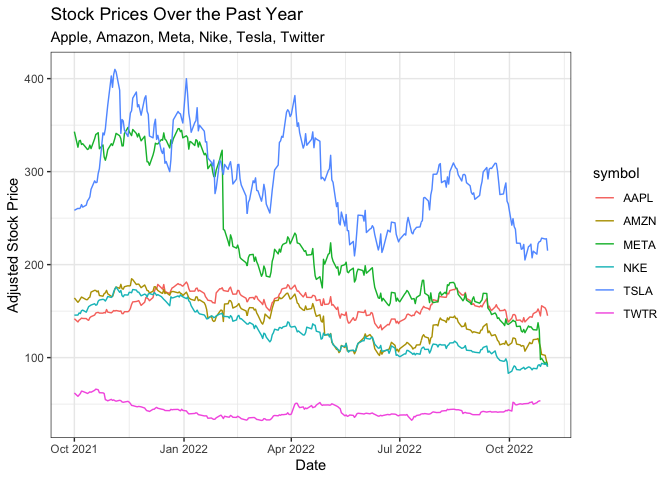
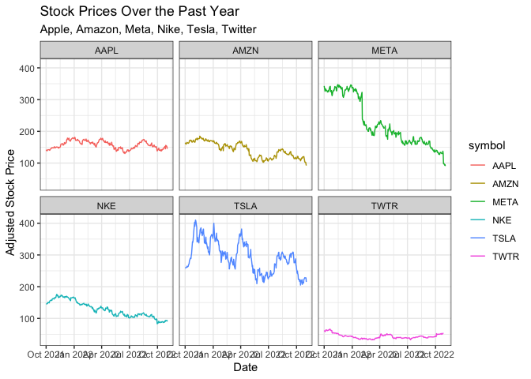

```r
library(tidyverse)
```

```
## ── Attaching packages ─────────────────────────────────────── tidyverse 1.3.1 ──
```

```
## ✔ ggplot2 3.3.5     ✔ purrr   0.3.4
## ✔ tibble  3.1.8     ✔ dplyr   1.0.8
## ✔ tidyr   1.2.0     ✔ stringr 1.4.0
## ✔ readr   2.1.2     ✔ forcats 0.5.1
```

```
## ── Conflicts ────────────────────────────────────────── tidyverse_conflicts() ──
## ✖ dplyr::filter() masks stats::filter()
## ✖ dplyr::lag()    masks stats::lag()
```

```r
library(knitr)
library(downloader)
library(dplyr)
library(lubridate)
```

```
## 
## Attaching package: 'lubridate'
```

```
## The following objects are masked from 'package:base':
## 
##     date, intersect, setdiff, union
```

```r
library(ggplot2)
library(grid)
library(corrplot)
```

```
## corrplot 0.92 loaded
```

```r
library(readr) 
library(haven)
library(readxl)
library(foreign)
library(stringr)
library(stringi)
library(tidyquant)
```

```
## Loading required package: PerformanceAnalytics
```

```
## Loading required package: xts
```

```
## Loading required package: zoo
```

```
## 
## Attaching package: 'zoo'
```

```
## The following objects are masked from 'package:base':
## 
##     as.Date, as.Date.numeric
```

```
## 
## Attaching package: 'xts'
```

```
## The following objects are masked from 'package:dplyr':
## 
##     first, last
```

```
## 
## Attaching package: 'PerformanceAnalytics'
```

```
## The following object is masked from 'package:graphics':
## 
##     legend
```

```
## Loading required package: quantmod
```

```
## Loading required package: TTR
```

```
## Registered S3 method overwritten by 'quantmod':
##   method            from
##   as.zoo.data.frame zoo
```

```r
library(timetk)
library(DT)
library(dygraphs)
```


```r
#dad's:
(Apple <- tq_get("AAPL", get = "stock.prices"))
```

```
## # A tibble: 2,728 × 8
##    symbol date        open  high   low close    volume adjusted
##    <chr>  <date>     <dbl> <dbl> <dbl> <dbl>     <dbl>    <dbl>
##  1 AAPL   2012-01-03  14.6  14.7  14.6  14.7 302220800     12.5
##  2 AAPL   2012-01-04  14.6  14.8  14.6  14.8 260022000     12.6
##  3 AAPL   2012-01-05  14.8  14.9  14.7  14.9 271269600     12.7
##  4 AAPL   2012-01-06  15.0  15.1  15.0  15.1 318292800     12.9
##  5 AAPL   2012-01-09  15.2  15.3  15.0  15.1 394024400     12.9
##  6 AAPL   2012-01-10  15.2  15.2  15.1  15.1 258196400     12.9
##  7 AAPL   2012-01-11  15.1  15.1  15.0  15.1 215084800     12.9
##  8 AAPL   2012-01-12  15.1  15.1  15.0  15.0 212587200     12.8
##  9 AAPL   2012-01-13  15.0  15.0  15.0  15.0 226021600     12.8
## 10 AAPL   2012-01-17  15.2  15.2  15.1  15.2 242897200     13.0
## # … with 2,718 more rows
```

```r
(Tesla <- tq_get("TSLA", get = "stock.prices"))
```

```
## # A tibble: 2,728 × 8
##    symbol date        open  high   low close   volume adjusted
##    <chr>  <date>     <dbl> <dbl> <dbl> <dbl>    <dbl>    <dbl>
##  1 TSLA   2012-01-03  1.93  1.97  1.84  1.87 13921500     1.87
##  2 TSLA   2012-01-04  1.88  1.91  1.83  1.85  9451500     1.85
##  3 TSLA   2012-01-05  1.85  1.86  1.79  1.81 15082500     1.81
##  4 TSLA   2012-01-06  1.81  1.85  1.76  1.79 14794500     1.79
##  5 TSLA   2012-01-09  1.8   1.83  1.74  1.82 13455000     1.82
##  6 TSLA   2012-01-10  1.83  1.85  1.82  1.84 10077000     1.84
##  7 TSLA   2012-01-11  1.84  1.89  1.82  1.88 10084500     1.88
##  8 TSLA   2012-01-12  1.90  1.91  1.85  1.88 10939500     1.88
##  9 TSLA   2012-01-13  1.89  1.9   1.51  1.52 82506000     1.52
## 10 TSLA   2012-01-17  1.77  1.82  1.76  1.77 69774000     1.77
## # … with 2,718 more rows
```

```r
(Nike <- tq_get("NKE", get = "stock.prices"))
```

```
## # A tibble: 2,728 × 8
##    symbol date        open  high   low close   volume adjusted
##    <chr>  <date>     <dbl> <dbl> <dbl> <dbl>    <dbl>    <dbl>
##  1 NKE    2012-01-03  24.3  24.5  24.2  24.2 10944400     21.4
##  2 NKE    2012-01-04  24.2  24.7  24.1  24.6  9440800     21.7
##  3 NKE    2012-01-05  24.4  24.6  24.2  24.5  8393200     21.7
##  4 NKE    2012-01-06  24.5  24.6  24.4  24.5  7760800     21.7
##  5 NKE    2012-01-09  24.5  24.7  24.4  24.6 10045600     21.8
##  6 NKE    2012-01-10  24.7  24.7  24.4  24.6  9812400     21.8
##  7 NKE    2012-01-11  24.6  24.6  24.4  24.5  7002800     21.7
##  8 NKE    2012-01-12  24.6  24.8  24.4  24.8  7516400     21.9
##  9 NKE    2012-01-13  24.6  24.7  24.5  24.6  6534000     21.7
## 10 NKE    2012-01-17  24.7  24.9  24.5  24.8  8242000     22.0
## # … with 2,718 more rows
```

```r
#mine:
(Amazon <- tq_get("AMZN", get = "stock.prices"))
```

```
## # A tibble: 2,728 × 8
##    symbol date        open  high   low close    volume adjusted
##    <chr>  <date>     <dbl> <dbl> <dbl> <dbl>     <dbl>    <dbl>
##  1 AMZN   2012-01-03  8.79  8.97  8.78  8.95 102216000     8.95
##  2 AMZN   2012-01-04  8.96  9.02  8.80  8.88  84104000     8.88
##  3 AMZN   2012-01-05  8.80  8.91  8.70  8.88  76182000     8.88
##  4 AMZN   2012-01-06  8.90  9.23  8.88  9.13 140168000     9.13
##  5 AMZN   2012-01-09  9.14  9.22  8.85  8.93 101138000     8.93
##  6 AMZN   2012-01-10  9.06  9.12  8.86  8.97  79716000     8.97
##  7 AMZN   2012-01-11  8.98  9.04  8.91  8.94  62054000     8.94
##  8 AMZN   2012-01-12  8.97  8.97  8.79  8.80 107716000     8.80
##  9 AMZN   2012-01-13  8.79  8.94  8.68  8.92  95070000     8.92
## 10 AMZN   2012-01-17  9.01  9.16  8.93  9.08 112890000     9.08
## # … with 2,718 more rows
```

```r
(Twitter <- tq_get("TWTR", get = "stock.prices"))
```

```
## # A tibble: 2,263 × 8
##    symbol date        open  high   low close    volume adjusted
##    <chr>  <date>     <dbl> <dbl> <dbl> <dbl>     <dbl>    <dbl>
##  1 TWTR   2013-11-07  45.1  50.1  44    44.9 117701670     44.9
##  2 TWTR   2013-11-08  45.9  46.9  40.7  41.7  27925307     41.7
##  3 TWTR   2013-11-11  40.5  43    39.4  42.9  16113941     42.9
##  4 TWTR   2013-11-12  43.7  43.8  41.8  41.9   6316755     41.9
##  5 TWTR   2013-11-13  41.0  42.9  40.8  42.6   8688325     42.6
##  6 TWTR   2013-11-14  42.3  45.7  42.2  44.7  11099433     44.7
##  7 TWTR   2013-11-15  45.2  45.3  43.4  44.0   8010663     44.0
##  8 TWTR   2013-11-18  43.5  44.0  40.8  41.1  12810624     41.1
##  9 TWTR   2013-11-19  41.4  41.9  40    41.8   7436616     41.8
## 10 TWTR   2013-11-20  41.4  41.8  40.5  41.0   5767325     41.0
## # … with 2,253 more rows
```

```r
(Facebook <- tq_get("META", get = "stock.prices"))
```

```
## # A tibble: 2,633 × 8
##    symbol date        open  high   low close    volume adjusted
##    <chr>  <date>     <dbl> <dbl> <dbl> <dbl>     <dbl>    <dbl>
##  1 META   2012-05-18  42.0  45    38    38.2 573576400     38.2
##  2 META   2012-05-21  36.5  36.7  33    34.0 168192700     34.0
##  3 META   2012-05-22  32.6  33.6  30.9  31   101786600     31  
##  4 META   2012-05-23  31.4  32.5  31.4  32    73600000     32  
##  5 META   2012-05-24  33.0  33.2  31.8  33.0  50237200     33.0
##  6 META   2012-05-25  32.9  33.0  31.1  31.9  37149800     31.9
##  7 META   2012-05-29  31.5  31.7  28.6  28.8  78063400     28.8
##  8 META   2012-05-30  28.7  29.5  27.9  28.2  57267900     28.2
##  9 META   2012-05-31  28.5  29.7  26.8  29.6 111639200     29.6
## 10 META   2012-06-01  28.9  29.2  27.4  27.7  41855500     27.7
## # … with 2,623 more rows
```

```r
end <- today()
start <- as.Date("2021-10-01")


dad <- tq_get(c("AAPL", "TSLA", "NKE"), get = "stock.prices", from = start, to = end)
me <- tq_get(c("AMZN", "TWTR", "META"), get = "stock.prices", from = start, to = end)
both <- tq_get(c("AAPL", "TSLA", "NKE", "AMZN", "TWTR", "META"), get = "stock.prices", from = start, to = end)
head(both)
```

```
## # A tibble: 6 × 8
##   symbol date        open  high   low close   volume adjusted
##   <chr>  <date>     <dbl> <dbl> <dbl> <dbl>    <dbl>    <dbl>
## 1 AAPL   2021-10-01  142.  143.  139.  143. 94639600     142.
## 2 AAPL   2021-10-04  142.  142.  138.  139. 98322000     138.
## 3 AAPL   2021-10-05  139.  142.  139.  141. 80861100     140.
## 4 AAPL   2021-10-06  139.  142.  138.  142  83221100     141.
## 5 AAPL   2021-10-07  143.  144.  143.  143. 61732700     142.
## 6 AAPL   2021-10-08  144.  144.  143.  143. 58773200     142.
```


```r
winner <- ggplot(data = both, mapping = aes(x = date, y = adjusted, color = symbol)) +
  geom_line() +
  labs(title = "Stock Prices Over the Past Year",
       subtitle = "Apple, Amazon, Meta, Nike, Tesla, Twitter",
       x = "Date",
       y = "Adjusted Stock Price") +
  theme_bw()
winner
```

```
## Warning: Removed 4 row(s) containing missing values (geom_path).
```

<!-- -->

```r
compare <- ggplot(data = both, mapping = aes(x = date, y = adjusted, color = symbol)) +
  geom_line() +
  facet_wrap(~symbol)+
  labs(title = "Stock Prices Over the Past Year",
     subtitle = "Apple, Amazon, Meta, Nike, Tesla, Twitter",
     x = "Date",
     y = "Adjusted Stock Price") +
 theme_bw()
compare
```

```
## Warning: Removed 4 row(s) containing missing values (geom_path).
```

<!-- -->

Overall, Dad is winning because of his TSLA stock.  Dad's Apple stock and Nike stock is similar in performance to my Amazon stock. My twitter stock is the lowest and my facebook stock started off strong but has been on a decline over the past year.  

My first visualization was a simple line graph comparing the six graphs over the past year using a line graph.  It allowed for alot of information to be displayed in one graph.  I can see approximately who was the winner has been over the past year and overall performance.  My second visualization, I still did a line graph but decided it would be helpful to facet by the stock so I could see better who the winner was.  
