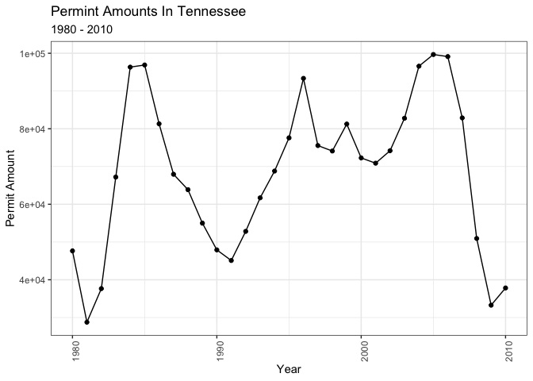

```r
library(tidyverse)
```

```
## ── Attaching packages ─────────────────────────────────────── tidyverse 1.3.1 ──
```

```
## ✔ ggplot2 3.3.5     ✔ purrr   0.3.4
## ✔ tibble  3.1.8     ✔ dplyr   1.0.8
## ✔ tidyr   1.2.0     ✔ stringr 1.4.0
## ✔ readr   2.1.2     ✔ forcats 0.5.1
```

```
## ── Conflicts ────────────────────────────────────────── tidyverse_conflicts() ──
## ✖ dplyr::filter() masks stats::filter()
## ✖ dplyr::lag()    masks stats::lag()
```

```r
library(knitr)
library(downloader)
library(dplyr)
library(lubridate)
```

```
## 
## Attaching package: 'lubridate'
```

```
## The following objects are masked from 'package:base':
## 
##     date, intersect, setdiff, union
```

```r
library(ggplot2)
library(grid)
library(corrplot)
```

```
## corrplot 0.92 loaded
```

```r
library(readr) 
library(haven)
library(readxl)
library(foreign)
library(stringr)
library(stringi)
library(tidyquant)
```

```
## Loading required package: PerformanceAnalytics
```

```
## Loading required package: xts
```

```
## Loading required package: zoo
```

```
## 
## Attaching package: 'zoo'
```

```
## The following objects are masked from 'package:base':
## 
##     as.Date, as.Date.numeric
```

```
## 
## Attaching package: 'xts'
```

```
## The following objects are masked from 'package:dplyr':
## 
##     first, last
```

```
## 
## Attaching package: 'PerformanceAnalytics'
```

```
## The following object is masked from 'package:graphics':
## 
##     legend
```

```
## Loading required package: quantmod
```

```
## Loading required package: TTR
```

```
## Registered S3 method overwritten by 'quantmod':
##   method            from
##   as.zoo.data.frame zoo
```

```r
library(timetk)
library(DT)
library(dygraphs)
library(sf)
```

```
## Linking to GEOS 3.10.2, GDAL 3.4.2, PROJ 8.2.1; sf_use_s2() is TRUE
```

```r
library(USAboundaries)
library(USAboundariesData)
library(ggsflabel)
```

```
## 
## Attaching package: 'ggsflabel'
```

```
## The following objects are masked from 'package:ggplot2':
## 
##     geom_sf_label, geom_sf_text, StatSfCoordinates
```

```r
library(maps)
```

```
## 
## Attaching package: 'maps'
```

```
## The following object is masked from 'package:purrr':
## 
##     map
```


```r
temp <- tempfile()
download.file("https://github.com/WJC-Data-Science/DTS350/raw/master/permits.csv", "temp")
permits_dat <- read_csv("temp")
```

```
## New names:
## Rows: 327422 Columns: 8
## ── Column specification
## ──────────────────────────────────────────────────────── Delimiter: "," chr
## (3): StateAbbr, countyname, variable dbl (5): ...1, state, county, year, value
## ℹ Use `spec()` to retrieve the full column specification for this data. ℹ
## Specify the column types or set `show_col_types = FALSE` to quiet this message.
## • `` -> `...1`
```

```r
head(permits_dat)
```

```
## # A tibble: 6 × 8
##    ...1 state StateAbbr county countyname     variable     year value
##   <dbl> <dbl> <chr>      <dbl> <chr>          <chr>       <dbl> <dbl>
## 1     1     1 AL             1 Autauga County All Permits  2010   191
## 2     2     1 AL             1 Autauga County All Permits  2009   110
## 3     3     1 AL             1 Autauga County All Permits  2008   173
## 4     4     1 AL             1 Autauga County All Permits  2007   260
## 5     5     1 AL             1 Autauga County All Permits  2006   347
## 6     6     1 AL             1 Autauga County All Permits  2005   313
```

```r
counties <- us_counties()
```


```r
FIPS <-permits_dat %>%
  mutate(state=as.character(state), stateFIPS=str_pad(state, 2,pad="0")) %>%
  mutate(county=as.character(county), countyFIPS=str_pad(county, 3,pad="0"))

FIPS$geoid <- paste0(FIPS$stateFIPS, FIPS$countyFIPS)

head(FIPS)
```

```
## # A tibble: 6 × 11
##    ...1 state StateAbbr county countyname     variable     year value stateFIPS
##   <dbl> <chr> <chr>     <chr>  <chr>          <chr>       <dbl> <dbl> <chr>    
## 1     1 1     AL        1      Autauga County All Permits  2010   191 01       
## 2     2 1     AL        1      Autauga County All Permits  2009   110 01       
## 3     3 1     AL        1      Autauga County All Permits  2008   173 01       
## 4     4 1     AL        1      Autauga County All Permits  2007   260 01       
## 5     5 1     AL        1      Autauga County All Permits  2006   347 01       
## 6     6 1     AL        1      Autauga County All Permits  2005   313 01       
## # … with 2 more variables: countyFIPS <chr>, geoid <chr>
```

```r
FIPS_county <- merge(FIPS,counties, by = "geoid") %>%
  group_by(state_name, StateAbbr, year) %>%
  summarise(across(value, sum))
```

```
## `summarise()` has grouped output by 'state_name', 'StateAbbr'. You can override
## using the `.groups` argument.
```

```r
head(FIPS_county)
```

```
## # A tibble: 6 × 4
## # Groups:   state_name, StateAbbr [1]
##   state_name StateAbbr  year value
##   <chr>      <chr>     <dbl> <dbl>
## 1 Alabama    AL         1980 38954
## 2 Alabama    AL         1981 24592
## 3 Alabama    AL         1982 21454
## 4 Alabama    AL         1983 43537
## 5 Alabama    AL         1984 37676
## 6 Alabama    AL         1985 41725
```

```r
summary(FIPS_county)
```

```
##   state_name         StateAbbr              year          value       
##  Length:1580        Length:1580        Min.   :1980   Min.   :    34  
##  Class :character   Class :character   1st Qu.:1987   1st Qu.: 13370  
##  Mode  :character   Mode  :character   Median :1995   Median : 36560  
##                                        Mean   :1995   Mean   : 63890  
##                                        3rd Qu.:2003   3rd Qu.: 81163  
##                                        Max.   :2010   Max.   :798193
```


```r
USA_facet <- FIPS_county %>%
  ggplot(data=FIPS_county, mapping = aes(x = year, y = value, color = StateAbbr)) +
  geom_line() +
  facet_wrap(~state_name) +
  labs(title = "Permint Amounts Across States",
       subtitle = "1980 - 2010",
       x = "Year", 
       y = "Permit Amount") +
  theme_bw() +
  theme(axis.text.x = element_text(angle = 90, hjust = 1))
USA_facet
```

<!-- -->

```r
USA_combine <- FIPS_county %>%
  ggplot(data=FIPS_county, mapping = aes(x = year, y = value, color = StateAbbr)) +
  geom_line() +
  labs(title = "Permint Amounts Across States",
       subtitle = "1980 - 2010",
       x = "Year", 
       y = "Permit Amount") +
  theme_bw() +
  theme(axis.text.x = element_text(angle = 90, hjust = 1))
USA_combine
```

<!-- -->

```r
Tennessee <- FIPS_county %>%
  filter(StateAbbr == "TN") %>%
  ggplot(mapping = aes(x = year, y = value)) +
  geom_line() +
  geom_point() +
  labs(title = "Permint Amounts In Tennessee",
       subtitle = "1980 - 2010",
       x = "Year", 
       y = "Permit Amount") +
  theme_bw() +
  theme(axis.text.x = element_text(angle = 90, hjust = 1))
Tennessee
```

<!-- -->

```r
Missouri <- FIPS_county %>%
  filter(StateAbbr == "MO") %>%
  ggplot(mapping = aes(x = year, y = value)) +
  geom_line() +
  geom_point() +
  labs(title = "Permint Amounts In Missouri",
       subtitle = "1980 - 2010",
       x = "Year", 
       y = "Permit Amount") +
  theme_bw() +
  theme(axis.text.x = element_text(angle = 90, hjust = 1))
Missouri
```

<!-- -->
To show the permit amounts overtime I used line graphs for all three of my graphs.  You can easily see the trends from 1980 - 2010.  We can see from the first graph that there was overall a spike around 1986 and 2005.  There were crashed after 1986 and in 2007. 
