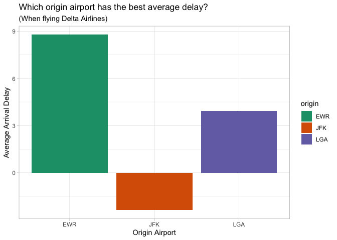
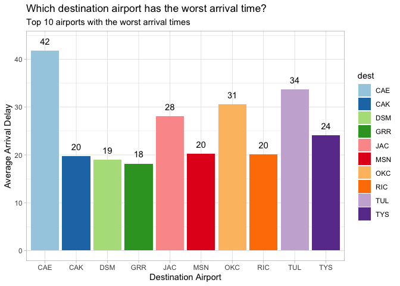

load packages

```r
library(tidyverse)
```

```
## ── Attaching packages ─────────────────────────────────────── tidyverse 1.3.1 ──
```

```
## ✓ ggplot2 3.3.5     ✓ purrr   0.3.4
## ✓ tibble  3.1.6     ✓ dplyr   1.0.8
## ✓ tidyr   1.2.0     ✓ stringr 1.4.0
## ✓ readr   2.1.2     ✓ forcats 0.5.1
```

```
## ── Conflicts ────────────────────────────────────────── tidyverse_conflicts() ──
## x dplyr::filter() masks stats::filter()
## x dplyr::lag()    masks stats::lag()
```

```r
library(knitr)
library(downloader)
library(dplyr)
library(ggplot2)
library(nycflights13)
```

QUESTION 2:
Which origin airport is best to minimize my chances of a late arrival when I am using Delta Airlines?

```r
str(flights)
```

```
## tibble [336,776 × 19] (S3: tbl_df/tbl/data.frame)
##  $ year          : int [1:336776] 2013 2013 2013 2013 2013 2013 2013 2013 2013 2013 ...
##  $ month         : int [1:336776] 1 1 1 1 1 1 1 1 1 1 ...
##  $ day           : int [1:336776] 1 1 1 1 1 1 1 1 1 1 ...
##  $ dep_time      : int [1:336776] 517 533 542 544 554 554 555 557 557 558 ...
##  $ sched_dep_time: int [1:336776] 515 529 540 545 600 558 600 600 600 600 ...
##  $ dep_delay     : num [1:336776] 2 4 2 -1 -6 -4 -5 -3 -3 -2 ...
##  $ arr_time      : int [1:336776] 830 850 923 1004 812 740 913 709 838 753 ...
##  $ sched_arr_time: int [1:336776] 819 830 850 1022 837 728 854 723 846 745 ...
##  $ arr_delay     : num [1:336776] 11 20 33 -18 -25 12 19 -14 -8 8 ...
##  $ carrier       : chr [1:336776] "UA" "UA" "AA" "B6" ...
##  $ flight        : int [1:336776] 1545 1714 1141 725 461 1696 507 5708 79 301 ...
##  $ tailnum       : chr [1:336776] "N14228" "N24211" "N619AA" "N804JB" ...
##  $ origin        : chr [1:336776] "EWR" "LGA" "JFK" "JFK" ...
##  $ dest          : chr [1:336776] "IAH" "IAH" "MIA" "BQN" ...
##  $ air_time      : num [1:336776] 227 227 160 183 116 150 158 53 140 138 ...
##  $ distance      : num [1:336776] 1400 1416 1089 1576 762 ...
##  $ hour          : num [1:336776] 5 5 5 5 6 5 6 6 6 6 ...
##  $ minute        : num [1:336776] 15 29 40 45 0 58 0 0 0 0 ...
##  $ time_hour     : POSIXct[1:336776], format: "2013-01-01 05:00:00" "2013-01-01 05:00:00" ...
```

```r
?flights

delta_airline<- filter(flights, carrier == "DL") %>%
  select(arr_delay, origin) %>%
  drop_na() %>%
  group_by(origin) %>%
  summarise(avg_delay = mean(arr_delay))


delta_airline
```

```
## # A tibble: 3 × 2
##   origin avg_delay
##   <chr>      <dbl>
## 1 EWR         8.78
## 2 JFK        -2.38
## 3 LGA         3.93
```
filter out delta airlines, then select the arrival delays and the origin to answer the question.
group by the origin to determine which origin of airport has the least likelyhood to have a delay.
we can see that EWR has a 8.78 min average delay, JFK has a 3.93 average delay, and JFK actually has a negative "average delay", so JFK on average actually arrives 2.38 minutes before arrival


```r
ggplot(data = delta_airline, aes(y= avg_delay, x= origin, fill = origin)) +
  geom_bar(stat = "identity", position = "dodge") +
  scale_fill_brewer(palette = "Dark2") +
  labs(y="Average Arrival Delay", x= "Origin Airport", title= "Which origin airport has the best average delay?", subtitle = "(When flying Delta Airlines)") +
  theme_light()
```

<!-- -->


QUESTION 3:
Which destination airport is the worst (you decide on the metric for worst) airport for arrival time?


```r
worst_delay <- flights %>%
  select(arr_delay, dest) %>%
  drop_na() %>%
  group_by(dest) %>%
  summarise(avg_delay = mean(arr_delay)) %>%
  arrange(desc(avg_delay))

worst_delay
```

```
## # A tibble: 104 × 2
##    dest  avg_delay
##    <chr>     <dbl>
##  1 CAE        41.8
##  2 TUL        33.7
##  3 OKC        30.6
##  4 JAC        28.1
##  5 TYS        24.1
##  6 MSN        20.2
##  7 RIC        20.1
##  8 CAK        19.7
##  9 DSM        19.0
## 10 GRR        18.2
## # … with 94 more rows
```
I chose to decide which destination airport was the worst based on the average arrival delay to that airport.  You can see that a destination of CAE (an airport in Lexington County, South Carolina) has an average arrival delay of nearly 42 minutes.  That is a significant (and the worst) delay of all destination airports. 


```r
top_worst_delays <- worst_delay %>%
  filter(avg_delay >= 18)

ggplot(data = top_worst_delays, aes(y= avg_delay, x= dest, fill = dest)) +
  geom_bar(stat = "identity", position = "dodge") +
  geom_text(aes(label=round(avg_delay)), nudge_y = 2) +
  scale_fill_brewer(palette = "Paired") +
  labs(y="Average Arrival Delay", x= "Destination Airport", title= "Which destination airport has the worst arrival time?", subtitle = "Top 10 airports with the worst arrival times") +
  theme_light()
```

<!-- -->

