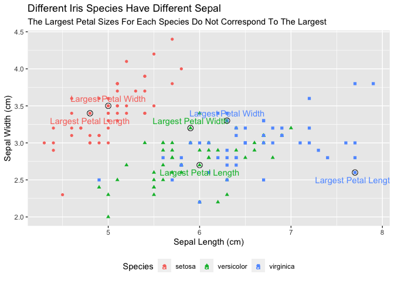
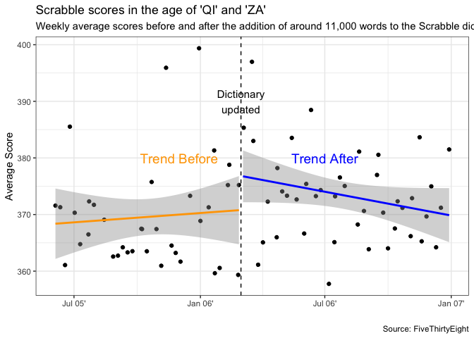

load packages

```r
library(tidyverse)
```

```
## ── Attaching packages ─────────────────────────────────────── tidyverse 1.3.1 ──
```

```
## ✓ ggplot2 3.3.5     ✓ purrr   0.3.4
## ✓ tibble  3.1.6     ✓ dplyr   1.0.8
## ✓ tidyr   1.2.0     ✓ stringr 1.4.0
## ✓ readr   2.1.2     ✓ forcats 0.5.1
```

```
## ── Conflicts ────────────────────────────────────────── tidyverse_conflicts() ──
## x dplyr::filter() masks stats::filter()
## x dplyr::lag()    masks stats::lag()
```

```r
library(knitr)
library(downloader)
library(dplyr)
library(lubridate)
```

```
## 
## Attaching package: 'lubridate'
```

```
## The following objects are masked from 'package:base':
## 
##     date, intersect, setdiff, union
```


```r
head(iris)
```

```
##   Sepal.Length Sepal.Width Petal.Length Petal.Width Species
## 1          5.1         3.5          1.4         0.2  setosa
## 2          4.9         3.0          1.4         0.2  setosa
## 3          4.7         3.2          1.3         0.2  setosa
## 4          4.6         3.1          1.5         0.2  setosa
## 5          5.0         3.6          1.4         0.2  setosa
## 6          5.4         3.9          1.7         0.4  setosa
```

```r
mutate(iris, 'Label')
```

```
##     Sepal.Length Sepal.Width Petal.Length Petal.Width    Species "Label"
## 1            5.1         3.5          1.4         0.2     setosa   Label
## 2            4.9         3.0          1.4         0.2     setosa   Label
## 3            4.7         3.2          1.3         0.2     setosa   Label
## 4            4.6         3.1          1.5         0.2     setosa   Label
## 5            5.0         3.6          1.4         0.2     setosa   Label
## 6            5.4         3.9          1.7         0.4     setosa   Label
## 7            4.6         3.4          1.4         0.3     setosa   Label
## 8            5.0         3.4          1.5         0.2     setosa   Label
## 9            4.4         2.9          1.4         0.2     setosa   Label
## 10           4.9         3.1          1.5         0.1     setosa   Label
## 11           5.4         3.7          1.5         0.2     setosa   Label
## 12           4.8         3.4          1.6         0.2     setosa   Label
## 13           4.8         3.0          1.4         0.1     setosa   Label
## 14           4.3         3.0          1.1         0.1     setosa   Label
## 15           5.8         4.0          1.2         0.2     setosa   Label
## 16           5.7         4.4          1.5         0.4     setosa   Label
## 17           5.4         3.9          1.3         0.4     setosa   Label
## 18           5.1         3.5          1.4         0.3     setosa   Label
## 19           5.7         3.8          1.7         0.3     setosa   Label
## 20           5.1         3.8          1.5         0.3     setosa   Label
## 21           5.4         3.4          1.7         0.2     setosa   Label
## 22           5.1         3.7          1.5         0.4     setosa   Label
## 23           4.6         3.6          1.0         0.2     setosa   Label
## 24           5.1         3.3          1.7         0.5     setosa   Label
## 25           4.8         3.4          1.9         0.2     setosa   Label
## 26           5.0         3.0          1.6         0.2     setosa   Label
## 27           5.0         3.4          1.6         0.4     setosa   Label
## 28           5.2         3.5          1.5         0.2     setosa   Label
## 29           5.2         3.4          1.4         0.2     setosa   Label
## 30           4.7         3.2          1.6         0.2     setosa   Label
## 31           4.8         3.1          1.6         0.2     setosa   Label
## 32           5.4         3.4          1.5         0.4     setosa   Label
## 33           5.2         4.1          1.5         0.1     setosa   Label
## 34           5.5         4.2          1.4         0.2     setosa   Label
## 35           4.9         3.1          1.5         0.2     setosa   Label
## 36           5.0         3.2          1.2         0.2     setosa   Label
## 37           5.5         3.5          1.3         0.2     setosa   Label
## 38           4.9         3.6          1.4         0.1     setosa   Label
## 39           4.4         3.0          1.3         0.2     setosa   Label
## 40           5.1         3.4          1.5         0.2     setosa   Label
## 41           5.0         3.5          1.3         0.3     setosa   Label
## 42           4.5         2.3          1.3         0.3     setosa   Label
## 43           4.4         3.2          1.3         0.2     setosa   Label
## 44           5.0         3.5          1.6         0.6     setosa   Label
## 45           5.1         3.8          1.9         0.4     setosa   Label
## 46           4.8         3.0          1.4         0.3     setosa   Label
## 47           5.1         3.8          1.6         0.2     setosa   Label
## 48           4.6         3.2          1.4         0.2     setosa   Label
## 49           5.3         3.7          1.5         0.2     setosa   Label
## 50           5.0         3.3          1.4         0.2     setosa   Label
## 51           7.0         3.2          4.7         1.4 versicolor   Label
## 52           6.4         3.2          4.5         1.5 versicolor   Label
## 53           6.9         3.1          4.9         1.5 versicolor   Label
## 54           5.5         2.3          4.0         1.3 versicolor   Label
## 55           6.5         2.8          4.6         1.5 versicolor   Label
## 56           5.7         2.8          4.5         1.3 versicolor   Label
## 57           6.3         3.3          4.7         1.6 versicolor   Label
## 58           4.9         2.4          3.3         1.0 versicolor   Label
## 59           6.6         2.9          4.6         1.3 versicolor   Label
## 60           5.2         2.7          3.9         1.4 versicolor   Label
## 61           5.0         2.0          3.5         1.0 versicolor   Label
## 62           5.9         3.0          4.2         1.5 versicolor   Label
## 63           6.0         2.2          4.0         1.0 versicolor   Label
## 64           6.1         2.9          4.7         1.4 versicolor   Label
## 65           5.6         2.9          3.6         1.3 versicolor   Label
## 66           6.7         3.1          4.4         1.4 versicolor   Label
## 67           5.6         3.0          4.5         1.5 versicolor   Label
## 68           5.8         2.7          4.1         1.0 versicolor   Label
## 69           6.2         2.2          4.5         1.5 versicolor   Label
## 70           5.6         2.5          3.9         1.1 versicolor   Label
## 71           5.9         3.2          4.8         1.8 versicolor   Label
## 72           6.1         2.8          4.0         1.3 versicolor   Label
## 73           6.3         2.5          4.9         1.5 versicolor   Label
## 74           6.1         2.8          4.7         1.2 versicolor   Label
## 75           6.4         2.9          4.3         1.3 versicolor   Label
## 76           6.6         3.0          4.4         1.4 versicolor   Label
## 77           6.8         2.8          4.8         1.4 versicolor   Label
## 78           6.7         3.0          5.0         1.7 versicolor   Label
## 79           6.0         2.9          4.5         1.5 versicolor   Label
## 80           5.7         2.6          3.5         1.0 versicolor   Label
## 81           5.5         2.4          3.8         1.1 versicolor   Label
## 82           5.5         2.4          3.7         1.0 versicolor   Label
## 83           5.8         2.7          3.9         1.2 versicolor   Label
## 84           6.0         2.7          5.1         1.6 versicolor   Label
## 85           5.4         3.0          4.5         1.5 versicolor   Label
## 86           6.0         3.4          4.5         1.6 versicolor   Label
## 87           6.7         3.1          4.7         1.5 versicolor   Label
## 88           6.3         2.3          4.4         1.3 versicolor   Label
## 89           5.6         3.0          4.1         1.3 versicolor   Label
## 90           5.5         2.5          4.0         1.3 versicolor   Label
## 91           5.5         2.6          4.4         1.2 versicolor   Label
## 92           6.1         3.0          4.6         1.4 versicolor   Label
## 93           5.8         2.6          4.0         1.2 versicolor   Label
## 94           5.0         2.3          3.3         1.0 versicolor   Label
## 95           5.6         2.7          4.2         1.3 versicolor   Label
## 96           5.7         3.0          4.2         1.2 versicolor   Label
## 97           5.7         2.9          4.2         1.3 versicolor   Label
## 98           6.2         2.9          4.3         1.3 versicolor   Label
## 99           5.1         2.5          3.0         1.1 versicolor   Label
## 100          5.7         2.8          4.1         1.3 versicolor   Label
## 101          6.3         3.3          6.0         2.5  virginica   Label
## 102          5.8         2.7          5.1         1.9  virginica   Label
## 103          7.1         3.0          5.9         2.1  virginica   Label
## 104          6.3         2.9          5.6         1.8  virginica   Label
## 105          6.5         3.0          5.8         2.2  virginica   Label
## 106          7.6         3.0          6.6         2.1  virginica   Label
## 107          4.9         2.5          4.5         1.7  virginica   Label
## 108          7.3         2.9          6.3         1.8  virginica   Label
## 109          6.7         2.5          5.8         1.8  virginica   Label
## 110          7.2         3.6          6.1         2.5  virginica   Label
## 111          6.5         3.2          5.1         2.0  virginica   Label
## 112          6.4         2.7          5.3         1.9  virginica   Label
## 113          6.8         3.0          5.5         2.1  virginica   Label
## 114          5.7         2.5          5.0         2.0  virginica   Label
## 115          5.8         2.8          5.1         2.4  virginica   Label
## 116          6.4         3.2          5.3         2.3  virginica   Label
## 117          6.5         3.0          5.5         1.8  virginica   Label
## 118          7.7         3.8          6.7         2.2  virginica   Label
## 119          7.7         2.6          6.9         2.3  virginica   Label
## 120          6.0         2.2          5.0         1.5  virginica   Label
## 121          6.9         3.2          5.7         2.3  virginica   Label
## 122          5.6         2.8          4.9         2.0  virginica   Label
## 123          7.7         2.8          6.7         2.0  virginica   Label
## 124          6.3         2.7          4.9         1.8  virginica   Label
## 125          6.7         3.3          5.7         2.1  virginica   Label
## 126          7.2         3.2          6.0         1.8  virginica   Label
## 127          6.2         2.8          4.8         1.8  virginica   Label
## 128          6.1         3.0          4.9         1.8  virginica   Label
## 129          6.4         2.8          5.6         2.1  virginica   Label
## 130          7.2         3.0          5.8         1.6  virginica   Label
## 131          7.4         2.8          6.1         1.9  virginica   Label
## 132          7.9         3.8          6.4         2.0  virginica   Label
## 133          6.4         2.8          5.6         2.2  virginica   Label
## 134          6.3         2.8          5.1         1.5  virginica   Label
## 135          6.1         2.6          5.6         1.4  virginica   Label
## 136          7.7         3.0          6.1         2.3  virginica   Label
## 137          6.3         3.4          5.6         2.4  virginica   Label
## 138          6.4         3.1          5.5         1.8  virginica   Label
## 139          6.0         3.0          4.8         1.8  virginica   Label
## 140          6.9         3.1          5.4         2.1  virginica   Label
## 141          6.7         3.1          5.6         2.4  virginica   Label
## 142          6.9         3.1          5.1         2.3  virginica   Label
## 143          5.8         2.7          5.1         1.9  virginica   Label
## 144          6.8         3.2          5.9         2.3  virginica   Label
## 145          6.7         3.3          5.7         2.5  virginica   Label
## 146          6.7         3.0          5.2         2.3  virginica   Label
## 147          6.3         2.5          5.0         1.9  virginica   Label
## 148          6.5         3.0          5.2         2.0  virginica   Label
## 149          6.2         3.4          5.4         2.3  virginica   Label
## 150          5.9         3.0          5.1         1.8  virginica   Label
```

```r
large_petal_width <- iris %>%
  group_by(Species) %>%
  filter(row_number(desc(Petal.Width)) == 1) %>%
  mutate(Label = 'Largest Petal Width')
large_petal_length <- iris %>%
  group_by(Species) %>%
  filter(row_number(desc(Petal.Length)) == 1) %>%
  mutate(Label = 'Largest Petal Length')


ggplot(data = iris, mapping = aes(x = Sepal.Length, 
                                  y = Sepal.Width)) +
  geom_point(aes(color = Species, shape = Species)) +
    geom_point(size = 3, shape = 1, color = "black", data = large_petal_length) +
    geom_point(size = 3, shape = 1, color = "black", data = large_petal_width) +
  geom_text(aes(color = Species, label = Label), nudge_y=-.1, data = large_petal_length) +
  geom_text(aes(color = Species, label = Label), nudge_y=.1, data = large_petal_width) +
  labs(x = "Sepal Length (cm)",
       y = "Sepal Width (cm)",
       title = "Different Iris Species Have Different Sepal",
       subtitle = "The Largest Petal Sizes For Each Species Do Not Correspond To The Largest") + 
  theme(legend.position = "bottom")
```

<!-- -->

Scrabble visual 

```r
download.file("https://github.com/fivethirtyeight/data/raw/master/scrabble-games/scrabble_games.csv", "Scrabble")
scrabble_dat <- read_csv("Scrabble")
```

```
## Rows: 1542642 Columns: 19
## ── Column specification ────────────────────────────────────────────────────────
## Delimiter: ","
## chr   (2): winnername, losername
## dbl  (14): gameid, tourneyid, winnerid, winnerscore, winneroldrating, winner...
## lgl   (2): tie, lexicon
## date  (1): date
## 
## ℹ Use `spec()` to retrieve the full column specification for this data.
## ℹ Specify the column types or set `show_col_types = FALSE` to quiet this message.
```

```r
head(scrabble_dat)
```

```
## # A tibble: 6 × 19
##   gameid tourneyid tie   winnerid winnername         winnerscore winneroldrating
##    <dbl>     <dbl> <lgl>    <dbl> <chr>                    <dbl>           <dbl>
## 1      1         1 FALSE      268 Harriette Lakerni…           0            1568
## 2      2         1 FALSE      268 Harriette Lakerni…           0            1568
## 3      3         1 FALSE      268 Harriette Lakerni…           0            1568
## 4      4         1 FALSE      268 Harriette Lakerni…           0            1568
## 5      5         1 FALSE      268 Harriette Lakerni…           0            1568
## 6      6         1 FALSE      268 Harriette Lakerni…           0            1568
## # … with 12 more variables: winnernewrating <dbl>, winnerpos <dbl>,
## #   loserid <dbl>, losername <chr>, loserscore <dbl>, loseroldrating <dbl>,
## #   losernewrating <dbl>, loserpos <dbl>, round <dbl>, division <dbl>,
## #   date <date>, lexicon <lgl>
```

```r
ScrabbleAll <- scrabble_dat %>%
  select(date, winnerscore, loserscore) %>%
  pivot_longer(c("winnerscore","loserscore"), names_to = "win-loss", values_to = "score") %>%
  filter(score > 0) %>%
  mutate(year = year(date),
         week = week(date)
  )

head(ScrabbleAll)
```

```
## # A tibble: 6 × 5
##   date       `win-loss`  score  year  week
##   <date>     <chr>       <dbl> <dbl> <dbl>
## 1 1999-01-15 winnerscore   521  1999     3
## 2 1999-01-15 loserscore    237  1999     3
## 3 1999-01-15 winnerscore   488  1999     3
## 4 1999-01-15 loserscore    262  1999     3
## 5 1999-01-15 winnerscore   465  1999     3
## 6 1999-01-15 loserscore    330  1999     3
```

```r
average_score <- ScrabbleAll %>%
  filter(date > "2005-06-01" & date < "2006-12-31") %>%
  group_by(year, week) %>%
  summarise(avglength = mean(score), Date = min(date))
```

```
## `summarise()` has grouped output by 'year'. You can override using the
## `.groups` argument.
```

```r
head(average_score)
```

```
## # A tibble: 6 × 4
## # Groups:   year [1]
##    year  week avglength Date      
##   <dbl> <dbl>     <dbl> <date>    
## 1  2005    23      372. 2005-06-04
## 2  2005    24      371. 2005-06-11
## 3  2005    25      361. 2005-06-18
## 4  2005    26      386. 2005-06-25
## 5  2005    27      370. 2005-07-02
## 6  2005    28      365. 2005-07-10
```

```r
tail(average_score)
```

```
## # A tibble: 6 × 4
## # Groups:   year [1]
##    year  week avglength Date      
##   <dbl> <dbl>     <dbl> <date>    
## 1  2006    47      365. 2006-11-19
## 2  2006    48      370. 2006-11-26
## 3  2006    49      375. 2006-12-03
## 4  2006    50      364. 2006-12-10
## 5  2006    51      371. 2006-12-17
## 6  2006    52      381. 2006-12-29
```

```r
before_add_avg <- ScrabbleAll %>%
  filter(date <= "2006-03-01" & date > "2005-06-01") %>%
  group_by(year, week) %>%
  summarise(avglength = mean (score), Date = min(date))
```

```
## `summarise()` has grouped output by 'year'. You can override using the
## `.groups` argument.
```

```r
head(before_add_avg)
```

```
## # A tibble: 6 × 4
## # Groups:   year [1]
##    year  week avglength Date      
##   <dbl> <dbl>     <dbl> <date>    
## 1  2005    23      372. 2005-06-04
## 2  2005    24      371. 2005-06-11
## 3  2005    25      361. 2005-06-18
## 4  2005    26      386. 2005-06-25
## 5  2005    27      370. 2005-07-02
## 6  2005    28      365. 2005-07-10
```

```r
after_add_avg <- ScrabbleAll %>%
  filter(date > "2006-03-01" & date < "2006-12-31") %>%
  group_by(year, week) %>%
  summarise(avglength = mean (score), Date = min(date))
```

```
## `summarise()` has grouped output by 'year'. You can override using the
## `.groups` argument.
```

```r
head(after_add_avg)
```

```
## # A tibble: 6 × 4
## # Groups:   year [1]
##    year  week avglength Date      
##   <dbl> <dbl>     <dbl> <date>    
## 1  2006     9      383. 2006-03-04
## 2  2006    10      385. 2006-03-05
## 3  2006    11      397. 2006-03-17
## 4  2006    12      383  2006-03-19
## 5  2006    13      361. 2006-03-26
## 6  2006    14      365. 2006-04-02
```

```r
ggplot(data = average_score, mapping = aes(x= Date, y = avglength)) +
  geom_point() +
  geom_smooth(data = before_add_avg, method = "lm", color = "Orange") +
  annotate("text", x=ymd(20051201), y=380, label="Trend Before", size=5, color="orange") +
  geom_smooth(data = after_add_avg, method = "lm", color = "Blue") +
  annotate("text", x=ymd(20060701), y=380, label="Trend After", size=5, color="blue") +
  geom_vline(xintercept=ymd(20060301), linetype = 2) +
  labs(x = " ", y = "Average Score", title = "Scrabble scores in the age of 'QI' and 'ZA'", subtitle = "Weekly average scores before and after the addition of around 11,000 words to the Scrabble dictionary", caption = "Source: FiveThirtyEight") +
  annotate("text", x=ymd(20060301), y = 390, label = "Dictionary\nupdated", size = 4) +
  scale_x_date(date_labels = "%b %y'") +
  theme_bw()
```

```
## `geom_smooth()` using formula 'y ~ x'
## `geom_smooth()` using formula 'y ~ x'
```

<!-- -->

