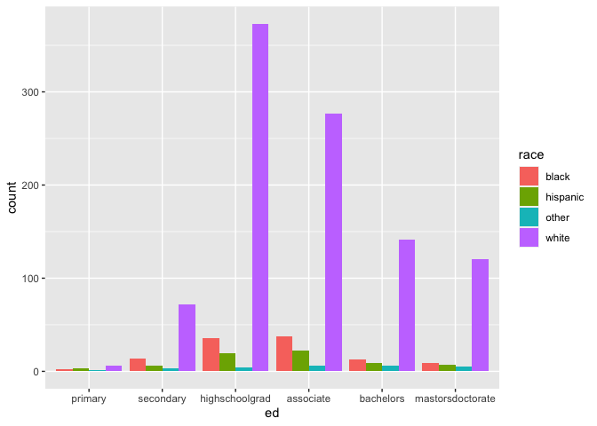
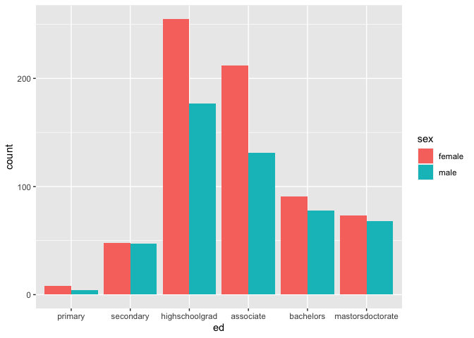
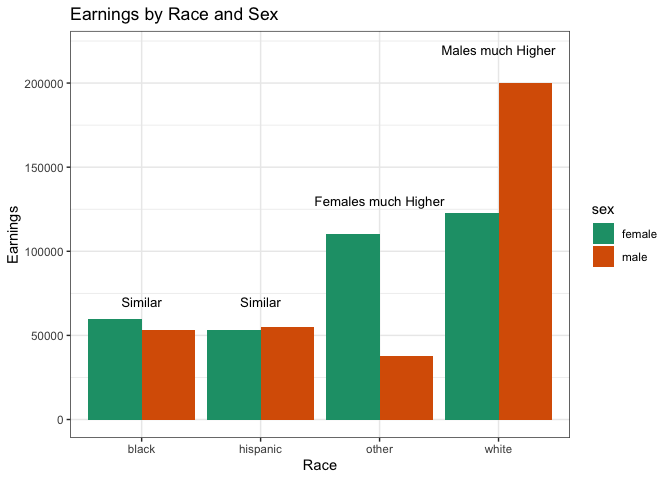

load packages

```r
library(tidyverse)
```

```
## ── Attaching packages ─────────────────────────────────────── tidyverse 1.3.1 ──
```

```
## ✓ ggplot2 3.3.5     ✓ purrr   0.3.4
## ✓ tibble  3.1.6     ✓ dplyr   1.0.8
## ✓ tidyr   1.2.0     ✓ stringr 1.4.0
## ✓ readr   2.1.2     ✓ forcats 0.5.1
```

```
## ── Conflicts ────────────────────────────────────────── tidyverse_conflicts() ──
## x dplyr::filter() masks stats::filter()
## x dplyr::lag()    masks stats::lag()
```

```r
library(knitr)
library(downloader)
library(dplyr)
library(ggplot2)
```


dowload data and create dataset

```r
getwd()
```

```
## [1] "/Users/clairehays/Desktop/DTS 350/HaysClaire/Week4/Task7"
```

```r
height_dat <- read_csv("heights.csv")
```

```
## Rows: 1192 Columns: 6
## ── Column specification ────────────────────────────────────────────────────────
## Delimiter: ","
## chr (2): sex, race
## dbl (4): earn, height, ed, age
## 
## ℹ Use `spec()` to retrieve the full column specification for this data.
## ℹ Specify the column types or set `show_col_types = FALSE` to quiet this message.
```

```r
str(height_dat)
```

```
## spec_tbl_df [1,192 × 6] (S3: spec_tbl_df/tbl_df/tbl/data.frame)
##  $ earn  : num [1:1192] 50000 60000 30000 50000 51000 9000 29000 32000 2000 27000 ...
##  $ height: num [1:1192] 74.4 65.5 63.6 63.1 63.4 ...
##  $ sex   : chr [1:1192] "male" "female" "female" "female" ...
##  $ ed    : num [1:1192] 16 16 16 16 17 15 12 17 15 12 ...
##  $ age   : num [1:1192] 45 58 29 91 39 26 49 46 21 26 ...
##  $ race  : chr [1:1192] "white" "white" "white" "other" ...
##  - attr(*, "spec")=
##   .. cols(
##   ..   earn = col_double(),
##   ..   height = col_double(),
##   ..   sex = col_character(),
##   ..   ed = col_double(),
##   ..   age = col_double(),
##   ..   race = col_character()
##   .. )
##  - attr(*, "problems")=<externalptr>
```

```r
HeightEd <- height_dat %>%
  mutate(ed = fct_collapse(as.factor(ed),
                           primary = c("3","4","5","6"),
                           secondary = c("7","8","9","10","11"),
                           highschoolgrad = ("12"),
                           associate = c("13","14","15"),
                           bachelors = ("16"),
                           mastorsdoctorate = c("17","18")
                           ))
head(HeightEd)
```

```
## # A tibble: 6 × 6
##    earn height sex    ed                 age race 
##   <dbl>  <dbl> <chr>  <fct>            <dbl> <chr>
## 1 50000   74.4 male   bachelors           45 white
## 2 60000   65.5 female bachelors           58 white
## 3 30000   63.6 female bachelors           29 white
## 4 50000   63.1 female bachelors           91 other
## 5 51000   63.4 female mastorsdoctorate    39 white
## 6  9000   64.4 female associate           26 white
```

```r
tail(HeightEd)
```

```
## # A tibble: 6 × 6
##    earn height sex    ed                 age race 
##   <dbl>  <dbl> <chr>  <fct>            <dbl> <chr>
## 1 10000   70.1 female bachelors           36 white
## 2 19000   72.2 male   highschoolgrad      29 white
## 3 15000   61.1 female mastorsdoctorate    82 white
## 4  8000   63.7 female highschoolgrad      33 white
## 5 60000   71.9 male   highschoolgrad      50 white
## 6  6000   68.4 male   highschoolgrad      27 white
```

relationship between education and race & education and sex

```r
ggplot(data = HeightEd) +
  geom_bar(mapping = aes(x = ed, fill = race), position = "dodge")
```

<!-- -->

```r
ggplot(data = HeightEd) +
  geom_bar(mapping = aes(x = ed, fill = sex), position = "dodge")
```

<!-- -->


new graph

```r
str(HeightEd)
```

```
## tibble [1,192 × 6] (S3: tbl_df/tbl/data.frame)
##  $ earn  : num [1:1192] 50000 60000 30000 50000 51000 9000 29000 32000 2000 27000 ...
##  $ height: num [1:1192] 74.4 65.5 63.6 63.1 63.4 ...
##  $ sex   : chr [1:1192] "male" "female" "female" "female" ...
##  $ ed    : Factor w/ 6 levels "primary","secondary",..: 5 5 5 5 6 4 3 6 4 3 ...
##  $ age   : num [1:1192] 45 58 29 91 39 26 49 46 21 26 ...
##  $ race  : chr [1:1192] "white" "white" "white" "other" ...
```

```r
ggplot(data = HeightEd, aes(x= race, y= earn, fill = sex)) +
  geom_bar(stat = "identity", position = "dodge") +
  labs(y= "Earnings", x= "Race", title= "Earnings by Race and Sex") +
  annotate("text", x = "other", y = 130000, label = "Females much Higher", size = 3.5) +
  annotate("text", x = "black", y = 70000, label = "Similar", size = 3.5) +
  annotate("text", x = "hispanic", y = 70000, label = "Similar", size = 3.5) +
  annotate("text", x = "white", y = 220000, label = "Males much Higher", size = 3.5) +
  scale_fill_brewer(palette = "Dark2") +
  theme_bw()
```

<!-- -->

We can see that among white females and males, overall, males make a much higher earning.  In the "other" category it found to be the opposite, with females making a notably higher earning.  Female and males among Black and hispanic races are found to make similar earnings. 

