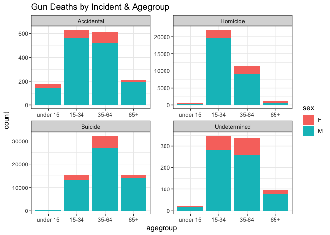
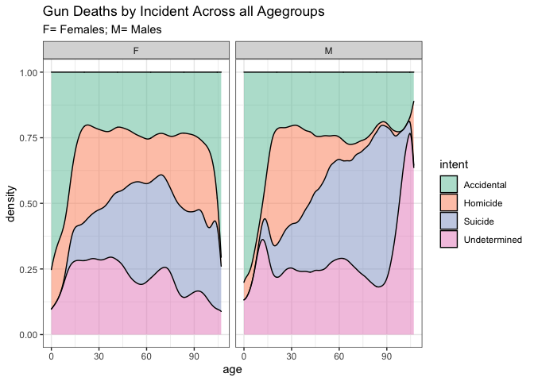
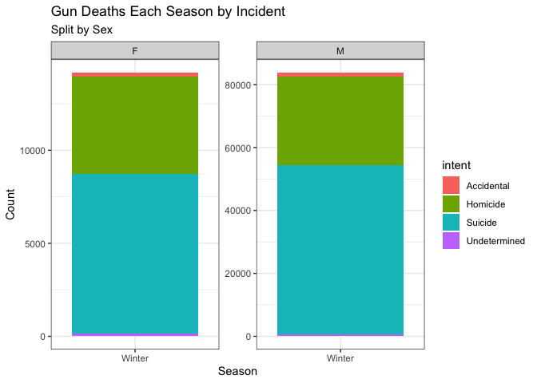
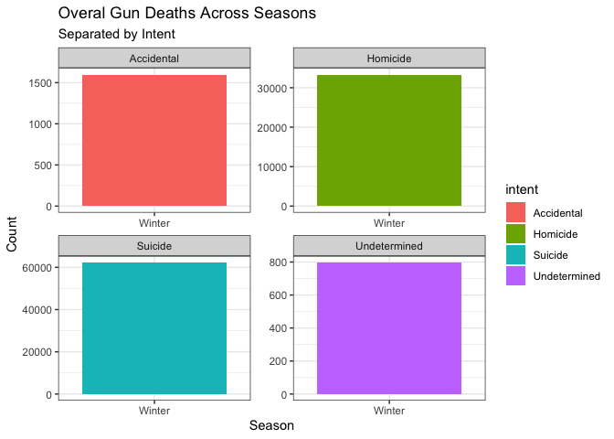

packages

```r
library(tidyverse)
```

```
## ── Attaching packages ─────────────────────────────────────── tidyverse 1.3.1 ──
```

```
## ✓ ggplot2 3.3.5     ✓ purrr   0.3.4
## ✓ tibble  3.1.6     ✓ dplyr   1.0.8
## ✓ tidyr   1.2.0     ✓ stringr 1.4.0
## ✓ readr   2.1.2     ✓ forcats 0.5.1
```

```
## ── Conflicts ────────────────────────────────────────── tidyverse_conflicts() ──
## x dplyr::filter() masks stats::filter()
## x dplyr::lag()    masks stats::lag()
```

```r
library(knitr)
library(downloader)
library(dplyr)
library(lubridate)
```

```
## 
## Attaching package: 'lubridate'
```

```
## The following objects are masked from 'package:base':
## 
##     date, intersect, setdiff, union
```

```r
library(ggplot2)
library(grid)
```


This data set is examining the deaths by gun in the U.S.

recreate the graphs

plot1

```r
dat <- read_csv("full_data.csv")
```

```
## New names:
## * `` -> ...1
```

```
## Rows: 100798 Columns: 11
## ── Column specification ────────────────────────────────────────────────────────
## Delimiter: ","
## chr (6): month, intent, sex, race, place, education
## dbl (5): ...1, year, police, age, hispanic
## 
## ℹ Use `spec()` to retrieve the full column specification for this data.
## ℹ Specify the column types or set `show_col_types = FALSE` to quiet this message.
```

```r
dat_plot1 <- dat %>%
  filter(intent != "", age != "") %>%
  mutate(agegroup = 
           case_when(  
             age >= 0 & age <= 14 ~ "under 15",
             age >= 15 & age <= 34 ~ "15-34",
             age >= 35 & age <= 64 ~ "35-64",
             age >= 65 ~ "65+"),
         agegroup = fct_relevel(agegroup,
                                "under 15", "15-34", "35-64", "65+"))
head(dat_plot1)
```

```
## # A tibble: 6 × 12
##    ...1  year month intent  police sex     age race     hispanic place education
##   <dbl> <dbl> <chr> <chr>    <dbl> <chr> <dbl> <chr>       <dbl> <chr> <chr>    
## 1     1  2012 01    Suicide      0 M        34 Asian/P…      100 Home  BA+      
## 2     2  2012 01    Suicide      0 F        21 White         100 Stre… Some col…
## 3     3  2012 01    Suicide      0 M        60 White         100 Othe… BA+      
## 4     4  2012 02    Suicide      0 M        64 White         100 Home  BA+      
## 5     5  2012 02    Suicide      0 M        31 White         100 Othe… HS/GED   
## 6     6  2012 02    Suicide      0 M        17 Native …      100 Home  Less tha…
## # … with 1 more variable: agegroup <fct>
```

```r
plot1 <- ggplot(data = dat_plot1, mapping = aes(x = agegroup, fill = sex)) +
  geom_bar() +
  facet_wrap(~ intent, scales = 'free') +
  labs(x = 'agegroup', 
       y = 'count', 
       title = 'Gun Deaths by Incident & Agegroup') +
  theme_bw() 

plot1
```

<!-- -->
It is much more common (in every scenario) for men to be killed by a gun than women.  All categories are highest in the age group 15-34 and 35-64.  


```r
dat2 <- dat %>%
  drop_na()

plot2 <- ggplot(data = dat2, mapping = aes(x = age)) +
  facet_wrap(~sex) +
  geom_density(aes(fill = intent), alpha = 0.5, position = "fill")  +
  labs(title = "Gun Deaths by Incident Across all Agegroups",
       subtitle = "F= Females; M= Males") +
  scale_fill_brewer(palette = "Set2") +
  theme_bw()

plot2
```

<!-- -->
This plot allows use to view male and female separtatle.  We can see the density of each intent of death by gun.  Additionally, we can see the trends across all agegroups.


investigate how seasons affect death by guns

```r
head(dat)
```

```
## # A tibble: 6 × 11
##    ...1  year month intent  police sex     age race     hispanic place education
##   <dbl> <dbl> <chr> <chr>    <dbl> <chr> <dbl> <chr>       <dbl> <chr> <chr>    
## 1     1  2012 01    Suicide      0 M        34 Asian/P…      100 Home  BA+      
## 2     2  2012 01    Suicide      0 F        21 White         100 Stre… Some col…
## 3     3  2012 01    Suicide      0 M        60 White         100 Othe… BA+      
## 4     4  2012 02    Suicide      0 M        64 White         100 Home  BA+      
## 5     5  2012 02    Suicide      0 M        31 White         100 Othe… HS/GED   
## 6     6  2012 02    Suicide      0 M        17 Native …      100 Home  Less tha…
```

```r
tail(dat)
```

```
## # A tibble: 6 × 11
##     ...1  year month intent   police sex     age race   hispanic place education
##    <dbl> <dbl> <chr> <chr>     <dbl> <chr> <dbl> <chr>     <dbl> <chr> <chr>    
## 1 100793  2014 12    Homicide      0 M        31 Black       100 Othe… HS/GED   
## 2 100794  2014 12    Homicide      0 M        36 Black       100 Home  HS/GED   
## 3 100795  2014 12    Homicide      0 M        19 Black       100 Stre… HS/GED   
## 4 100796  2014 12    Homicide      0 M        20 Black       100 Stre… HS/GED   
## 5 100797  2014 12    Homicide      0 M        22 Hispa…      260 Stre… Less tha…
## 6 100798  2014 10    Homicide      0 M        43 Black       100 Othe… HS/GED
```

```r
str(dat)
```

```
## spec_tbl_df [100,798 × 11] (S3: spec_tbl_df/tbl_df/tbl/data.frame)
##  $ ...1     : num [1:100798] 1 2 3 4 5 6 7 8 9 10 ...
##  $ year     : num [1:100798] 2012 2012 2012 2012 2012 ...
##  $ month    : chr [1:100798] "01" "01" "01" "02" ...
##  $ intent   : chr [1:100798] "Suicide" "Suicide" "Suicide" "Suicide" ...
##  $ police   : num [1:100798] 0 0 0 0 0 0 0 0 0 0 ...
##  $ sex      : chr [1:100798] "M" "F" "M" "M" ...
##  $ age      : num [1:100798] 34 21 60 64 31 17 48 41 50 NA ...
##  $ race     : chr [1:100798] "Asian/Pacific Islander" "White" "White" "White" ...
##  $ hispanic : num [1:100798] 100 100 100 100 100 100 100 100 100 998 ...
##  $ place    : chr [1:100798] "Home" "Street" "Other specified" "Home" ...
##  $ education: chr [1:100798] "BA+" "Some college" "BA+" "BA+" ...
##  - attr(*, "spec")=
##   .. cols(
##   ..   ...1 = col_double(),
##   ..   year = col_double(),
##   ..   month = col_character(),
##   ..   intent = col_character(),
##   ..   police = col_double(),
##   ..   sex = col_character(),
##   ..   age = col_double(),
##   ..   race = col_character(),
##   ..   hispanic = col_double(),
##   ..   place = col_character(),
##   ..   education = col_character()
##   .. )
##  - attr(*, "problems")=<externalptr>
```

```r
dat$month <- as.integer(dat$month)

dat_seasons <- dat2 %>%
  mutate(season =
           case_when(
             month == 12 | month <= 2 ~ "Winter",
             month >= 3 & month <= 5 ~ "Spring",
             month >= 6 & month <= 8 ~ "Summer",
             month >= 9 & month <= 11 ~ "Fall"))
dat_seasons
```

```
## # A tibble: 98,015 × 12
##     ...1  year month intent    police sex     age race  hispanic place education
##    <dbl> <dbl> <chr> <chr>      <dbl> <chr> <dbl> <chr>    <dbl> <chr> <chr>    
##  1     1  2012 01    Suicide        0 M        34 Asia…      100 Home  BA+      
##  2     2  2012 01    Suicide        0 F        21 White      100 Stre… Some col…
##  3     3  2012 01    Suicide        0 M        60 White      100 Othe… BA+      
##  4     4  2012 02    Suicide        0 M        64 White      100 Home  BA+      
##  5     5  2012 02    Suicide        0 M        31 White      100 Othe… HS/GED   
##  6     6  2012 02    Suicide        0 M        17 Nati…      100 Home  Less tha…
##  7     7  2012 02    Undeterm…      0 M        48 White      100 Home  HS/GED   
##  8     8  2012 03    Suicide        0 M        41 Nati…      100 Home  HS/GED   
##  9     9  2012 02    Accident…      0 M        50 White      100 Othe… Some col…
## 10    11  2012 02    Suicide        0 M        30 White      100 Home  Some col…
## # … with 98,005 more rows, and 1 more variable: season <chr>
```

```r
plot3 <-ggplot(data = dat_seasons, mapping = aes(x = season, fill = intent)) +
  geom_bar() +
  facet_wrap(~sex) +
  facet_wrap(~ sex, scales = 'free') +
  labs(x = 'Season', 
       y = 'Count', 
       title = 'Gun Deaths Each Season by Incident',
       subtitle = "Split by Sex") +
  theme_bw() 

plot3
```

<!-- -->

```r
plot4 <- ggplot(data = dat_seasons, mapping = aes(x = season, fill = intent)) +
  geom_bar() +
  facet_wrap(~intent) +
  facet_wrap(~ intent, scales = 'free') +
  labs(x = 'Season', 
       y = 'Count', 
       title = 'Overal Gun Deaths Across Seasons',
       subtitle = "Separated by Intent") +
  theme_bw()

plot4
```

<!-- -->

plot3 compares, separately male and female, the gun deaths by each season.  The deaths are still classified by their intent.  You can see that there is only one season that that seems to reasonably stand out from the others and this is winter.  Winter stands out because it has less suicides during that season (this is true for both males and females, but more so true for males).  The other seasons appear to all be very similar.  

plot4 allows for separate comparison of each season.  In this graph we are looking at total gun deaths (not split by sex).  Looking closer at each intent individually across the season, I noticed a new trend.  THis is that the their seems to be the least gun deaths per accient in the spring time. 
