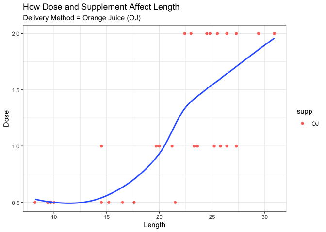
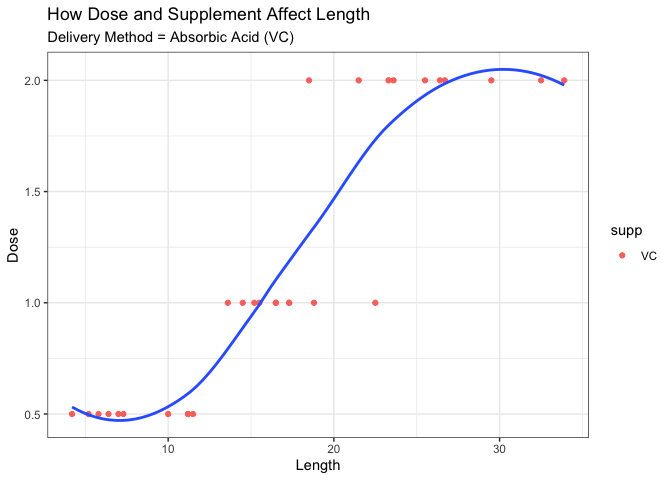
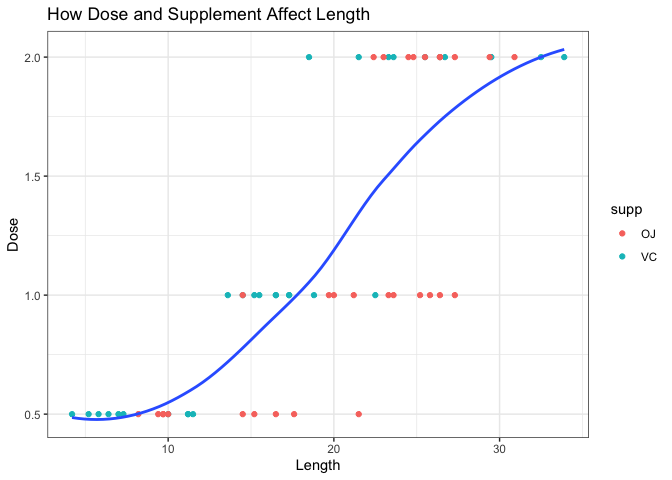
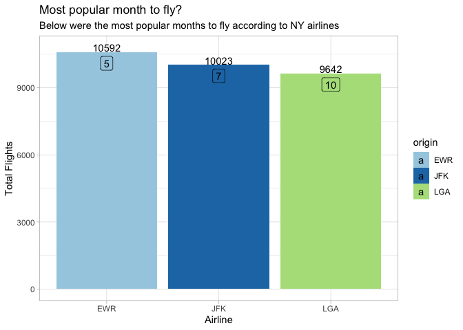
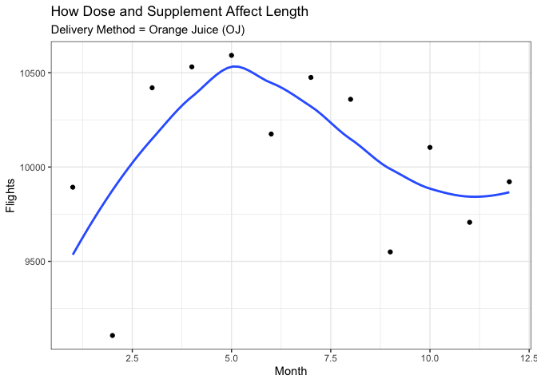
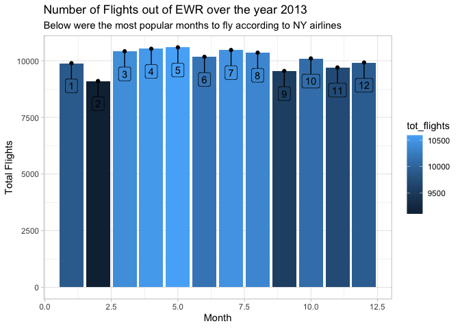

load packages

```r
library(tidyverse)
```

```
## ── Attaching packages ─────────────────────────────────────── tidyverse 1.3.1 ──
```

```
## ✓ ggplot2 3.3.5     ✓ purrr   0.3.4
## ✓ tibble  3.1.6     ✓ dplyr   1.0.8
## ✓ tidyr   1.2.0     ✓ stringr 1.4.0
## ✓ readr   2.1.2     ✓ forcats 0.5.1
```

```
## ── Conflicts ────────────────────────────────────────── tidyverse_conflicts() ──
## x dplyr::filter() masks stats::filter()
## x dplyr::lag()    masks stats::lag()
```

```r
library(knitr)
library(downloader)
library(dplyr)
library(lubridate)
```

```
## 
## Attaching package: 'lubridate'
```

```
## The following objects are masked from 'package:base':
## 
##     date, intersect, setdiff, union
```

```r
library(ggplot2)
library(grid)
```

Using the toothgrowth dataset

```r
dat <- ToothGrowth
str(dat)
```

```
## 'data.frame':	60 obs. of  3 variables:
##  $ len : num  4.2 11.5 7.3 5.8 6.4 10 11.2 11.2 5.2 7 ...
##  $ supp: Factor w/ 2 levels "OJ","VC": 2 2 2 2 2 2 2 2 2 2 ...
##  $ dose: num  0.5 0.5 0.5 0.5 0.5 0.5 0.5 0.5 0.5 0.5 ...
```

```r
head(dat)
```

```
##    len supp dose
## 1  4.2   VC  0.5
## 2 11.5   VC  0.5
## 3  7.3   VC  0.5
## 4  5.8   VC  0.5
## 5  6.4   VC  0.5
## 6 10.0   VC  0.5
```

```r
tail(dat)
```

```
##     len supp dose
## 55 24.8   OJ    2
## 56 30.9   OJ    2
## 57 26.4   OJ    2
## 58 27.3   OJ    2
## 59 29.4   OJ    2
## 60 23.0   OJ    2
```

```r
?ToothGrowth
```


I want to compare tooth length with delivery of OJ and tooth length with delivery of VC

```r
just_OJ <- dat %>%
  filter(supp == "OJ")

plot1_using_OJ <- ggplot(just_OJ, aes(x=len, y=dose)) + 
  geom_point(aes(col= supp)) +
  geom_smooth(method="loess", se=F) +
  labs(
       y="Dose", 
       x="Length", 
       title="How Dose and Supplement Affect Length",
       subtitle="Delivery Method = Orange Juice (OJ)") +
  theme_bw()

plot1_using_OJ
```

```
## `geom_smooth()` using formula 'y ~ x'
```

<!-- -->

```r
just_VC <- dat %>%
  filter(supp == "VC")

plot2_using_VC <- ggplot(just_VC, aes(x=len, y=dose)) + 
  geom_point(aes(col= supp)) +
  geom_smooth(method="loess", se=F) +
  labs(
       y="Dose", 
       x="Length", 
       title="How Dose and Supplement Affect Length",
       subtitle="Delivery Method = Absorbic Acid (VC)") +
  theme_bw()

plot2_using_VC
```

```
## `geom_smooth()` using formula 'y ~ x'
```

<!-- -->

```r
plot3_compare_oj_vc <- ggplot(dat, aes(x=len, y=dose)) + 
  geom_point(aes(col= supp)) +
  labs(
       y="Dose", 
       x="Length", 
       title="How Dose and Supplement Affect Length") +
      geom_smooth(method="loess", se=F) +
  theme_bw()
plot3_compare_oj_vc
```

```
## `geom_smooth()` using formula 'y ~ x'
```

<!-- -->

I created a couple plots to see which dose had the best affect in increasing tooth length.  Since there were two delivery methods, I chose to look at these affects separately and then together.  The two delivery methods were orange juice (OJ) and absorbic acid (VC).  I created a scatter plot first and then added a geom_smooth line to help visualize the affect of increasing dose.  What I discovered was that as dose increases, so does tooth length.  This was true for both delivery method OJ and VC.  I created a third scatter plot with the two delivery methods together and this was still true.  So, regardless of delivery method, as the dose increases, the tooth length also increases. 


using the flights dataset

I am going to try and determine which month is most popular to fly depending on the origin airport.  then, I will create a second plot that 

```r
library(nycflights13)
?flights
str(flights)
```

```
## tibble [336,776 × 19] (S3: tbl_df/tbl/data.frame)
##  $ year          : int [1:336776] 2013 2013 2013 2013 2013 2013 2013 2013 2013 2013 ...
##  $ month         : int [1:336776] 1 1 1 1 1 1 1 1 1 1 ...
##  $ day           : int [1:336776] 1 1 1 1 1 1 1 1 1 1 ...
##  $ dep_time      : int [1:336776] 517 533 542 544 554 554 555 557 557 558 ...
##  $ sched_dep_time: int [1:336776] 515 529 540 545 600 558 600 600 600 600 ...
##  $ dep_delay     : num [1:336776] 2 4 2 -1 -6 -4 -5 -3 -3 -2 ...
##  $ arr_time      : int [1:336776] 830 850 923 1004 812 740 913 709 838 753 ...
##  $ sched_arr_time: int [1:336776] 819 830 850 1022 837 728 854 723 846 745 ...
##  $ arr_delay     : num [1:336776] 11 20 33 -18 -25 12 19 -14 -8 8 ...
##  $ carrier       : chr [1:336776] "UA" "UA" "AA" "B6" ...
##  $ flight        : int [1:336776] 1545 1714 1141 725 461 1696 507 5708 79 301 ...
##  $ tailnum       : chr [1:336776] "N14228" "N24211" "N619AA" "N804JB" ...
##  $ origin        : chr [1:336776] "EWR" "LGA" "JFK" "JFK" ...
##  $ dest          : chr [1:336776] "IAH" "IAH" "MIA" "BQN" ...
##  $ air_time      : num [1:336776] 227 227 160 183 116 150 158 53 140 138 ...
##  $ distance      : num [1:336776] 1400 1416 1089 1576 762 ...
##  $ hour          : num [1:336776] 5 5 5 5 6 5 6 6 6 6 ...
##  $ minute        : num [1:336776] 15 29 40 45 0 58 0 0 0 0 ...
##  $ time_hour     : POSIXct[1:336776], format: "2013-01-01 05:00:00" "2013-01-01 05:00:00" ...
```

```r
count_months <- flights %>%
  select(month, origin) %>%
  count(month)


busy_months <- flights %>%
  select(month, origin) %>%
  drop_na() %>%
  group_by(origin, month) %>%
  summarise(tot_flights = n()) %>%
  arrange(desc(tot_flights))
```

```
## `summarise()` has grouped output by 'origin'. You can override using the
## `.groups` argument.
```

```r
tot_busy_months <- busy_months %>% 
  group_by(origin) %>%
  filter(tot_flights == max(tot_flights))


pop_month <- ggplot(data = tot_busy_months, aes(y= tot_flights, x= origin, fill = origin)) +
  geom_bar(stat = "identity", position = "dodge") +
  geom_text(aes(label=tot_flights), nudge_y = 200) +
  ggrepel::geom_label_repel(aes(label = month), data = tot_busy_months, nudge_y = -300) + 
  scale_fill_brewer(palette = "Paired") +
  labs(y="Total Flights", x= "Airline", title= "Most popular month to fly?", subtitle = "Below were the most popular months to fly according to NY airlines") +
  theme_light()

pop_month
```

<!-- -->

(group by each airport, count by each month, pull out highest number 
then group by without month and filter to get max count)

I added a couple layers to this plot to discover the answer to my question.  This bar graph shows the busiest months of flying for three different airports in New York.  We can see that each airport had a month of the year with about 10,000 flights.  I added an element to define the exact number of flights for easier comparison. EWR had the most with 10,592, JFK had the second most with 10,023, and LGA came in third with 9,642 flights in one month.  The months are represented in the clear boxes towards to top of each bar.  EWR's busiest month was May.  JFK's busiest month was July.  LGA's busiest month was October.


I want to look further at the trends over the months of just EWR over a year.

```r
EWR <- flights %>%
  filter(origin == 'EWR')

EWR_trends <- EWR %>%
  select(month) %>%
  drop_na() %>%
  group_by(month) %>%
  summarise(tot_flights = n())

ggplot(EWR_trends, aes(x=month, y=tot_flights)) + 
  geom_point(aes()) +
  geom_smooth(method="loess", se=F) +
  labs(
       y="Flights", 
       x="Month", 
       title="How Dose and Supplement Affect Length",
       subtitle="Delivery Method = Orange Juice (OJ)") +
  theme_bw()
```

```
## `geom_smooth()` using formula 'y ~ x'
```

<!-- -->

```r
EWR_2013 <- ggplot(data = EWR_trends, aes(y= tot_flights, x= month, fill = tot_flights)) +
  geom_bar(stat = "identity", position = "dodge") +
  geom_point() +
  ggrepel::geom_label_repel(aes(label = month), data = EWR_trends, nudge_y = -1000) + 
  labs(y="Total Flights", x= "Month", title= "Number of Flights out of EWR over the year 2013", subtitle = "Below were the most popular months to fly according to NY airlines") +
  theme_light()

EWR_2013
```

<!-- -->

We saw from our previous graph that EWRs most popular month was the 5th month of the year.  This visual of just EWR allows us to see all 12 months and the trends across the whole year.  We can see that there are several other months that are nearly just as busy.  Overall, the EWR airport has thousands of flights a month, but the summer months were most popular while February was noticeably the least popular.  Similar to the last graph, I chose a bar graph that would allow me to compare the total flights across several months.  I also added the exact month that each bar was representing for easier viewing.  


