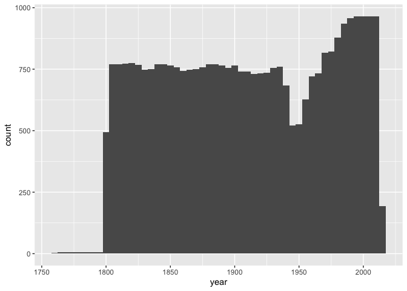
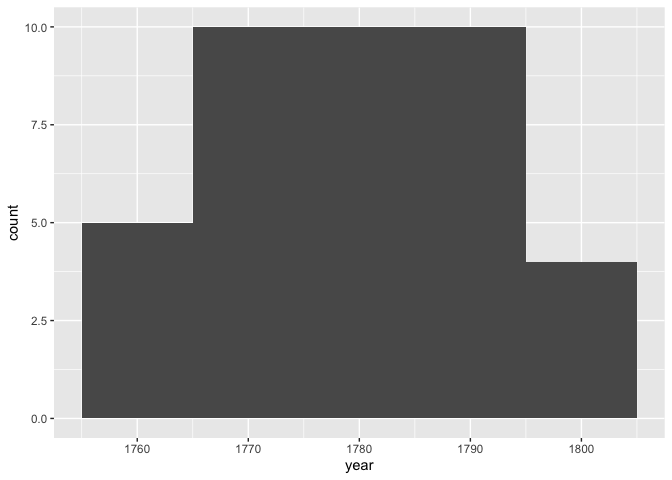
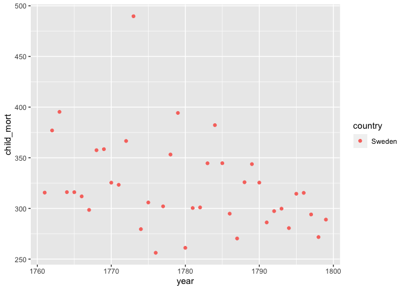
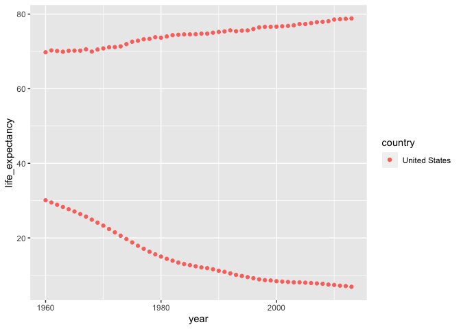
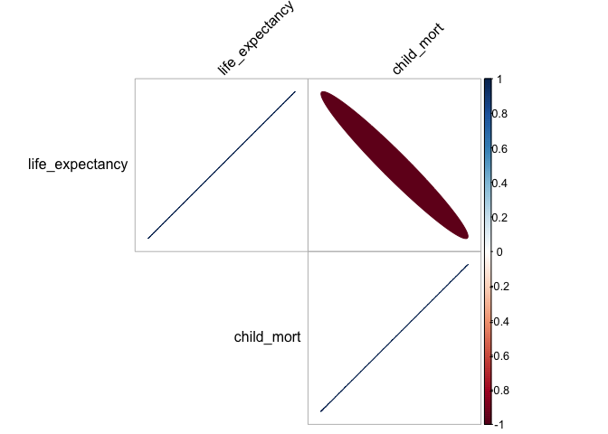

```
## ── Attaching packages ─────────────────────────────────────── tidyverse 1.3.1 ──
```

```
## ✔ ggplot2 3.3.5     ✔ purrr   0.3.4
## ✔ tibble  3.1.6     ✔ dplyr   1.0.8
## ✔ tidyr   1.2.0     ✔ stringr 1.4.0
## ✔ readr   2.1.2     ✔ forcats 0.5.1
```

```
## ── Conflicts ────────────────────────────────────────── tidyverse_conflicts() ──
## ✖ dplyr::filter() masks stats::filter()
## ✖ dplyr::lag()    masks stats::lag()
```

```
## 
## Attaching package: 'lubridate'
```

```
## The following objects are masked from 'package:base':
## 
##     date, intersect, setdiff, union
```

```
## corrplot 0.92 loaded
```


```
## Skipping install of 'ourworldindata' from a github remote, the SHA1 (ed2fc17b) has not changed since last install.
##   Use `force = TRUE` to force installation
```

```
## [1] "/Users/clairehays/Desktop/DTS 350/HaysClaire/Week6/Task10"
```

```
## Warning: One or more parsing issues, see `problems()` for details
```

```
## Rows: 36873 Columns: 17
```

```
## ── Column specification ────────────────────────────────────────────────────────
## Delimiter: ","
## chr  (2): country, continent
## dbl (14): year, health_exp_total, health_exp_public, nhs_exp, health_exp_pri...
## lgl  (1): health_insurance
## 
## ℹ Use `spec()` to retrieve the full column specification for this data.
## ℹ Specify the column types or set `show_col_types = FALSE` to quiet this message.
```

```
## spec_tbl_df [36,873 × 17] (S3: spec_tbl_df/tbl_df/tbl/data.frame)
##  $ year                     : num [1:36873] 2015 1800 1801 1802 1803 ...
##  $ country                  : chr [1:36873] "Abkhazia" "Afghanistan" "Afghanistan" "Afghanistan" ...
##  $ continent                : chr [1:36873] NA "Asia" "Asia" "Asia" ...
##  $ health_exp_total         : num [1:36873] NA NA NA NA NA NA NA NA NA NA ...
##  $ health_exp_public        : num [1:36873] NA NA NA NA NA NA NA NA NA NA ...
##  $ health_insurance         : logi [1:36873] NA NA NA NA NA NA ...
##  $ nhs_exp                  : num [1:36873] NA NA NA NA NA NA NA NA NA NA ...
##  $ health_exp_private       : num [1:36873] NA NA NA NA NA NA NA NA NA NA ...
##  $ health_insurance_govt    : num [1:36873] NA NA NA NA NA NA NA NA NA NA ...
##  $ health_insurance_private : num [1:36873] NA NA NA NA NA NA NA NA NA NA ...
##  $ health_insurance_any     : num [1:36873] NA NA NA NA NA NA NA NA NA NA ...
##  $ health_exp_public_percent: num [1:36873] NA NA NA NA NA NA NA NA NA NA ...
##  $ health_exp_oop_percent   : num [1:36873] NA NA NA NA NA NA NA NA NA NA ...
##  $ no_health_insurance      : num [1:36873] NA NA NA NA NA NA NA NA NA NA ...
##  $ gdp                      : num [1:36873] NA NA NA NA NA NA NA NA NA NA ...
##  $ life_expectancy          : num [1:36873] NA NA NA NA NA NA NA NA NA NA ...
##  $ child_mort               : num [1:36873] NA 469 469 469 469 ...
##  - attr(*, "spec")=
##   .. cols(
##   ..   year = col_double(),
##   ..   country = col_character(),
##   ..   continent = col_character(),
##   ..   health_exp_total = col_double(),
##   ..   health_exp_public = col_double(),
##   ..   health_insurance = col_logical(),
##   ..   nhs_exp = col_double(),
##   ..   health_exp_private = col_double(),
##   ..   health_insurance_govt = col_double(),
##   ..   health_insurance_private = col_double(),
##   ..   health_insurance_any = col_double(),
##   ..   health_exp_public_percent = col_double(),
##   ..   health_exp_oop_percent = col_double(),
##   ..   no_health_insurance = col_double(),
##   ..   gdp = col_double(),
##   ..   life_expectancy = col_double(),
##   ..   child_mort = col_double()
##   .. )
##  - attr(*, "problems")=<externalptr>
```

```
## # A tibble: 6 × 17
##    year country     continent health_exp_total health_exp_publ… health_insurance
##   <dbl> <chr>       <chr>                <dbl>            <dbl> <lgl>           
## 1  2015 Abkhazia    <NA>                    NA               NA NA              
## 2  1800 Afghanistan Asia                    NA               NA NA              
## 3  1801 Afghanistan Asia                    NA               NA NA              
## 4  1802 Afghanistan Asia                    NA               NA NA              
## 5  1803 Afghanistan Asia                    NA               NA NA              
## 6  1804 Afghanistan Asia                    NA               NA NA              
## # … with 11 more variables: nhs_exp <dbl>, health_exp_private <dbl>,
## #   health_insurance_govt <dbl>, health_insurance_private <dbl>,
## #   health_insurance_any <dbl>, health_exp_public_percent <dbl>,
## #   health_exp_oop_percent <dbl>, no_health_insurance <dbl>, gdp <dbl>,
## #   life_expectancy <dbl>, child_mort <dbl>
```

```
## # A tibble: 6 × 17
##    year country  continent health_exp_total health_exp_public health_insurance
##   <dbl> <chr>    <chr>                <dbl>             <dbl> <lgl>           
## 1  2010 Zimbabwe Africa                  NA                NA NA              
## 2  2011 Zimbabwe Africa                  NA                NA NA              
## 3  2012 Zimbabwe Africa                  NA                NA NA              
## 4  2013 Zimbabwe Africa                  NA                NA NA              
## 5  2014 Zimbabwe Africa                  NA                NA NA              
## 6  2015 Zimbabwe Africa                  NA                NA NA              
## # … with 11 more variables: nhs_exp <dbl>, health_exp_private <dbl>,
## #   health_insurance_govt <dbl>, health_insurance_private <dbl>,
## #   health_insurance_any <dbl>, health_exp_public_percent <dbl>,
## #   health_exp_oop_percent <dbl>, no_health_insurance <dbl>, gdp <dbl>,
## #   life_expectancy <dbl>, child_mort <dbl>
```

```
##       year        country            child_mort   
##  Min.   :1761   Length:33241       Min.   :  2.0  
##  1st Qu.:1853   Class :character   1st Qu.:124.8  
##  Median :1908   Mode  :character   Median :369.2  
##  Mean   :1909                      Mean   :293.6  
##  3rd Qu.:1968                      3rd Qu.:425.2  
##  Max.   :2013                      Max.   :756.3
```

```
## tibble [33,241 × 3] (S3: tbl_df/tbl/data.frame)
##  $ year      : num [1:33241] 1800 1801 1802 1803 1804 ...
##  $ country   : chr [1:33241] "Afghanistan" "Afghanistan" "Afghanistan" "Afghanistan" ...
##  $ child_mort: num [1:33241] 469 469 469 469 469 ...
```

```
## # A tibble: 194 × 2
##    country                 n
##    <chr>               <int>
##  1 Afghanistan           209
##  2 Albania               187
##  3 Algeria               205
##  4 Andorra                24
##  5 Angola                205
##  6 Antigua and Barbuda    56
##  7 Argentina             200
##  8 Armenia                58
##  9 Australia             205
## 10 Austria               205
## # … with 184 more rows
```

<!-- -->

I started by plotting a histogram to get a general idea of child mortality over the years.
There was almost no death from 1750 - 1800. This seemed bizarre to me, so I am going to look at this more.  From 1800 - 1930 it was relatively steady.  Around the 1950s there was a significant drip in mortality only for the numbers to increase until about 2000.  Entering into the 2000s, we see an extremely significant drop in child mortality.  


<!-- --><!-- -->
Now, we can see that these numbers were so low because the only country on record was Sweden.


```
##       year        country            child_mort    life_expectancy
##  Min.   :1960   Length:54          Min.   : 6.90   Min.   :69.77  
##  1st Qu.:1973   Class :character   1st Qu.: 8.45   1st Qu.:71.51  
##  Median :1986   Mode  :character   Median :12.25   Median :74.69  
##  Mean   :1986                      Mean   :14.86   Mean   :74.36  
##  3rd Qu.:2000                      3rd Qu.:20.38   3rd Qu.:76.62  
##  Max.   :2013                      Max.   :30.10   Max.   :78.84
```

<!-- -->
I decided to filter out the years before 1800 since those only had the data from Sweden. Then I decided to look just at the U.S. child_mortality versus life expectancy.  I plotted both these variable using a geom_point.  It seemed that these were negatively correlated, which would make since so I plotted a corrplot below.  

<!-- -->

This corrplot confirms my expectation that in the U.S. as child mortality went down the life expectancy went up.  We can see this because there is a strongly negavtive correlation between the two variables.  
