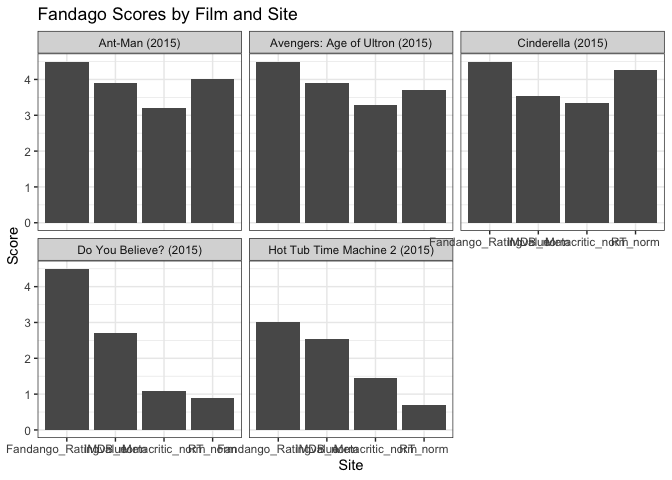

```r
library(tidyverse)
```

```
## ── Attaching packages ─────────────────────────────────────── tidyverse 1.3.1 ──
```

```
## ✔ ggplot2 3.3.5     ✔ purrr   0.3.4
## ✔ tibble  3.1.6     ✔ dplyr   1.0.8
## ✔ tidyr   1.2.0     ✔ stringr 1.4.0
## ✔ readr   2.1.2     ✔ forcats 0.5.1
```

```
## ── Conflicts ────────────────────────────────────────── tidyverse_conflicts() ──
## ✖ dplyr::filter() masks stats::filter()
## ✖ dplyr::lag()    masks stats::lag()
```

```r
library(knitr)
library(downloader)
library(dplyr)
library(lubridate)
```

```
## 
## Attaching package: 'lubridate'
```

```
## The following objects are masked from 'package:base':
## 
##     date, intersect, setdiff, union
```

```r
library(ggplot2)
library(grid)
```


```r
dat <- read_csv("https://raw.githubusercontent.com/fivethirtyeight/data/master/fandango/fandango_score_comparison.csv")
```

```
## Rows: 146 Columns: 22
## ── Column specification ────────────────────────────────────────────────────────
## Delimiter: ","
## chr  (1): FILM
## dbl (21): RottenTomatoes, RottenTomatoes_User, Metacritic, Metacritic_User, ...
## 
## ℹ Use `spec()` to retrieve the full column specification for this data.
## ℹ Specify the column types or set `show_col_types = FALSE` to quiet this message.
```

```r
head(dat)
```

```
## # A tibble: 6 × 22
##   FILM          RottenTomatoes RottenTomatoes_… Metacritic Metacritic_User  IMDB
##   <chr>                  <dbl>            <dbl>      <dbl>           <dbl> <dbl>
## 1 Avengers: Ag…             74               86         66             7.1   7.8
## 2 Cinderella (…             85               80         67             7.5   7.1
## 3 Ant-Man (201…             80               90         64             8.1   7.8
## 4 Do You Belie…             18               84         22             4.7   5.4
## 5 Hot Tub Time…             14               28         29             3.4   5.1
## 6 The Water Di…             63               62         50             6.8   7.2
## # … with 16 more variables: Fandango_Stars <dbl>, Fandango_Ratingvalue <dbl>,
## #   RT_norm <dbl>, RT_user_norm <dbl>, Metacritic_norm <dbl>,
## #   Metacritic_user_nom <dbl>, IMDB_norm <dbl>, RT_norm_round <dbl>,
## #   RT_user_norm_round <dbl>, Metacritic_norm_round <dbl>,
## #   Metacritic_user_norm_round <dbl>, IMDB_norm_round <dbl>,
## #   Metacritic_user_vote_count <dbl>, IMDB_user_vote_count <dbl>,
## #   Fandango_votes <dbl>, Fandango_Difference <dbl>
```

```r
str(dat)
```

```
## spec_tbl_df [146 × 22] (S3: spec_tbl_df/tbl_df/tbl/data.frame)
##  $ FILM                      : chr [1:146] "Avengers: Age of Ultron (2015)" "Cinderella (2015)" "Ant-Man (2015)" "Do You Believe? (2015)" ...
##  $ RottenTomatoes            : num [1:146] 74 85 80 18 14 63 42 86 99 89 ...
##  $ RottenTomatoes_User       : num [1:146] 86 80 90 84 28 62 53 64 82 87 ...
##  $ Metacritic                : num [1:146] 66 67 64 22 29 50 53 81 81 80 ...
##  $ Metacritic_User           : num [1:146] 7.1 7.5 8.1 4.7 3.4 6.8 7.6 6.8 8.8 8.5 ...
##  $ IMDB                      : num [1:146] 7.8 7.1 7.8 5.4 5.1 7.2 6.9 6.5 7.4 7.8 ...
##  $ Fandango_Stars            : num [1:146] 5 5 5 5 3.5 4.5 4 4 4.5 4.5 ...
##  $ Fandango_Ratingvalue      : num [1:146] 4.5 4.5 4.5 4.5 3 4 3.5 3.5 4 4 ...
##  $ RT_norm                   : num [1:146] 3.7 4.25 4 0.9 0.7 3.15 2.1 4.3 4.95 4.45 ...
##  $ RT_user_norm              : num [1:146] 4.3 4 4.5 4.2 1.4 3.1 2.65 3.2 4.1 4.35 ...
##  $ Metacritic_norm           : num [1:146] 3.3 3.35 3.2 1.1 1.45 2.5 2.65 4.05 4.05 4 ...
##  $ Metacritic_user_nom       : num [1:146] 3.55 3.75 4.05 2.35 1.7 3.4 3.8 3.4 4.4 4.25 ...
##  $ IMDB_norm                 : num [1:146] 3.9 3.55 3.9 2.7 2.55 3.6 3.45 3.25 3.7 3.9 ...
##  $ RT_norm_round             : num [1:146] 3.5 4.5 4 1 0.5 3 2 4.5 5 4.5 ...
##  $ RT_user_norm_round        : num [1:146] 4.5 4 4.5 4 1.5 3 2.5 3 4 4.5 ...
##  $ Metacritic_norm_round     : num [1:146] 3.5 3.5 3 1 1.5 2.5 2.5 4 4 4 ...
##  $ Metacritic_user_norm_round: num [1:146] 3.5 4 4 2.5 1.5 3.5 4 3.5 4.5 4.5 ...
##  $ IMDB_norm_round           : num [1:146] 4 3.5 4 2.5 2.5 3.5 3.5 3.5 3.5 4 ...
##  $ Metacritic_user_vote_count: num [1:146] 1330 249 627 31 88 34 17 124 62 54 ...
##  $ IMDB_user_vote_count      : num [1:146] 271107 65709 103660 3136 19560 ...
##  $ Fandango_votes            : num [1:146] 14846 12640 12055 1793 1021 ...
##  $ Fandango_Difference       : num [1:146] 0.5 0.5 0.5 0.5 0.5 0.5 0.5 0.5 0.5 0.5 ...
##  - attr(*, "spec")=
##   .. cols(
##   ..   FILM = col_character(),
##   ..   RottenTomatoes = col_double(),
##   ..   RottenTomatoes_User = col_double(),
##   ..   Metacritic = col_double(),
##   ..   Metacritic_User = col_double(),
##   ..   IMDB = col_double(),
##   ..   Fandango_Stars = col_double(),
##   ..   Fandango_Ratingvalue = col_double(),
##   ..   RT_norm = col_double(),
##   ..   RT_user_norm = col_double(),
##   ..   Metacritic_norm = col_double(),
##   ..   Metacritic_user_nom = col_double(),
##   ..   IMDB_norm = col_double(),
##   ..   RT_norm_round = col_double(),
##   ..   RT_user_norm_round = col_double(),
##   ..   Metacritic_norm_round = col_double(),
##   ..   Metacritic_user_norm_round = col_double(),
##   ..   IMDB_norm_round = col_double(),
##   ..   Metacritic_user_vote_count = col_double(),
##   ..   IMDB_user_vote_count = col_double(),
##   ..   Fandango_votes = col_double(),
##   ..   Fandango_Difference = col_double()
##   .. )
##  - attr(*, "problems")=<externalptr>
```

```r
summary(dat)
```

```
##      FILM           RottenTomatoes   RottenTomatoes_User   Metacritic   
##  Length:146         Min.   :  5.00   Min.   :20.00       Min.   :13.00  
##  Class :character   1st Qu.: 31.25   1st Qu.:50.00       1st Qu.:43.50  
##  Mode  :character   Median : 63.50   Median :66.50       Median :59.00  
##                     Mean   : 60.85   Mean   :63.88       Mean   :58.81  
##                     3rd Qu.: 89.00   3rd Qu.:81.00       3rd Qu.:75.00  
##                     Max.   :100.00   Max.   :94.00       Max.   :94.00  
##  Metacritic_User      IMDB       Fandango_Stars  Fandango_Ratingvalue
##  Min.   :2.400   Min.   :4.000   Min.   :3.000   Min.   :2.700       
##  1st Qu.:5.700   1st Qu.:6.300   1st Qu.:3.500   1st Qu.:3.500       
##  Median :6.850   Median :6.900   Median :4.000   Median :3.900       
##  Mean   :6.519   Mean   :6.737   Mean   :4.089   Mean   :3.845       
##  3rd Qu.:7.500   3rd Qu.:7.400   3rd Qu.:4.500   3rd Qu.:4.200       
##  Max.   :9.600   Max.   :8.600   Max.   :5.000   Max.   :4.800       
##     RT_norm       RT_user_norm   Metacritic_norm Metacritic_user_nom
##  Min.   :0.250   Min.   :1.000   Min.   :0.650   Min.   :1.200      
##  1st Qu.:1.562   1st Qu.:2.500   1st Qu.:2.175   1st Qu.:2.850      
##  Median :3.175   Median :3.325   Median :2.950   Median :3.425      
##  Mean   :3.042   Mean   :3.194   Mean   :2.940   Mean   :3.260      
##  3rd Qu.:4.450   3rd Qu.:4.050   3rd Qu.:3.750   3rd Qu.:3.750      
##  Max.   :5.000   Max.   :4.700   Max.   :4.700   Max.   :4.800      
##    IMDB_norm     RT_norm_round   RT_user_norm_round Metacritic_norm_round
##  Min.   :2.000   Min.   :0.500   Min.   :1.000      Min.   :0.500        
##  1st Qu.:3.150   1st Qu.:1.500   1st Qu.:2.500      1st Qu.:2.125        
##  Median :3.450   Median :3.000   Median :3.500      Median :3.000        
##  Mean   :3.368   Mean   :3.065   Mean   :3.226      Mean   :2.973        
##  3rd Qu.:3.700   3rd Qu.:4.500   3rd Qu.:4.000      3rd Qu.:4.000        
##  Max.   :4.300   Max.   :5.000   Max.   :4.500      Max.   :4.500        
##  Metacritic_user_norm_round IMDB_norm_round Metacritic_user_vote_count
##  Min.   :1.000              Min.   :2.00    Min.   :   4.00           
##  1st Qu.:3.000              1st Qu.:3.00    1st Qu.:  33.25           
##  Median :3.500              Median :3.50    Median :  72.50           
##  Mean   :3.271              Mean   :3.38    Mean   : 185.71           
##  3rd Qu.:4.000              3rd Qu.:3.50    3rd Qu.: 168.50           
##  Max.   :5.000              Max.   :4.50    Max.   :2375.00           
##  IMDB_user_vote_count Fandango_votes    Fandango_Difference
##  Min.   :   243       Min.   :   35.0   Min.   :0.0000     
##  1st Qu.:  5627       1st Qu.:  222.2   1st Qu.:0.1000     
##  Median : 19103       Median : 1446.0   Median :0.2000     
##  Mean   : 42846       Mean   : 3848.8   Mean   :0.2438     
##  3rd Qu.: 45186       3rd Qu.: 4439.5   3rd Qu.:0.4000     
##  Max.   :334164       Max.   :34846.0   Max.   :0.5000
```


```r
clean_dat <- dat %>%
  select(FILM, RT_norm, Metacritic_norm, IMDB_norm, Fandango_Ratingvalue) %>%
  pivot_longer(2:5, names_to = "site", values_to = "score") %>%
  select(FILM, site, score)

clean_dat_20 <- head(clean_dat, n=20)
clean_dat_20
```

```
## # A tibble: 20 × 3
##    FILM                           site                 score
##    <chr>                          <chr>                <dbl>
##  1 Avengers: Age of Ultron (2015) RT_norm               3.7 
##  2 Avengers: Age of Ultron (2015) Metacritic_norm       3.3 
##  3 Avengers: Age of Ultron (2015) IMDB_norm             3.9 
##  4 Avengers: Age of Ultron (2015) Fandango_Ratingvalue  4.5 
##  5 Cinderella (2015)              RT_norm               4.25
##  6 Cinderella (2015)              Metacritic_norm       3.35
##  7 Cinderella (2015)              IMDB_norm             3.55
##  8 Cinderella (2015)              Fandango_Ratingvalue  4.5 
##  9 Ant-Man (2015)                 RT_norm               4   
## 10 Ant-Man (2015)                 Metacritic_norm       3.2 
## 11 Ant-Man (2015)                 IMDB_norm             3.9 
## 12 Ant-Man (2015)                 Fandango_Ratingvalue  4.5 
## 13 Do You Believe? (2015)         RT_norm               0.9 
## 14 Do You Believe? (2015)         Metacritic_norm       1.1 
## 15 Do You Believe? (2015)         IMDB_norm             2.7 
## 16 Do You Believe? (2015)         Fandango_Ratingvalue  4.5 
## 17 Hot Tub Time Machine 2 (2015)  RT_norm               0.7 
## 18 Hot Tub Time Machine 2 (2015)  Metacritic_norm       1.45
## 19 Hot Tub Time Machine 2 (2015)  IMDB_norm             2.55
## 20 Hot Tub Time Machine 2 (2015)  Fandango_Ratingvalue  3
```


```r
graph1 <- ggplot(clean_dat_20, aes(x = site, y = score)) +
  geom_col() +
  facet_wrap(~FILM) +
  labs(title = "Fandago Scores by Film and Site",
       y = "Score",
       x = "Site") +
  theme_bw() 

graph1
```

<!-- -->

In every movie, Fandago Rating had the highest score and IMDB norm had a higher score than Metacritic norm.  The fourth site, RT norm, was inconsistent on how it ranked in comparison to the other sites. 
