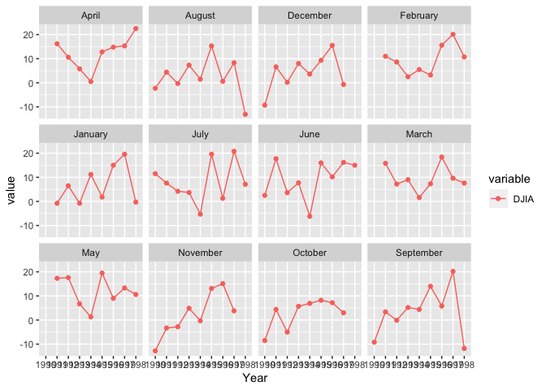

```r
library(tidyverse)
```

```
## ── Attaching packages ─────────────────────────────────────── tidyverse 1.3.1 ──
```

```
## ✔ ggplot2 3.3.5     ✔ purrr   0.3.4
## ✔ tibble  3.1.6     ✔ dplyr   1.0.8
## ✔ tidyr   1.2.0     ✔ stringr 1.4.0
## ✔ readr   2.1.2     ✔ forcats 0.5.1
```

```
## ── Conflicts ────────────────────────────────────────── tidyverse_conflicts() ──
## ✖ dplyr::filter() masks stats::filter()
## ✖ dplyr::lag()    masks stats::lag()
```

```r
library(knitr)
library(downloader)
library(dplyr)
library(lubridate)
```

```
## 
## Attaching package: 'lubridate'
```

```
## The following objects are masked from 'package:base':
## 
##     date, intersect, setdiff, union
```

```r
library(ggplot2)
library(grid)
library(corrplot)
```

```
## corrplot 0.92 loaded
```

```r
library(COR)
library(readr) 
library(haven)
library(readxl)
```


```r
dat_1 <- tempfile()
download.file("https://github.com/WJC-Data-Science/DTS350/raw/master/Dart_Expert_Dow_6month_anova/Dart_Expert_Dow_6month_anova.RDS", dat_1)
dat1 <- read_rds(dat_1)
head(dat1)
```

```
## # A tibble: 6 × 3
##   contest_period      variable value
##   <chr>               <chr>    <dbl>
## 1 January-June1990    PROS      12.7
## 2 February-July1990   PROS      26.4
## 3 March-August1990    PROS       2.5
## 4 April-September1990 PROS     -20  
## 5 May-October1990     PROS     -37.8
## 6 June-November1990   PROS     -33.3
```

```r
dat_2 <- tempfile()
download.file("https://github.com/WJC-Data-Science/DTS350/raw/master/Dart_Expert_Dow_6month_anova/Dart_Expert_Dow_6month_anova.csv", dat_2)
dat2 <- read_csv(dat_2)
```

```
## Rows: 300 Columns: 3
## ── Column specification ────────────────────────────────────────────────────────
## Delimiter: ","
## chr (2): contest_period, variable
## dbl (1): value
## 
## ℹ Use `spec()` to retrieve the full column specification for this data.
## ℹ Specify the column types or set `show_col_types = FALSE` to quiet this message.
```

```r
head(dat2)
```

```
## # A tibble: 6 × 3
##   contest_period      variable value
##   <chr>               <chr>    <dbl>
## 1 January-June1990    PROS      12.7
## 2 February-July1990   PROS      26.4
## 3 March-August1990    PROS       2.5
## 4 April-September1990 PROS     -20  
## 5 May-October1990     PROS     -37.8
## 6 June-November1990   PROS     -33.3
```

```r
dat_3 <- tempfile()
download.file("https://github.com/WJC-Data-Science/DTS350/raw/master/Dart_Expert_Dow_6month_anova/Dart_Expert_Dow_6month_anova.dta", dat_3)
dat3 <- read_dta(dat_3)
head(dat3)
```

```
## # A tibble: 6 × 3
##   contest_period      variable value
##   <chr>               <chr>    <dbl>
## 1 January-June1990    PROS      12.7
## 2 February-July1990   PROS      26.4
## 3 March-August1990    PROS       2.5
## 4 April-September1990 PROS     -20  
## 5 May-October1990     PROS     -37.8
## 6 June-November1990   PROS     -33.3
```

```r
dat_4 <- tempfile()
download.file("https://github.com/WJC-Data-Science/DTS350/raw/master/Dart_Expert_Dow_6month_anova/Dart_Expert_Dow_6month_anova.sav", dat_4)
dat4 <- read_sav(dat_4)
head(dat4)
```

```
## # A tibble: 6 × 3
##   contest_period      variable value
##   <chr>               <chr>    <dbl>
## 1 January-June1990    PROS      12.7
## 2 February-July1990   PROS      26.4
## 3 March-August1990    PROS       2.5
## 4 April-September1990 PROS     -20  
## 5 May-October1990     PROS     -37.8
## 6 June-November1990   PROS     -33.3
```

```r
dat_5 <- tempfile()
download.file("https://github.com/WJC-Data-Science/DTS350/raw/master/Dart_Expert_Dow_6month_anova/Dart_Expert_Dow_6month_anova.xlsx", dat_5)
dat5 <- read_xlsx(dat_5)
head(dat5)
```

```
## # A tibble: 6 × 3
##   contest_period      variable value
##   <chr>               <chr>    <dbl>
## 1 January-June1990    PROS      12.7
## 2 February-July1990   PROS      26.4
## 3 March-August1990    PROS       2.5
## 4 April-September1990 PROS     -20  
## 5 May-October1990     PROS     -37.8
## 6 June-November1990   PROS     -33.3
```

```r
all_equal(dat1, dat2, dat3, convert = TRUE)
```

```
## [1] TRUE
```

```r
all_equal(dat1, dat4, dat5, convert = TRUE)
```

```
## [1] TRUE
```


```r
boxplot <- ggplot(data=dat1, aes(x=variable, y=value, fill=variable)) +
           geom_boxplot()
boxplot
```

<!-- -->

```r
jitter <- ggplot(data=dat1, aes(x=variable, y=value, fill=variable)) +
           geom_jitter()
jitter
```

<!-- -->

```r
average_return <- ggplot(data=dat1, aes(x=contest_period, y=value, group=variable, color=variable)) +
                  geom_line() +
                  facet_wrap(~variable)
average_return
```

<!-- -->
boxplot - PROS has the best potential and also the most risk.  DJIA doesn't have as high of potential as PROS but it is "safer" because there is not as much margin.  DARTS is reasonably "safe" but the potential is not as significant as PROS.  

jitter - mostly similar to what the boxplot showed us.  this jitter plot does allow us to see that there are few outliers for DARTS, allowing there to be potentional a gain almost as high as we see using PROS.  

average_return - DJIA would be the easiest to predict.  DART and PROS have much more variation.


```r
dat1_tidy <- dat1 %>%
             filter(variable == 'DJIA') %>%
      mutate(contest_period = str_replace_all(contest_period, '19', '_19'),
             contest_period = str_replace(contest_period, 'Febuary', 'February'),
             contest_period = str_replace(contest_period, 'Dec._1993', 'December_1993')) %>%
      separate(contest_period, into = c('Month', 'Year_End'), sep = '-') %>%
      separate(Year_End, into = c('Month', 'Year'), sep = '_') %>%
      arrange(factor(Month, levels = month.name))

head(dat1_tidy, n=10)
```

```
## # A tibble: 10 × 4
##    variable Month    Year  value
##    <chr>    <chr>    <chr> <dbl>
##  1 DJIA     January  1991   -0.8
##  2 DJIA     January  1992    6.5
##  3 DJIA     January  1993   -0.8
##  4 DJIA     January  1994   11.2
##  5 DJIA     January  1995    1.8
##  6 DJIA     January  1996   15  
##  7 DJIA     January  1997   19.6
##  8 DJIA     January  1998   -0.3
##  9 DJIA     February 1991   11  
## 10 DJIA     February 1992    8.6
```

```r
saveRDS(dat1_tidy, file='dat1_tidy.rds')
```


```r
returns <- ggplot(data=dat1_tidy, aes(x=Year, y=value, group=Month, color=variable)) +
                  geom_line() +
                  geom_point() +
                  facet_wrap(~Month)
returns
```

<!-- -->
returns - lots of variation among the different months.  October seems to have the least.  March and May also seem to have less than other months.  September and November have a lot of variation. April, February, May, and March all seemed to stay above 0.  


```r
final_table <- dat1%>%
  filter(variable == "DJIA") %>%
  mutate(contest_period = str_replace_all(contest_period, "19", "_19"),
         contest_period = str_replace(contest_period, "Febuary", "February"),
         contest_period = str_replace(contest_period, "Dec._1993", "December_1993")) %>%
  separate(contest_period, into = c("Month", "Year_end"), sep = "-") %>%
  separate(Year_end, into = c("Month", "Year"), sep = "_") %>%
  pivot_wider(names_from = "Year", values_from = "value") %>%
  arrange(factor(Month, levels = month.name)) %>%
  select(-variable)
head(final_table)
```

```
## # A tibble: 6 × 10
##   Month    `1990` `1991` `1992` `1993` `1994` `1995` `1996` `1997` `1998`
##   <chr>     <dbl>  <dbl>  <dbl>  <dbl>  <dbl>  <dbl>  <dbl>  <dbl>  <dbl>
## 1 January    NA     -0.8    6.5   -0.8   11.2    1.8   15     19.6   -0.3
## 2 February   NA     11      8.6    2.5    5.5    3.2   15.6   20.1   10.7
## 3 March      NA     15.8    7.2    9      1.6    7.3   18.4    9.6    7.6
## 4 April      NA     16.2   10.6    5.8    0.5   12.8   14.8   15.3   22.5
## 5 May        NA     17.3   17.6    6.7    1.3   19.5    9     13.3   10.6
## 6 June        2.5   17.7    3.6    7.7   -6.2   16     10.2   16.2   15
```

```r
tail(final_table)
```

```
## # A tibble: 6 × 10
##   Month     `1990` `1991` `1992` `1993` `1994` `1995` `1996` `1997` `1998`
##   <chr>      <dbl>  <dbl>  <dbl>  <dbl>  <dbl>  <dbl>  <dbl>  <dbl>  <dbl>
## 1 July        11.5    7.6    4.2    3.7   -5.3   19.6    1.3   20.8    7.1
## 2 August      -2.3    4.4   -0.3    7.3    1.5   15.3    0.6    8.3  -13.1
## 3 September   -9.2    3.4   -0.1    5.2    4.4   14      5.8   20.2  -11.8
## 4 October     -8.5    4.4   -5      5.7    6.9    8.2    7.2    3     NA  
## 5 November   -12.8   -3.3   -2.8    4.9   -0.3   13.1   15.1    3.8   NA  
## 6 December    -9.3    6.6    0.2    8      3.6    9.3   15.5   -0.7   NA
```


